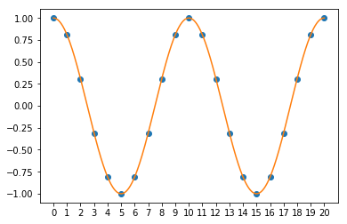
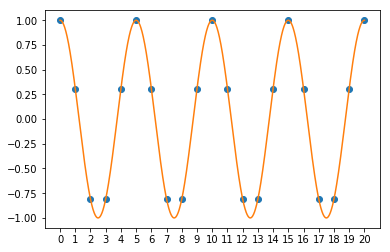
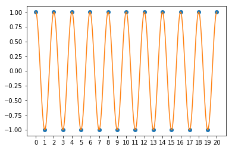
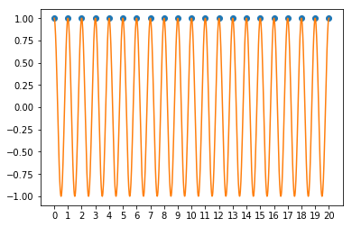
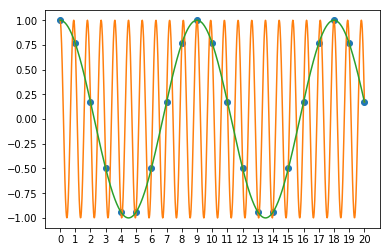

---
jupyter:
  jupytext:
    formats: ipynb,md
    text_representation:
      extension: .md
      format_name: markdown
      format_version: '1.3'
      jupytext_version: 1.14.4
  kernelspec:
    display_name: Python 3
    language: python
    name: python3
---

# Basics of the Discrete Fourier Transform

In this lecture, we will explore how the Fast Fourier Transform works in python, with an emphasis of how to use it, what it does, and how to interpret the data it produces.

At the end of the notebook, we will also explore an example of using the FFT to find a weak singal in a noisy dataset.

**Learning objectives:** After finishing this lecture, you should be able to:

1. Calculate the FFT of a dataset
2. Calculate the correct frequency vector for the transformed data
3. Convert the fourier-transformed data into a physically meaningful power spectrum with the correct units
4. Use the FFT to determine the frequency and amplitude of weak periodic signals in noisy data

```python 
# Initialisation code for the notebook
import numpy as np
import matplotlib.pyplot as plt

plt.rcParams['figure.figsize'] = (10,4)
plt.rcParams['figure.dpi'] = 100
```


## Background Material

### Review of the Fourier Series

A powerful and frequently used tool in computational science is the Discrete Fourier transform (DFT). The DFT can be thought of as the digital analog of the conventional Fourier transform:

https://en.wikipedia.org/wiki/Fourier_transform

For a function defined from $t=0$ to $t=T$, one can express that function mathematically with a Fourier series:

$$
y(t) = \sum_{\omega=-\infty}^{\infty} \tilde y_\omega \exp \left( i\omega t \right)
$$

For a continuous function $y(t)$, the coefficients $\tilde y_\omega$ are given by the following integral:

$$
\tilde y_\omega = \frac{1}{T} \int_0^T y(t) \exp \left( - i \omega t\right) dt
$$

### Discrete Fourier Transforms

For the case that $y(t)$ is a continuous function, I need an infinite number of Fourier coefficients $\tilde y_\omega$. When working with Fourier transforms in Python, we will consider instead a function that is sampled at discrete points with a spacing $\Delta t$. In this case, our function $y(t)$ is actually an array of values `y[i]`, accompanied by a time vector `t[i]`. In this case, we can transform the integral in the equation for $\tilde y_\omega$ into a sum:

$$
\tilde y_\omega = \frac{1}{N} \sum_{i=0}^{N-1} y_i \exp \left( i \omega t_i \right)
$$

where $y_i$ is the value of element `y[i]` of the array of the data that we are taking the Fourier transform of. In general, if you start with $N$ elements in your sampled function $y(t_i)$, then your Fourier transform $\tilde y_\omega$ will also be a vector of $N$ (complex valued) elements. 

### The Fast Fourier Transform 

One of the reasons for the prevalence of the Fourier transform in computational science is that there is a trick that makes it's calculation extremely computationally efficient! As you can see above, computing all of the $N$ elements of your array $f_k$ requires adding up $N$ elements from your initial vector $f(t_n)$. In total, if you did this as I just described using two nested `for` loops, it would require $N^2$ operations.

It turns out that some smart people (including Gauss in 1805) discovered that if you are smart about how you calculate the Fourier transform, you can perform the calculation in $N\log N$ steps. The algorithm is called the Fast Fourier Transform. 

Why is it called "Fast"? For $N=10^6$, the difference between $N^2$ and $N\log N$ is a big deal!! Say your calculation with the FFT takes 1 second. To perform the same calculation with a nested `for` loop would take $10^6$ seconds = 11 days. 1 second vs 11 days is a big deal! And it only gets worse: for $N=10^9$, the same hypothetical FFT would take 1000 seconds (16 minutes) vs 31 years!

Understanding how the FFT is coded is an interesting problem in computer science, but the details of that are beyond the scope of this course: we will not code an FFT routine ourselves. *(If you're interested, you can find some more information [here](https://jakevdp.github.io/blog/2013/08/28/understanding-the-fft/).)* Fortunately, `numpy` provides a wide range of functions for working with FFTs:

https://docs.scipy.org/doc/numpy/reference/routines.fft.html

### Other types of (related) Fourier Transforms

In addition to the complex-valued transform described above, there are several of different types of closely related Fourier-type transforms:

https://en.wikipedia.org/wiki/List_of_Fourier-related_transforms

Including the discrete sine transform (DST):

https://en.wikipedia.org/wiki/Discrete_sine_transform

and the discrete cosine transform (DCT):

https://en.wikipedia.org/wiki/Discrete_cosine_transform

The difference between the DFT, the DCT, and the DST is the type of boundary condition that is applied at the edges:

* DFT: applies periodic boundary conditions on your array of data
* DST: Applies the boundary condition that the values are zero at the edges of the array
* DCT: Applies the boundary condition that the slope of your data at the edges of the array is zero

If your data naturally satisfies one of these boundary conditions, then it can be advantageous to pick the transform that matches your expected data boundary behaviour, as this will minimize the artifacts that arise from the application of the transform to your data. 

In principle, though, as long as you are aware of these boundary conditions and any artifacts that may arise from them, then it is also fine to use any of the transforms with your data. 

## Exercises

There are some complicated and subtle issues in understanding FFTs, along with some confusing terminology. Instead of trying to explain these all up front, we will just look at how the specific general-use FFT from numpy `np.fft()` and `np.ifft()` works, and how to interpret what it does.

We will start by looking at a function $y(t) = \sin(\omega t)$, which should have a pretty simple Fourier transform! In principle, the Fourier transform of a sinusoidal function should be just a delta-function peak, and so we will expect that we should get a Fourier transform $\tilde y_\omega$ that has just one entry that is not zero. 

**Exercise 1:** Create a an array representing of an oscillation voltage in the form of a 1 Hz sine wave that runs for 10 seconds and is sampled at 100 Hz.

```python
# Exercise 1

# The frequency in Hz
# f0 = ___

# The sampling frequency (100 Hz, 1 point per millisecond)
# fs = ___

# The time array (look up the help for the np.arange() function)
# t = np.arange(___, ___, 1/___)

# And now the y values
#y = ....


answer_7_01_1 = np.copy(t)
answer_7_01_2 = np.copy(y)
```

```python
question = "answer_7_01"
num = 2

to_check = [question + "_%d" % (n+1) for n in range(num)]
feedback = ""
passed = True
for var in to_check:
    res, msg = check_answer(eval(var), var)
    passed = passed and res
    print(msg); feedback += msg + "n"

assert passed == True, feedback
```

**Solution:**
``` python tags=["hide-input"] 
# Exercise 1

# The frequency in Hz
# f0 = ___
### BEGIN SOLUTION
f0 = 1
### END SOLUTION

# The sampling frequency (100 Hz, 1 point per millisecond)
# fs = ___
### BEGIN SOLUTION
fs = 100
### END SOLUTION

# The time array (look up the help for the np.arange() function)
# t = np.arange(___, ___, 1/___
### BEGIN SOLUTION
t = np.arange(0,10,1/fs)
### END SOLUTION

# And now the y values
#y = ....

### BEGIN SOLUTION
y = np.sin(2*np.pi*f0*t)
### END SOLUTION

answer_7_01_1 = np.copy(t)
answer_7_01_2 = np.copy(y)
```


**Exercise 2:** Make a plot of your sine wave (it should have 10 periods and 100 points per oscillation).

```python
# Exercise 2

# Use lines and circles to be able to see the points
# plt.plot(_____,____,'o-')

plt.xticks(range(11));
plt.grid()
# plt.ylabel("_____)")
# plt.xlabel("______")
```

**Solution:**
``` python tags=["hide-input"] 
# Exercise 2

# Use lines and circles to be able to see the points
# plt.plot(_____,____,'o-')
### BEGIN SOLUTION
plt.plot(t,y,'o-')
### END SOLUTION

plt.xticks(range(11));
plt.grid()
# plt.ylabel("_____)")
# plt.xlabel("______")
### BEGIN SOLUTION
plt.ylabel("Voltage (V)")
plt.xlabel("Time (s)")
### END SOLUTION
```

**Exercise 3:** Take the FFT of your sine wave using the `np.fft.fft()` function. Make a plot of the absolute values of the FFT vs index number of the Fourier transform array. 

You can make plots of the values in an array vs index number by giving the `plot()` command just one array: `plt.plot(y)` for example will plot the values of y on the y-axis and using the point number in the array as the x-axis. 

Use plot style `'o-'` to plot both points and lines.  

```python
# The FFT-ed array
# yt = _____
# plt.plot(np.____(yt), 'o-')


plt.ylabel("|FFT of y(t)|")
plt.xlabel("Point number")

answer_7_03_1 = np.copy(yt)
```

```python
question = "answer_7_03"
num = 1

to_check = [question + "_%d" % (n+1) for n in range(num)]
feedback = ""
passed = True
for var in to_check:
    res, msg = check_answer(eval(var), var)
    passed = passed and res
    print(msg); feedback += msg + "n"

assert passed == True, feedback
```

**Solution:**
``` python tags=["hide-input"] 
# The FFT-ed array
# yt = _____
# plt.plot(np.____(yt), 'o-')
### BEGIN SOLUTION
yt = np.fft.fft(y)
plt.plot(np.abs(yt), 'o-')
### END SOLUTION


plt.ylabel("|FFT of y(t)|")
plt.xlabel("Point number")

answer_7_03_1 = np.copy(yt)
```


How many points are non-zero? Does this make any sense to you? (It probably should not!)

To solve the mystery of this plot, we should work to make an x-axis on the plot that shows the proper units that we expect for a Fourier transform, and not just "point number". But what are the correct units? 

If we interpret the x-axis of our original trace as time running from 0 to 10 seconds, than the correct units of the Fourier transform x-axis should be in frequency (Hz). How do I figure out how to translate point number to frequency? 

Before I reveal the function that can calculate the frequency axis for you, there are two important concepts in understanding frequencies in the discrete Fourier transform:

1. **The Nyquist frequency**
2. **The spectral resolution**

### 1. Nyquist frequency

The first is the "maximum" frequency that one can define for a time-sampled function (also known as the <a href=https://en.wikipedia.org/wiki/Nyquist_frequency>Nyquist frequency</a>). To understand where the Nyquist frequency comes from, it is useful to take a look a what happens when you "sample" an oscillating signal. For this, I will consider a sine wave that is sampled at a 1 Hz sampling frequency. 

For low enough frequencies, we can nicely see the shape of the sine wave:



For a higher freuquency sine wave, it looks less "pretty", but you can still see that the signal is oscillating:



What is the **highest** frequency that you can still see oscillations in for a 1 Hz sampling rate? To know that a signal is oscillating, it should go up and down. If the first point is up, the second point should be down, and then the third point should be up again. If the points are spaced by 1 second, we need at least a two second period (one up, one down). **The Nyquist frequency for a 1 Hz sampling rate is therefore 0.5 Hz!** And it looks like this:



What if we sample a faster frequency sine wave? If we pick a 1 Hz sine wave sampled at 1 Hz, we cannot distinguish this from just a constant voltage!



Something even more intersting happens if we pick something a bit different from 1 Hz. For example, if we look at a 1.1 Hz sine wave sampled at 1 Hz, it actually looks identical to if we had sampled a 0.11 Hz sine wave!!!



This phenomenon is known as frequency folding or aliasing, and it is something that you may see sometimes when you are working with a digital oscilloscope.  

### 2. Spectral resolution

The Nyquist frequency determines the _fastest_ frequency that we can observe in our discrete Fourier transform. But what sets the _lowest_ frequency? 

To be able to observe that something is periodic and oscillating, we need to be able to observe one period of oscillation. For a time trace of total length $T$, this then sets our frequency resolution:

$$
\Delta f = \frac{1}{T}
$$

This determines not only what the lowest frequency is we can observe, but also the maximum accuracy with which one can distinguish two signals that are oscillating at nearly the same frequency

### Summary of Nyquist frequency and Spectral Resolution 

With $f_s$ = Sampling frequency and $T$ = Total time of trace, the two important numbers are given by:

* **Nyquist Frequency:** $f_n = f_s/2$  = Maximum frequency in your FFT

* **Spectral resolution:** $\Delta f = 1/T$ = Spacing between points in your FFT

It is important that you know and understand these concepts! 

Fortunately, though, there is also a function build into numpy for this called <a href=https://docs.scipy.org/doc/numpy/reference/generated/numpy.fft.fftfreq.html#numpy.fft.fftfreq>fftfreq()</a> that can automatically generate an appropriate vector representing the frequency axis of your FFT. To use it, you need to tell it the number of points in the array you transformed, and the spacing in time between the time points. 

For your trace, because we have been careful to use the `np.arange()` function, the spacing between the points is exactly `1/fs`. If you did not know for sure, you could also take `dt = t[1]-t[0]`.

**Exercise 4:** Modify the code below to use fftfreq to get the frequency array, and then make the same plot as the previous exercise but with frequency on the x-axis.


```python
# f = np.fft.fftfreq(_____, ____)

plt.plot(f, np.abs(yt), 'o-')
plt.ylabel("|FFT of y(t)|")
plt.xlabel("Frequency (Hz)")

answer_7_04_1 = np.copy(f)
```

```python
question = "answer_7_04"
num = 1

to_check = [question + "_%d" % (n+1) for n in range(num)]
feedback = ""
passed = True
for var in to_check:
    res, msg = check_answer(eval(var), var)
    passed = passed and res
    print(msg); feedback += msg + "n"

assert passed == True, feedback
```

**Solution:**
``` python tags=["hide-input"] 
# f = np.fft.fftfreq(_____, ____)
### BEGIN SOLUTION
f = np.fft.fftfreq(len(y), 1/fs)
### END SOLUTION

plt.plot(f, np.abs(yt), 'o-')
plt.ylabel("|FFT of y(t)|")
plt.xlabel("Frequency (Hz)")

answer_7_04_1 = np.copy(f)
```


There are several important things to note here. 

_First_ is that the reason we have two points that are not zero is that our Fourier transform also includes _negative_ frequency. What does negative frequency mean? 

It turns out that if our original function $y(t)$ is real-valued, then there is no extra information in the "negative' frequency points in the FFT. The reason is that you can mathematically prove that for real-valued $y(t)$, $\tilde y(\omega)$ and $\tilde y(-\omega)$ are related by a complex congugate:

$$
\tilde y(-\omega) = \tilde y^*(\omega)
$$

For real valued functions $y(t)$, the information on the negative frequency side is redundant. (The functions `np.fft.rfft()` hide these for you so you don't need to worry about them...). But as long as you know they are there, and understand what they mean, they are no harm. And it means you can use the same code for the case that you want to take the FFT of a complex-valued dataset $y(t)$. 

_Second_ is that the peaks have moved from the outer edges of the plot to the middle of the plot. This has to do with a peculiar ordering of the frequency vs point number stored in the transformed arrays. To see this more clearly, we can plot the values of the frequency in the array `f` vs point number:


```python
plt.plot(f,'o-')
plt.ylabel("Frequency (Hz)")
plt.xlabel("Point number")
```

As you can see in the plot, the frequency starts at zero, goes up to about 50 Hz, then jumps to -50 Hz, and then goes back up to zero. (The reason for this is related to how the efficient calculation using the FFT algorithm works...)

This is no problem for calculations, but it can sometimes be annoying for plots. For this, there is a built-in function called `fftshift` that re-orders the array:

```python
plt.plot(np.fft.fftshift(f), 'o-')
plt.ylabel("FFT shift-ed Frequency (Hz)")
plt.xlabel("Point number");
```

You do have to make sure that if you `fftshift` the frequency axis vector, that you also do the same for the FFT data:

```python
# Handy trick to make this shorter to save too much typing when plotting 
# everything with fftshift...

s = np.fft.fftshift
plt.plot(s(f), s(np.abs(yt)), 'o-')
plt.ylabel("FFT shift-ed Frequency")
plt.xlabel("Frequency (Hz)")
```

Important to note when using fftshift: you should avoid shifting the data itself because the inverse transform function `np.fft.ifft()` assumes that it is in the original funny frequency ordering

_Third observation:_ The maximum frequency in the plot is 50 Hz. Where does this come from? As discussed above, the maximum frequency is called the <a href=https://en.wikipedia.org/wiki/Nyquist_frequency>Nyquist frequency</a>, and is related to the time spacing between the points in our original data array. The Nyquist frequency is equal to the half the sampling frequency. An intuitive picture is that to know that something is oscillating, you need at least two points per oscillation.

There is also a fourth observation as well in this picture, but to see that carefully, we will have to zoom in in the plot a bit.

**Exercise 5:** Adjust the plot so that it zoom so you zoom in on the range from 0 to 2 Hz. Set x-ticks of your graph to a spacing of 0.1 by using the command `plt.xticks(np.arange(0,2,0.1))`, and turn on the grid. 
   

```python
# Your code here:
```

**Solution:**
``` python tags=["hide-input"] 
### BEGIN SOLUTION
plt.plot(s(f), s(np.abs(yt)), 'o-')
plt.ylabel("|FFT of y(t)|")
plt.xlabel("Frequency (Hz)")
plt.xlim(0,2)
plt.xticks(np.arange(0,2,0.1));
plt.grid()
### END SOLUTION
```

_Fourth observation:_ You can see here that the "frequency resolution" we have in our FFT data is 0.1 Hz. What determines our frequency resolution? 

Not coincidentally, our total time trace is 10 seconds = 1/0.1 Hz. Also as discussed above, in a Fourier Transform, **the frequency resolution is determined by the total sampling time: $\Delta f = 1/T$**. To get higher resolution in my spectral information, I need to have longer time traces. 

### Meaning of the complex value of the FFT

There is one last thing we will look at before we move to the next topic: **the meaning of the "imaginary" part** of  the Fourier transform. As mentioned above, the Fourier transform is actually a complex number that contains both a real and imaginary part. What do these real and imaginary parts tell us? 

To explore this, let's take a look at the actual values of the real and imaginary parts of the peak our Fourier transform. This happens to correspond to index 10 of our non-fft-shifted arrays. 

```python
print("Real %.2f Imaginary %.2f" % (np.real(yt[10]), np.imag(yt[10])))
```

It turns out that our Fourier transform is purely imaginary for $y(t) = \sin(\omega t)$, and the value is negative. Let's try a cosine wave:

```python
y2 = np.cos(2*np.pi*f0*t)
y2t = np.fft.fft(y2)
print("Real %.2f Imaginary %.2f" % (np.real(y2t[10]), np.imag(y2t[10])))
```

```python
# Angle in degrees
ang = 55
y2 = np.cos(2*np.pi*f0*t + ang/180*np.pi)
y2t = np.fft.fft(y2)
print("Real %.2f Imaginary %.2f" % (np.real(y2t[10]), np.imag(y2t[10])))
print("Angle in complex plane %.2f degrees" % (np.angle(y2t[10])/np.pi*180))
```

We can see from this that the angle that the complex number `yt` makes in the plane is related to the phase of the oscillating signal relative to cosine wave. 

### What units go on the y-axis?

Now we understand the frequency axis, and the meaning of the imaginary part of the FFT. However, here is a question: what should I write on the y-axis of this plot? Using the `fftfreq` function, we now have physically meaningful information on the x-axis of our plots. However, what about the y-axis? What units should it have? 

One thing we do know is that the larger the amplitude of the oscillating signal, the higher the "peak" should be in our FFT. We can test if this is true by taking the Fourier transform of a signal that has two frequencies. 

**Exercise 6:** Use the arrays above to create a signal that consists of a sum of 1 Hz cosine wave of amplitude 1 and a 0.5 Hz sine wave with amplitude 0.5. Make a plot of the absolute value of the FFT.

```python
# Exercise 6

# y = .....
# yt = .....

plt.plot(s(f), s(np.abs(yt)), 'o-')
plt.ylabel("np.abs(yt)")
plt.xlabel("Frequency (Hz)")
plt.xlim(0,2)
plt.xticks(np.arange(0,2,0.1));
plt.grid()

answer_7_06_1 = np.copy(y)
answer_7_06_2 = np.copy(yt)
```

```python
question = "answer_7_06"
num = 2

to_check = [question + "_%d" % (n+1) for n in range(num)]
feedback = ""
passed = True
for var in to_check:
    res, msg = check_answer(eval(var), var)
    passed = passed and res
    print(msg); feedback += msg + "n"

assert passed == True, feedback
```

**Solution:**
``` python tags=["hide-input"] 
# Exercise 6

# y = .....
# yt = .....
### BEGIN SOLUTION
y = np.cos(2*np.pi*1.0*t) + 0.5*np.sin(2*np.pi*0.5*t)
yt = np.fft.fft(y)
### END SOLUTION

plt.plot(s(f), s(np.abs(yt)), 'o-')
plt.ylabel("np.abs(yt)")
plt.xlabel("Frequency (Hz)")
plt.xlim(0,2)
plt.xticks(np.arange(0,2,0.1));
plt.grid()

answer_7_06_1 = np.copy(y)
answer_7_06_2 = np.copy(yt)
```


OK, so this makes sense! At least one peak is twice as high as my other peak. However, on the x-axis we have this nice unit of "Hz". What should we put on the y-axis? What units should it have? And what does it mean? 

Unfortunately, the FFT as it is calculated by numpy does not have very useful physical units (although it does have units that are very handy for performing calculations...). To illustrate this, we will consider the following example where we don't change the amplitude of the sine wave, but we will see that we can change the absolute value of the numpy Fourier coefficients! 

```python
tspan=10
t1 = np.arange(0,tspan,1/fs)
y1 = np.cos(2*np.pi*1.0*t1) 
y1t = np.fft.fft(y1)
f1 = np.fft.fftfreq(len(y1), 1/fs)

tspan=5
t2 = np.arange(0,tspan,1/fs)
y2 = np.cos(2*np.pi*1.0*t2) 
y2t = np.fft.fft(y2)
f2 = np.fft.fftfreq(len(y2), 1/fs)

plt.plot(s(f1), s(np.abs(y1t)), 'o-', label="T = 10 s")
plt.plot(s(f2), s(np.abs(y2t)), 'o-', label="T = 5 s")
plt.ylabel("np.abs(yt)")
plt.xlabel("Frequency (Hz)")
plt.xlim(0,2)
plt.xticks(np.arange(0,2,0.1));
plt.grid()
plt.legend()
```

One thing that makes sense in this plot is that there are twice as many points for the 10s trace as for the 5s trace. This was discussed earlier: a total time trace that is twice as long gives a spectral resolution that is twice as high. 

**What is strange is that even though our sine waves are the exact same amplitude, the amplitude of the FFT is different...WHAT IS GOING ON???!!!?**

Clearly, if we want the amplitude of the FFT that numpy calculates to have some kind of reasonable physical interpretation, we will have to scale it by some kind of factor. One scaling factor that will fix our problem is to convert the FFT into a "power spectrum" $P$, proportional to $|\tilde y (\omega)|^2$. To get the scaling correct, you need to multiply by a factor $2/(f_s T)^2$:

$$
\mathrm{Power\ Spectrum} = P = \frac{2|\tilde y (\omega)|^2}{(f_s T)^2}
$$

where $f_s$ is the sampling rate and $T$ is the total trace time. This is referred to as a "power spectrum" scaling (see <a href=https://docs.scipy.org/doc/scipy/reference/generated/scipy.signal.periodogram.html>this documentation</a> for more detail). For more reading on the definition of the power spectrum, and the associated quantity "power spectral density", see <a href=https://en.wikipedia.org/wiki/Spectral_density#Power_spectral_density>this</a> wikipedia page.

If you work it out, the power spectrum has units that is equal to the square of the units of the original trace $y(t)$. If $y(t)$ represents a voltage and has the units of volts $V$, then the power spectrum $P$ of $y(t)$ has the units of $V^2$. You can think of the name "power spectrum" as being inspired by the fact that the power dissipated by a resistor is proportional to $V^2$ ($P = V^2/R$).

How do I interpret the meaning of the value of $P$ for a sine wave? The root-mean-square (RMS) amplitude of the sine wave $A_{RMS}$ and the spectral power $P$ are related by: 

$$
P = A_{RMS}^2
$$

And, as you may know, the RMS amplitude is related to the usual amplitude A, ie. a sine wave $A\sin(\omega t)$ by: 

$$
A = \sqrt{2} A_{RMS} = \sqrt{2 P}
$$

Putting this all together, a sine wave $A \sin(2\pi ft)$ will have a peak in its power spectrum with a height $P$ given by:

$$
P = \frac{A^2}{2}
$$

**Exercise 7:** Check that that the scaling factor I propose works and produces the same height of peak in the power spectrum for the sine wave independent of your choise of the sampling frequency or the total time trace length.
```python
# Exercise 7

T1 = 10

# t1 = np.arange(___,___,___)


y1 = np.cos(2*np.pi*1.0*t1) 

# y1t = _____
# f1 = np.fft.fftfreq(___,____)
# power1 = ____


T2 = 5
# t2 = np.arange(___,___,___)

y2 = np.cos(2*np.pi*1.0*t2) 


# y2t = ___
# f2 = np.fft.fftfreq(___, ___)
# power2 = ____


plt.plot(s(f1), s(power1), 'o-', label="T = 10 s")
plt.plot(s(f2), s(power2), 'o-', label="T = 5 s")
plt.ylabel("Spectral Power ($V^2$)")
plt.xlabel("Frequency (Hz)")
plt.xlim(0,2)
plt.xticks(np.arange(0,2,0.1));
plt.grid()
plt.legend()

answer_7_07_1 = np.copy(f1)
answer_7_07_2 = np.copy(power1)

answer_7_07_3 = np.copy(f2)
answer_7_07_4 = np.copy(power2)
```

```python
question = "answer_7_07"
num = 4

to_check = [question + "_%d" % (n+1) for n in range(num)]
feedback = ""
passed = True
for var in to_check:
    res, msg = check_answer(eval(var), var)
    passed = passed and res
    print(msg); feedback += msg + "n"

assert passed == True, feedback
```

**Solution:**
``` python tags=["hide-input"] 
# Exercise 7

T1 = 10

# t1 = np.arange(___,___,___)
### BEGIN SOLUTION
t1 = np.arange(0,T1,1/fs)
### END SOLUTION


y1 = np.cos(2*np.pi*1.0*t1) 

# y1t = _____
# f1 = np.fft.fftfreq(___,____)
# power1 = ____
### BEGIN SOLUTION
y1t = np.fft.fft(y1)
f1 = np.fft.fftfreq(len(y1), 1/fs)
power1 = 2*np.abs(y1t)**2/(fs*T1)**2
### END SOLUTION


T2 = 5
# t2 = np.arange(___,___,___)
### BEGIN SOLUTION
t2 = np.arange(0,T2,1/fs)
### END SOLUTION

y2 = np.cos(2*np.pi*1.0*t2) 


# y2t = ___
# f2 = np.fft.fftfreq(___, ___)
# power2 = ____
### BEGIN SOLUTION
y2t = np.fft.fft(y2)
f2 = np.fft.fftfreq(len(y2), 1/fs)
power2 = 2*np.abs(y2t)**2/(fs*T2)**2
### END SOLUTION


plt.plot(s(f1), s(power1), 'o-', label="T = 10 s")
plt.plot(s(f2), s(power2), 'o-', label="T = 5 s")
plt.ylabel("Spectral Power ($V^2$)")
plt.xlabel("Frequency (Hz)")
plt.xlim(0,2)
plt.xticks(np.arange(0,2,0.1));
plt.grid()
plt.legend()

answer_7_07_1 = np.copy(f1)
answer_7_07_2 = np.copy(power1)

answer_7_07_3 = np.copy(f2)
answer_7_07_4 = np.copy(power2)
```


With this normalisation, the power spectrum peak has the same height independent of our chosen sampling rate $f_s$ or total trace time $T$. For determining the amplitude of oscillating waves that make up your signal, this "spectrum" representation is a good way to plot the amplitude of the Fourier transform. 


**Exercise 8:** The dataset "data.dat" for lecture 7 contains two columns. The second column represents a measured voltage in Volts, and the first column represents the time of the measurement in seconds. The data points are measured at a constant sampling rate. Load the dataset and make a plot voltage vs. time.

note: The path to the data.dat file is: "data.dat"


```python
# Exercise 8

# data = np.loadtxt(_____)
# t = data[___,___]
# v = data[___,___]


# plt.plot(___,___)

plt.ylabel("Voltage (V)")
plt.xlabel("Time (s)")

answer_7_08_1 = np.copy(t)
answer_7_08_2 = np.copy(v)
```

```python
question = "answer_7_08"
num = 2

to_check = [question + "_%d" % (n+1) for n in range(num)]
feedback = ""
passed = True
for var in to_check:
    res, msg = check_answer(eval(var), var)
    passed = passed and res
    print(msg); feedback += msg + "n"

assert passed == True, feedback
```

**Solution:**
``` python tags=["hide-input"] 
# Exercise 8

# data = np.loadtxt(_____)
# t = data[___,___]
# v = data[___,___]
### BEGIN SOLUTION
data = np.loadtxt("data.dat")
t = data[:,0]
v = data[:,1]
### END SOLUTION


# plt.plot(___,___)
### BEGIN SOLUTION
plt.plot(t,v)
### END SOLUTION

plt.ylabel("Voltage (V)")
plt.xlabel("Time (s)")

answer_7_08_1 = np.copy(t)
answer_7_08_2 = np.copy(v)
```


From here, the data looks just like noise. But as we will see, there is a hidden oscillating signal in the noise, and we will find this using the FFT. (You can zoom in if you want, but I doubt you will be able to find the sine wave!)

**Exercise 9:** Calculate and plot the power spectrum of the data. Limit your plot to positive frequencies, and plot the data with a log scale on the y-axis.

```python
# The Fourier transform of the voltage
vt = np.fft.fft(v)

# The total time of the trace, the time step, and the sampling frequency
# T = ___-___
# dt = ___ - ____
# fs = ___


# The frequency vector, and the spectral power
# f = np.fft.fftfreq(___, ___)
# power = _____


# We want only the positive frequencies. If we don't fftshift, this corresponds 
# only to the first half of the array.
end = int(len(f)/2)
plt.plot(f[:end], power[:end])
plt.yscale('log')
plt.ylabel("Spectral Power ($V^2$)")
plt.xlabel("Frequency(Hz)")

answer_7_09_1 = np.copy(f)
answer_7_09_2 = np.copy(power)
```

```python
question = "answer_7_09"
num = 2

to_check = [question + "_%d" % (n+1) for n in range(num)]
feedback = ""
passed = True
for var in to_check:
    res, msg = check_answer(eval(var), var)
    passed = passed and res
    print(msg); feedback += msg + "n"

assert passed == True, feedback
```

**Solution:**
``` python tags=["hide-input"] 
# The Fourier transform of the voltage
vt = np.fft.fft(v)

# The total time of the trace, the time step, and the sampling frequency
# T = ___-___
# dt = ___ - ____
# fs = ___
### BEGIN SOLUTION
T = t[-1]-t[0]
dt = t[1] - t[0]
fs = 1/dt
### END SOLUTION


# The frequency vector, and the spectral power
# f = np.fft.fftfreq(___, ___)
# power = _____
### BEGIN SOLUTION
f = np.fft.fftfreq(len(v), d=dt)
power = 2*np.abs(vt)**2/(fs*T)**2
### END SOLUTION


# We want only the positive frequencies. If we don't fftshift, this corresponds 
# only to the first half of the array.
end = int(len(f)/2)
plt.plot(f[:end], power[:end])
plt.yscale('log')
plt.ylabel("Spectral Power ($V^2$)")
plt.xlabel("Frequency(Hz)")

answer_7_09_1 = np.copy(f)
answer_7_09_2 = np.copy(power)
```


There is clearly a peak in the spectrum! If we can find the position of the peak, we can find the frequency of the hidden sine wave. 

**Exercise 10**: Find the frequency of the sine wave by looking for the frequency at which the peak occurs. (I would recommend just using a `for` loop for this, but there might be another way if you are clever.) Print out both the frequency of the sine wave, along with it's spectral power. 

```python
# Exercise 10
# (Use `f` from the previous exercise)

# The power is always bigger than zero, so this is a good starting point
Pmax=-1

# The array index corresponding the max power
max_index = 0

for i in range(0,end):
    #if ____ > ____:
    #    max_index = ___
    #    Pmax = ____
    
    
print("The frequency of the sine wave is %f Hz" % f[max_index])
print("The spectral power of the sine wave is is %f V^2" % Pmax)
    
answer_7_10_1 = f[max_index]
answer_7_10_2 = Pmax
```

```python
question = "answer_7_10"
num = 2

to_check = [question + "_%d" % (n+1) for n in range(num)]
feedback = ""
passed = True
for var in to_check:
    res, msg = check_answer(eval(var), var)
    passed = passed and res
    print(msg); feedback += msg + "n"

assert passed == True, feedback
```

**Solution:**
``` python tags=["hide-input"] 
# Exercise 10

# The power is always bigger than zero, so this is a good starting point
Pmax=-1

# The array index corresponding the max power
max_index = 0

for i in range(0,end):
    #if ____ > ____:
    #    max_index = ___
    #    Pmax = ____
    ### BEGIN SOLUTION
    if power[i] > Pmax:
        max_index = i
        Pmax = power[i]
    ### END SOLUTION
    
    
print("The frequency of the sine wave is %f Hz" % f[max_index])
print("The spectral power of the sine wave is is %f V^2" % Pmax)
    
answer_7_10_1 = f[max_index]
answer_7_10_2 = Pmax
```


Now that we know where the frequency is, we can take a careful look at the time data to see if we can recognise the oscillations on top of the noise. 

**Exercise 11:** Plot a sine wave on top of the data with the amplitude and frequency based on the frequency and power of the peak you found in the power spectrum. Set the x-limits of your plot to show the first 30 milliseconds.

```python
# Exercise 11

# Calculate the amplitude based on the spectral power peak value
# A = _____

# Now make a sine wave vs time using the frequency and amplitude that we found
# v_sine = _____

# Now the plot
# plt.plot(___,___, label='Data')
# plt.plot(___,___, 'r', label="Sine wave")
# plt.xlim(____, ____)

plt.ylabel("Voltage (V)")
plt.xlabel("Time (s)")
print("The amplitude is %f V" % A)

answer_7_11_1 = A
answer_7_11_2 = np.copy(v_sine)
```

```python
question = "answer_7_11"
num = 2

to_check = [question + "_%d" % (n+1) for n in range(num)]
feedback = ""
passed = True
for var in to_check:
    res, msg = check_answer(eval(var), var)
    passed = passed and res
    print(msg); feedback += msg + "n"

assert passed == True, feedback
```

**Solution:**
``` python tags=["hide-input"] 
# Exercise 11

# Calculate the amplitude based on the spectral power peak value
# A = _____
### BEGIN SOLUTION
A = np.sqrt(2*Pmax)
### END SOLUTION

# Now make a sine wave vs time using the frequency and amplitude that we found
# v_sine = _____
### BEGIN SOLUTION
v_sine = A*np.sin(2*np.pi*f[max_index]*t)
### END SOLUTION

# Now the plot
# plt.plot(___,___, label='Data')
# plt.plot(___,___, 'r', label="Sine wave")
# plt.xlim(____, ____)
### BEGIN SOLUTION
plt.plot(t,v, label='Data')
plt.plot(t,v_sine, 'r', label="Sine wave")
plt.xlim(0,0.03)
### END SOLUTION

plt.ylabel("Voltage (V)")
plt.xlabel("Time (s)")
print("The amplitude is %f V" % A)

answer_7_11_1 = A
answer_7_11_2 = np.copy(v_sine)
```


I'm not sure about you, but I would have a lot of trouble seeing the sine wave oscillations in the original data! But from the FFT, we know that they are there: this is the magic of spectral analysis!

```python tags=["auto-execute-page", "thebe-init", "hide-input"]
## Pre-loading the solutions

import sys
await micropip.install("numpy")
from validate_answers_complex import *

with open(location):
    pass # Initially this notebook does not recognise the file unless someone tries to read it first
```
