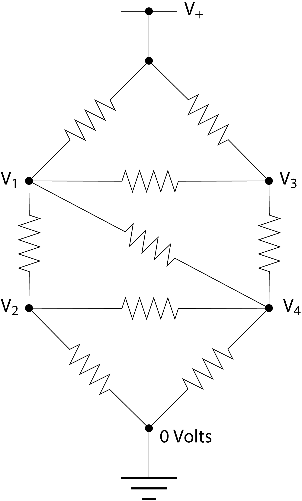
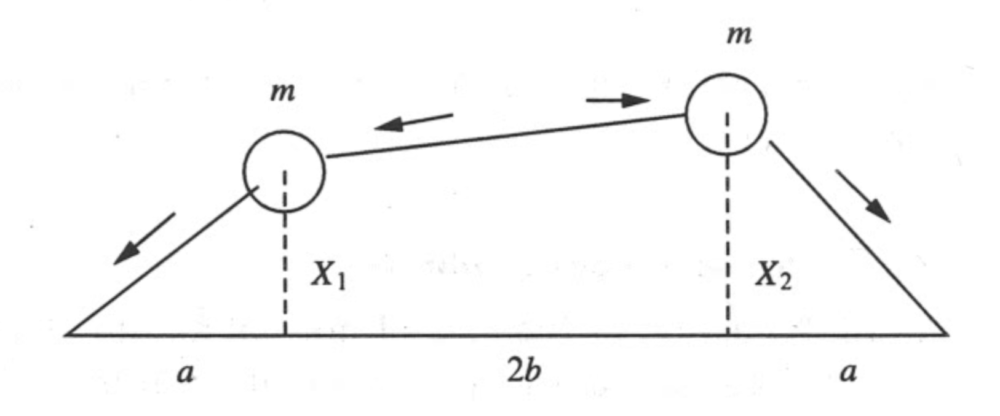
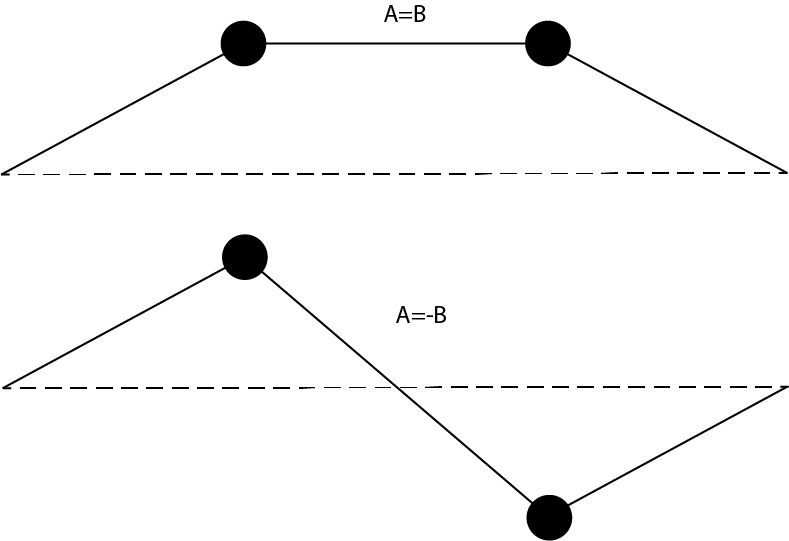

---
jupyter:
  jupytext:
    formats: ipynb,md
    text_representation:
      extension: .md
      format_name: markdown
      format_version: '1.3'
      jupytext_version: 1.16.1
  kernelspec:
    display_name: Python 3 (ipykernel)
    language: python
    name: python3
---

# Linear algebra

In this lecture, you will implement linear algebra techniques in Python. You will see that for solving physics problems using linear algebra, the most complicated part is to translate the physical problem into a matrix-vector equation. When put in a standardized form, many linear algebra tools are at your disposal in the numpy package.

**Learning objectives:** After finishing this lecture, you should be able to:

1. Solve a set of linear equations
2. Know when a set of linear equations can be solved
3. Determine eigenvalues and eigenvectors of a matrix 

```python nbgrader={"schema_version": 3, "solution": false, "grade": false, "locked": true, "task": false, "grade_id": "cell-a38e8c1bedad5850"}
# Initialisation code for the notebook
import numpy as np
import matplotlib.pyplot as plt
```

## Some basic vector operations

As we have seen earlier, numpy can do basic algebra with matrices and vectors, although we have to take care to correctly treat arrays as vectors, i.e. use them with the correct dimensions.

**Exercise 1**

Write a script for calculating the angle between two vectors in degrees. Start with vectors `a` and `b` as input and then find the angle. Evaluation of the angle must be done with a single line. Note that numpy does not care about the dimensions (column or row) as calculates the inner product for arrays. Howeve, take care that the script does not crash in case of faulty input (two vectors of different length for example). Output the angle to variable `theta`. Test your code with vectors for which you already know the outcome. 

```python
a=np.array([1, 0, 0])
b=np.array([0, 1, 0])

# theta = ...
# print(theta)
```

**Solution:**
``` python tags=["hide-input"] 
a=np.array([1, 0, 0])
b=np.array([0, 1, 0])

### BEGIN SOLUTION
if len(a)!=len(b):
    print('The length of the two vectors is not equal')
elif np.linalg.norm(b)==0 or np.linalg.norm(a)==0:
    print('The length of one of the two vectors is equal to zero')
else:
    theta=(180/np.pi)*np.arccos(np.inner(a,b)/np.linalg.norm(a)/np.linalg.norm(b))

print(theta)
### END SOLUTION
```

## Solving sets of linear equations with Gaussian elimination 

To understand how to solve a complicated physics problem in matrix algebra we are going to make solve for the currents in a complex electrical network. You will see how a long and complex code can be substituted with a single line of code from a Python package.

Consider the following circuit of resistors:


All the resistors have the same resistance $R$. The power rail at the top is at voltage $V_+$=5V. What are the other four voltages, $V_1$ to $V_4$?

To answer this question we use Ohm's law and the Kirchhoff current law, which says that the total net current flow out of (or into) any junction in a circuit must be zero. Thus for the junction at voltage $V_1$, for instance, we have

$$
{V_1-V_2\over R} + {V_1-V_3\over R} + {V_1-V_4\over R} + {V_1-V_+\over R} = 0,
$$

or equivalently

$$
4V_1 - V_2 - V_3 - V_4 = V_+.
$$

**Exercise 2**

Write with pen and paper similar equations for the other three junctions with unknown voltages. Define the matrix equation relating the four unknown voltages and the known parameters.

The most straightforward way to solve a set of equations is by means of Gaussian elimination. We can multiply any equation by a constant and subtract equations from each other while still obtaining the correct solution. This is utilized to make the matrix describing the linear set of equations upper triangular. The solution is then easily obtained by back-substitution from the bottom equation to the top. The program below can solve the four resulting equations using Gaussian elimination and find the four voltages. Use your result obtained above to set-up the correct `A` matrix and `v` vector for your problem. Go through it and notice how Python efficiently uses the matrix $A$ storage and works on entire rows by slicing.

NB: make sure to set up the matrix $A$ such that the soluion is on the form `x = [V1, V2, V3, V4]`. Also for the Gaussian elimination code to work (with the in-place division `A[m,:] /= div`) setup both $A$ and $v$ containing floats using the `dtype` argument of the numpy array function (or by entering your matrix using floating point numbers like 4.0 instead of 4, which would make it an `int` by default).

```python
from numpy import array,empty
# A = ...
# v = ...

N = len(v)

# Gaussian elimination
for m in range(N):
    # Divide by the diagonal element
    div = A[m,m]
    A[m,:] /= div
    v[m] /= div

    # Now subtract from the lower rows
    for i in range(m+1,N):
        mult = A[i,m]
        A[i,:] -= mult*A[m,:]
        v[i] -= mult*v[m]
print('The matrix after Gaussian elimiation is')
print(A)
        
# Backsubstitution
x = empty(N,float)
for m in range(N-1,-1,-1):
    x[m] = v[m]
    for i in range(m+1,N):
        x[m] -= A[m,i]*x[i]

print('The solution is')
print(x)

answer_6_02 = np.copy(x)
```

```python
# answer_6_02 (1 points)

to_check = ["answer_6_02"]
feedback = ""
passed = True
for var in to_check:
    res, msg = check_answer(eval(var), var)
    passed = passed and res
    print(msg)

assert passed == True
```

**Solution:**
``` python tags=["hide-input"] 
from numpy import array,empty
### BEGIN SOLUTION
A = array([[ 4, -1, -1, -1 ],
           [-1,  3,  0, -1 ],
           [-1,  0,  3, -1 ],
           [-1, -1, -1,  4 ]], float)
A0 = A.copy()
v = array( [ 5,  0,  5,  0 ],float)

print('The input matrix is')
print(A)

### END SOLUTION

N = len(v)

# Gaussian elimination
for m in range(N):
    # Divide by the diagonal element
    div = A[m,m]
    A[m,:] /= div
    v[m] /= div

    # Now subtract from the lower rows
    for i in range(m+1,N):
        mult = A[i,m]
        A[i,:] -= mult*A[m,:]
        v[i] -= mult*v[m]
print('The matrix after Gaussian elimiation is')
print(A)
        
# Backsubstitution
x = empty(N,float)
for m in range(N-1,-1,-1):
    x[m] = v[m]
    for i in range(m+1,N):
        x[m] -= A[m,i]*x[i]

print('The solution is')
print(x)

answer_6_02 = np.copy(x)
```


## Solving sets of linear equations

Solving sets of linear equations is not always trivial. For example, the matrix of coefficients can be non-square (more equations than unknowns) or have elements with zeros in it (leading to division by zero). In that case standard Gaussian elimination will not work. Alternatively, the equations may not be linear independent. Here we will investigate these issues by solving various sets of linear equations.

Consider the linear set of equations $Ax=b$.<br>

$$
\left[\begin{array}{cccc} 0 & 0 & 2 & 3\\4 & 2 & 3 & 1\\2 & 5 & 1 & 2\\1 & 0 & 0 & 1\end{array}\right]\left[\begin{array}{c}x_1\\x_2\\x_3\\x_4\end{array}\right]=\left[\begin{array}{c}5\\1\\7\\2\end{array}\right]
$$

This set of equation is solvable as $x=A^{-1}b$ when the matrix $A$ is invertible. There are many conditions that a matrix meets/does not meet when it is invertible/non-invertible. The most important ones for a square matrix to be invertible are
1. The matrix is full rank, i.e., the rank is equal to the number of rows/columns. This means that all rows/columns are linearly independent
2. The determinant of the matrix is non-zero, e.g., for a two-by-two matrix $A$ the inverse is proportional to (det$(A))^{-1}$ and therefore det$(A)$ needs to be non-zero in order for the inverse to exist.

If a matrix is non-invertible, the above mentioned conditions are not met, these matrices are also called  singular matrices.<br>

**Exercise 3** 

Calculate the following matrix properties:
* Inverse of the matrix $A$ using the `inv` function from the numpy linear algebra package. Name the inverse `invA`. 
* Rank of the matrix `A` with the numpy function `matrix_rank` and save it to parameter `rankA`
* Matrix determinant with the numpy function `det` and store it to variable `detA`.

Look in the help for more details on the functions.

```python
# invA = ...
# rankA = ...
# detA = ...

answer_6_03_1 = np.copy(invA)
answer_6_03_2 = np.copy(rankA)
answer_6_03_3 = np.copy(detA)
```

```python
# answer_6_03 (2 points)

question = "answer_6_03"
num = 3

to_check = [question + "_%d" % (n+1) for n in range(num)]
feedback = ""
passed = True
for var in to_check:
    res, msg = check_answer(eval(var), var)
    passed = passed and res
    print(msg)

assert passed == True
```

**Solution:**
``` python tags=["hide-input"] 
### BEGIN SOLUTION
A=np.array([[0, 0, 2, 3],[4, 2, 3, 1],[2, 5, 1, 2],[1, 0, 0, 1]])

invA=np.linalg.inv(A)

N=A.shape[1]

rankA=np.linalg.matrix_rank(A)
detA=np.linalg.det(A)

print('The matrix dimension is ' +str(N)+ ' and the rank is ' + str(rankA))
print('The matrix determinant is ' + str(detA) + ' and is non zero')

### END SOLUTION
answer_6_03_1 = np.copy(invA)
answer_6_03_2 = np.copy(rankA)
answer_6_03_3 = np.copy(detA)
```


Now see what happens if you lower the rank of the matrix by making last two rows identical. Print the matrix rank, matrix determinant to the command line. Can you calculate the inverse? And what if the rows are copies of each other differing only by a small number close to the machine precision, say 1e-16 or 1e-17. Play around and try it for yourself.

```python
# Your code here:

# print(np.linalg.matrix_rank(A))
# print(np.linalg.det(A))
# print(np.linalg.inv(A))
```

**Solution:**
``` python tags=["hide-input"] 
### BEGIN SOLUTION
A[3,:]=A[2,:]
print(np.linalg.matrix_rank(A))
print(np.linalg.det(A))

eps=1e-16
A[3,:]=(1-eps)*A[2,:]
print(np.linalg.matrix_rank(A))
print(np.linalg.det(A))
print(np.linalg.inv(A))
### END SOLUTION
```

As you have seen a set of linear equations can be solved using the matrix inverse `inv` for square matrices even when they have zero entries on the diagonal. Calculating the inverse with `inv` can be used to solve $Ax=b$ through multiplication as $x=A^{-1}b$. However, in many cases you want solve $Ax=y$ for different $y$ but with the same $A$. A more efficient way to do this is by using LU-decomposition and the function `solve`. Solve does not calculate the full inverse, but instead factorizes it to the set of equations much faster, by how much, we shall investigate now.

**Exercise 4**

Write a script to evaluate the differences in computational time between the inverse method and the solve method.  Perform the following steps
* Generate random  matrices  $A$  of  size  $N\times N$ and random  (column) vectors $b$ of size $N\times 1$ using the `rand` command from the numpy random library. 
* Compute the solution $x$ to $Ax = b$ using the `inv` method and the `solve` method
* Compute the time it takes for the computer to finish the calculation for both methods and store the calculation time. Look up lecture 2c for timing the computation time.
* Make a loop over a range of values for $N$, perform the calculation for every matrix size $N$ and store the computation times in an array. Take a range of values for $N$ between 100 and 1000 in ten steps on a logarithmic scale (e.g. use `np.geomspace` and round off to integer value).
* Make a plot of both calculation times as a function of $N$. Use a double logarithmic plot with the command `loglog` and `plt.grid(which='minor')`.  
* Finally, formulate a hypothesis for the dependence of computational time on $N$, i.e. propose a formula for this dependence. Read from the graph, by what factor is `solve` faster than `inv`.

In a log-log plot a dependence of $t \propto N^{p}$ corresponds to a linear line log $t=p $log $N$. Hence, the slope of the linear dependence is the exponent $p$. To determine power $p$ divide the number of units on the vertical scale with the number of units on the horizontal scale.

```python
# Your code here:
```

**Solution:**
``` python tags=["hide-input"] 
### BEGIN SOLUTION
from time import time

nmin = 100;
nmax = 1000;
n = 10;

Nmatrix = np.round(np.geomspace(nmin,nmax,n))

time_inv=np.zeros(n)
time_solve=np.zeros(n)

for j in range(n):
    N = int(Nmatrix[j])
    B = np.random.rand(N,N)
    y = np.random.rand(N,1)

    tstart = time()
    x = np.linalg.inv(B)@y
    tend=time()
    time_inv[j] = tend-tstart

    tstart = time()
    x = np.linalg.solve(B, y)
    tend=time()
    time_solve[j] = tend-tstart

plt.loglog(Nmatrix, time_inv, '-ob', label='inverse')
plt.loglog(Nmatrix, time_solve, '-or', label='solve')
plt.grid(which='minor')        
plt.xlabel('Matrix size')
plt.ylabel('Computation time (sec)')
plt.legend()

# linear log-log plot for large N with slope ~2 indicates an N^2 scaling of the computational time
# solve is close to a factor of two faster

### END SOLUTION
```

**Self check**
* Do you observe an approximately linear dependence (in log-log) of the computation time as a function of the matrix size?
* Do the linear curves for inverse and solve have an offset?
* Did you add a legend to your graph?

## Eigenvalues and eigenvectors
Eigenvalues and eigenvectors play an important role in physics. They are the solution to the eigenvalue equation

$$
A \vec{x} = \lambda \vec{x} \, ,
$$

where $A$ is a symmetric $N \times N$ matrix. The eigenvalue equation essentially means that the matrix $A$ operating on vector $\vec{x}$ changes the length of the vector, but not its' direction. For an $N \times N$ matrix there are $N$ eigenvalues and the eigenvectors have the property that they are orthogonal.

Here we are going to show that the calculation of eigenvalues and eigenvectors can be very useful to study the dynamics of mechanical systems. For this, we will consider the following case of two masses on tensioned springs that are free to move in the vertical direction:



Using classical mechanics, we can find that the equations of motions that describe the vertical motion of the two masses are given by:

$$
m \frac{\text{d}^2 X_1}{\text{d} t^2} &=& -T \frac{X_1}{a} + T\frac{X_2 - X_1}{2b}\\
m \frac{\text{d}^2 X_2}{\text{d} t^2} &=& -T \frac{X_2}{a} - T\frac{X_2 - X_1}{2b} \, .\\
$$

With the following trial solutions, which assume that the solutions are oscillating harmonic motion:

$$
X_1 &= A \text{cos}(\omega t + \phi) \\
X_2 &= B \text{cos}(\omega t + \phi) \, ,
$$

we can derive a system of set of coupled linear equations for the amplitudes $A$ and $B$, which one can express in matrix form as an eigenvalue problem of the form:

$$
\left[
\begin{array}{cc}
... & ... \\
... & ...
\end{array}
\right]
\begin{array}{cc}
A \\
B \\
\end{array}
= 
\lambda
\left[
\begin{array}{cc}
A \\
B \\
\end{array}
\right]
$$

From here, the solution of the problem becomes solving for the eigenvectors and eigenvalues of the matrix, which we can do in python using the linear algebra routines. 

**Exercise 5** 
Use pen and paper to write this system of equation as an eigenvalue problem. Take a picture of your derivation and upload it to your workspace as a JPG file named `my_derivation.jpg` using the "upload" button that is visible in the top right of the screen in your workspace:


After you upload the image, the image should be displayed here inline if you run the following code:

```python nbgrader={"schema_version": 3, "solution": false, "grade": false, "locked": true, "task": false, "grade_id": "cell-ee5ac85415361bd3"}
from IPython.display import Image
Image(filename="my_derivation.jpg")
```

Based on the matrix equation you derived, define in Python the matrix `A` that describes this problem as an eigenvalue problem. Fill it with the correct numbers given $T=1$, $m=2$, and $a=b=0.25$. Determine the eigenvalues `eigA` and eigenvectors `eigvA` with the ```eigh``` function of numpy for the system with $T=1$, $m=2$, and $a=b=0.25$. 

```python
# define parameters
T=1
m=2
a=0.25
b=0.25

# A = ...
# eigA = ...
# eigvA = ...

answer_6_05_1 = np.copy(A)
answer_6_05_2 = np.copy(eigA)
answer_6_05_3 = np.copy(eigvA)
```

```python
# answer_6_05 (2 points)

question = "answer_6_05"
num = 3

to_check = [question + "_%d" % (n+1) for n in range(num)]
feedback = ""
passed = True
for var in to_check:
    res, msg = check_answer(eval(var), var)
    passed = passed and res
    print(msg)

assert passed == True
```

**Solution:**
``` python tags=["hide-input"] 
# define parameters
T=1
m=2
a=0.25
b=0.25

### BEGIN SOLUTION

# setting up the system of equations
A = (1/m)*np.array([[ (T/a + T/2/b),  -T/2/b],
           [ -T/2/b,  (T/a + T/2/b)]], float)

eigA,eigvA=np.linalg.eigh(A)

omega1=np.sqrt(T/m/a)
print('The analytical answer for omega^2 is ' + str(omega1**2) + ' and the eigenvalue is ' + str(eigA[0]))
omega2=np.sqrt(T*(a+b)/m/a/b)
print('The analytical answer for omega^2 is ' + str(omega2**2) + ' and the eigenvalue is ' + str(eigA[1]))

### END SOLUTION
answer_6_05_1 = np.copy(A)
answer_6_05_2 = np.copy(eigA)
answer_6_05_3 = np.copy(eigvA)
```


The analytical eigenvalues can be calculated as

$$
\omega_1^2=\frac{T}{m a}
$$

and

$$
\omega_2^2=\frac{T(a+b)}{m a b}
$$

Compare your eigenvalues to the analytical result. Plot the positions of the particles and the string at $t=0$ and $\phi=0$ in a single graph. In this graph, create the shapes of the string as shown below



Use `np.concatenate` to add the fixed side points to the bead positions for plotting the string.<br>

Why are the eigenvectors from numpy quantitative, whereas the eigenvectors of calculated with numpy are relative $[A, B]$ and $[A, -B]$?

```python
# Your code here:
```

**Solution:**
``` python tags=["hide-input"] 
### BEGIN SOLUTION

plt.plot([a, a+2*b], eigvA[:,0], 'or', label=['mode 1: omega^2=', str(omega1**2)])
string1=np.concatenate(([0], eigvA[:,0], [0]))
plt.plot([0,a,a+2*b,2*(a+b)], string1, '-r')

plt.plot([a, a+2*b], eigvA[:,1], 'og', label=['mode 2: omega^2=', str(omega2**2)])
string2=np.concatenate(([0], eigvA[:,1], [0]))
plt.plot([0,a,a+2*b,2*(a+b)], string2, '-g')

plt.axhline(0,color='grey', linestyle=':')
plt.xlim((0,1))
plt.grid()
plt.legend(loc=2)

# numpy answer is just as correct any multiplicative factor operating on the eigenvector 
# results in an eigenvector as well
# substitution of lowest frequency results in A=B 

### END SOLUTION
```

With the eigenvalues solved, we can now solve the time-dynamics of the systems such that

$\begin{pmatrix} x_1(t) \\ x_2(t) \end{pmatrix} = A \cos(\omega_1 t) v_1 + B \cos(\omega_2 t) v_2$

where $\omega_1$ and $\omega_2$ are the eigenfrequencies (square-root of the eigenvalues) and $v_1$ and $v_2$ are the corresponding eigenvectors. For an inital position vector $x_0$, we can find the constants $A$ and $B$ as

$A = v_1^T x_0$ and $B = v_2^T x_0$

Calculate an array `xt` of dimension `(100,2)` such that `x[n]` corresponds to the position at the time `t[n]` when the starting point is `x0 = [1,0]`. Plot the position of both $x_1$ and $x_2$ as function of time in the same plot.

```python
v1 = eigvA[:,0]
v2 = eigvA[:,1]
x0 = np.array([1,0])

t = np.linspace(0,10,100)

# xt = ...


answer_6_05_4 = np.copy(xt)
```

```python
# answer_6_05_4 (1 points)

to_check = ["answer_6_05_4"]
feedback = ""
passed = True
for var in to_check:
    res, msg = check_answer(eval(var), var)
    passed = passed and res
    print(msg)

assert passed == True
```

**Solution:**
``` python tags=["hide-input"] 
v1 = eigvA[:,0]
v2 = eigvA[:,1]
x0 = np.array([1,0])

t = np.linspace(0,10,100)

### BEGIN SOLUTION
A = np.dot(v1,x0)
B = np.dot(v2,x0)

xt = np.zeros((100,2))

xt[:,0] = A*np.cos(omega1*t)*v1[0] + B*np.cos(omega2*t)*v2[0]
xt[:,1] = A*np.cos(omega1*t)*v1[1] + B*np.cos(omega2*t)*v2[1]

plt.plot(t, xt[:,0], label='x1')
plt.plot(t, xt[:,1], label='x2')

plt.xlim((0,10))
plt.legend()

plt.xlabel(r'Time, $t$')
plt.ylabel(r'Position, $x$')
### END SOLUTION

answer_6_05_4 = np.copy(xt)
```


Although in this case the solution can be obtained both analytically and with the computer we now have a framework to set up much more complicated systems of equations and solve them. Consider a string with $N$ particles spaced by distance $a$. The $x$-positions of the $i$th particle is given by $x_i=i \cdot a$. The system of motion of the $i$th particle is given by

$$
m \frac{\text{d}^2 x_i}{\text{d} t^2} &=& T \frac{x_{i-1} - x_i}{a} + T \frac{x_{i+1} - x_i}{a} \\
$$

Note that the string is fixed on the wall, hence, $x_0=x_{N+1}=0$.

**Exercise 6**

Set up a system of 50 particles on a string at distance $a=1$ relative to each other. _Hint_ : use the numpy function `eye` to quickly fill your matrix with diagonal and off-diagonal elements. Find the eigenvalues and eigenvectors. Plot the positions of the particles for the first 4 eigenmodes at $t=0$ and $\phi=0$ in a for loop. Automatically make a legend indicating the mode number.

```python
# Your code here:
```

**Solution:**
``` python tags=["hide-input"] 
### BEGIN SOLUTION

N=50
a=1
A=(2*T/a)*np.eye(N,N)-(T/a)*np.eye(N,N, 1)-(T/a)*np.eye(N,N, -1)
# note the sign change in A caused by the double derivative on the left hand side

x,V=np.linalg.eigh(A)
# for symmetric matrices (as expected for physics problems) only

for cnt in range(4):
    legstr=('mode'+str(cnt+1))
    plt.plot(V[:,cnt], '-o', label=legstr)

plt.xlabel('Particle number i')
plt.ylabel('Position')
plt.grid()
plt.legend()

### END SOLUTION
```

**Self-check**
* Do you observe a wave pattern in the amplitude of the particles?
* Why do we use the function `eigh` for solving this eigenvalue problem and not the `eig` function? Does it give the same results for this problem?

```python tags=["auto-execute-page", "thebe-init", "hide-input"]
## Pre-loading the solutions

import sys
await micropip.install("numpy")
from validate_answers import *

with open(location):
    pass # Initially this notebook does not recognise the file unless someone tries to read it first
```
