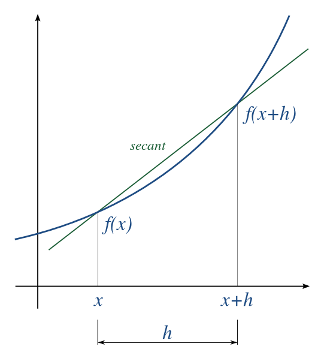
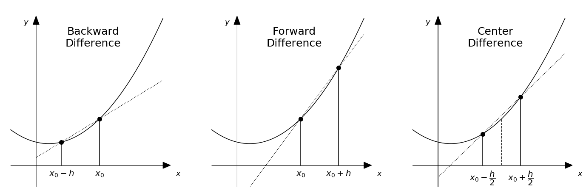

---
jupyter:
  jupytext:
    formats: ipynb,md
    text_representation:
      extension: .md
      format_name: markdown
      format_version: '1.3'
      jupytext_version: 1.16.1
  kernelspec:
    display_name: Python 3 (ipykernel)
    language: python
    name: python3
---

#```python tags=["hide-input", "auto-execute-page"]
```python tags=["auto-execute-page"]
## Code that will be run as soon as the page is loaded but hidden from the students.

# Load the answers (but leave other imports so the students can see them)
import sys
sys.path.insert(1, '/validate_answers/Numerical_differentiation')
from validate_answers import *
with open(location):
    pass # Initially this notebook does not recognise the file unless someone tries to read it first

# test
print(validate_answers.check_answer(None, "answer_3_01_1"))
```


# Numerical Differentiation 

In this notebook, you will explore taking numerical derivatives and implementating various interpolation schemes in one and two dimensions.

**Learning objectives:** After finishing this notebook, you should be able to:

1. Write a function to calculate the numerical derivative of an arbitrary function using both the forward difference and the central difference approximation
2. Interpret the error made in central and forward numerical derivatives
3. Calculate the numerical derivative of a dataset
<!-- #endregion -->

```python 
# Initialisation code for the notebook
import numpy as np
import matplotlib.pyplot as plt

# I like bigger plots: setting a higher DPI makes the fonts bigger
plt.rcParams['figure.dpi']=100
```


## Finite difference methods for calculating derivatives of functions

### Introduction

We will begin with considering calculating the numerical derivatives of functions, specifically using the technique of finite differences:

https://en.wikipedia.org/wiki/Finite_difference

In the simplest case, the derivative we want to calculate might be the derivative of a functions that we have an analytical expression for, such as $f(x) = ax^2$. In contrast to analytical integration, which can sometimes be challenging to perform and find a closed solution for, taking derivatives of functions is in general not so difficult (you likely learned this in your first calculus course!). For example, the derivative of $f(x)$ above is simply $f'(x) = 2ax$. 

You might ask: if it is always possible to analytically calculate the derivative of a function, why would I bother calculating the derivative with a computer? Some quick answers:

* It is handy 
* Sometimes you don't know the function
* Finite difference is a key concept in solving many numerical problems

A first reason is that it is just handy sometimes to calculate the derivative numerically, it saves you time in having to calculate the analytical derivative by hand. For example, later, when we solve differential equations, we will use code routines from libraries to get solutions, and then it is handy for us if we only need to provide the function, and not it's derivatives. The same is true for curve fitting: curve fitting routines also use derivatives of the fitting functions, which they calculate numerically so that the user using them doesn't have to think about it. 

A second reason is that in a computer program, you can implement functions that are not necessarily simple analytical formulas. For example, $f(x)$ in a computer could return the result of a numerical simulation. Or it could be a random number. Or it could be a piecewise function:

```
def my_funny_function(x):
    if (x<0):
        return 0
    else:
        return x**2
```

If we calculate the calculate the derivative of `my_funny_function(x)` numerically, then I don't even need to know what happens inside of the function.

Finally, a third important reasons is that the concept of finite difference methods for calculating derivatives also forms the basis of important numerical algorithms used for solving equations in physics, such as Maxwells equtions, the Schroedinger equation, and more. 

### Overview of finite difference methods

All finite difference methods are based on approximating a derivative of a function at a point by the slope of a line connecting two points separated by a distance $h$:

$$
\frac{df}{dx} \approx 
\frac{f(x+h) - f(x)}{h}
$$

The idea is illustrated in this image from wikipedia, where the formula above calculates the *secant*: 



The approximation becomes exact in the limit $\Delta x \rightarrow 0$, but in a computer we will work with a non-zero $\Delta x$. A subtle point of the above equation is: to which point $x$ do we assign the value of $df/dx$ from this formula? Do we choose it to be the value of the derivative at $x$? Or the value at $x = x+h$? Or somewhere in between?

Generally speaking, people distinguish three different common choices for this: 

* **Backward difference** Approximates that the secant is the derivative in the right side of the plot $df/dx = f'(x+h)$
* **Forward difference** Approximates that the secant is the derivative at the left side of the above plot: $df/dx = f'(x)$
* **Center difference** Approximates that the secant is the derivative in the middle of the plot $df/dx = f'(x+h/2)$


In the specific example above, we can see that the secant will over-estimate the derivative at position $x$ (the secant is steeper than the slope of the function at that point): this means that the forward difference approximation will overestimate the derivative in this case. Conversely, in the example above, the secant will underestimate the slope of the function at $x+h$, and so the backwards difference will underestimate the derivative in this case. 

To explain the terminology further, it is useful to remember that the forward difference uses a point in *front* of where we are (at larger x) to estimate the derivative, the backwards derivative uses a point *behind* where we are to estimate the derivative, and the center difference uses equally spaced points forward and backwards to estimate the derivative. These three are illustrated here for estimating the derivative at a position $x_0$:



And, as you can already maybe guess looking at these two examples, the center difference gives the most accurate approximation of the derivative $df/dx$ at position $x_0$, something we will explore below.

### Definition of the three techniques

Having explored the basic ideas above, we give here the formal definitions of the three techniques. The forward difference as:

$$
f'_F(x,h) = \frac{f(x+h) - f(x)}{h}
$$

The backward difference is defined as:

$$
f'_B(x,h) = \frac{f(x) - f(x-h)}{h}
$$

and the center difference as:

$$
f'_C(x,h) = \frac{f(x+h/2) - f(x-h/2)}{h}
$$

### Order of the errors made

Using a Taylor expansion, one can also estimate the errors made in the above approximations of the derivative (see for example the <a href=https://en.wikipedia.org/wiki/Finite_difference#Relation_with_derivatives>wikipedia page</a>).

The forward difference approximation result in an error $\epsilon_F = f'_F(x,h) - f'(x)$ that is *first order* in $h$, ie. proportional to $h$:

$$
\epsilon_F \propto h |f''(x)| \hspace{1em} {\rm as}\  h \rightarrow 0
$$

where $f''(x)$ is the second derivative of the function. 

A common notation for this in computer science big-O notation, which is used to define the asymptotic limits of functions. Basically, $ = \mathcal{O}(h)$ means the same thing as $\propto h$, and in words we would read this as "the error is order h". We can then write:

$$
\epsilon_F = \mathcal{O}(h) \hspace{1em} {\rm as}\  h \rightarrow 0
$$

Similarly, the error for the backwards difference is also $\mathcal O(h)$:

$$
\epsilon_B = \mathcal{O}(h) \hspace{1em} {\rm as}\  h \rightarrow 0
$$

The center difference is actually more accurate:

$$
\epsilon_C = \mathcal{O}(h^2) \hspace{1em} {\rm as}\  h \rightarrow 0
$$

It is often used for this reason, although can suffer from problems with periodic function (see wikipedia page if you are interested in learning more).

### Higher order approximations of derivatives 

If one would like to have a more accurate estimate of the derivative without taking a smaller value of $h$, one can also use higher order approximations of the derivative: for example, the following forward difference approximation is a more complicated formula: 

$$
\frac{df}{dx} \approx \frac{f(x+2h)-4f(x+h)+3f(x)}{2h}
$$

but gives an error order $\mathcal O(h^2)$. (This forms the basis of the Runge-Kutta techniques for solving differential equations that we will look at later in the course.)

### Higher order derivatives

One can also extend the above techniques to calculate second-order derivatives (or even higher if needed). For example, in the center difference approximation,  

$$
\frac{d^2f}{dx^2} \approx \frac{f(x+h)-2f(x)+f(x-h)}{h^2}
$$

which is a formula we will use later when we are solving the Poisson equation. 

## Exercises 

### Benchmarking the numerical derivative 

To illustrated the above concepts, we will use python code to calculate the derivative of the function: 

$$
f(x) = 1+\frac{1}{2} \tanh 2x
$$

We will do this using different techniques, and perform "benchmarking" of these techniques by comparing the numerically calculated derivative with the analytical answer. 

**Exercise 1:** Calculate the derivative of this function analytically (ie. with a pen and paper). Program the two results into two python functions. Create variable arrays `y` and `y_prime` with the value $y = f(x)$ and $y' = f'(x)$ respectively, with x in the range $-2 \leq x \leq 2$ and 100 points.  Make plots of $f(x)$ and its derivative $f'(x)$.

```python
def f(x):
    # ...
    
def fp(x):
    # ...
    
# x = ....
# y = ....
# y_prime = ....

# Now the plot (with labels and legend of course!)

answer_3_01_1 = np.copy(x)
answer_3_01_2 = np.copy(y)
answer_3_01_3 = np.copy(y_prime)
```

```python
## Check answer ##
question = "answer_3_01"
num = 3

to_check = [question + "_%d" % (n+1) for n in range(num)]
feedback = ""
passed = True
for var in to_check:
    res, msg = check_answer(eval(var), var)
    passed = passed and res
    print(msg); feedback += msg + "n"

assert passed == True, feedback
```

**Solution:**
``` python tags=["hide-input"] 
def f(x):
    ### BEGIN SOLUTION
    return 1+0.5*np.tanh(2*x)
    ### END SOLUTION
    
def fp(x):
    ### BEGIN SOLUTION
    return 1/np.cosh(2*x)**2
    ### END SOLUTION
    
# x = ....
# y = ....
# y_prime = ....
### BEGIN SOLUTION
x = np.linspace(-2,2,100)
y = f(x)
y_prime = fp(x)
### END SOLUTION

# Now the plot (with labels and legend of course!)
### BEGIN SOLUTION
plt.plot(x, f(x), label='f(x)')
plt.plot(x, fp(x), label="f'(x)")
plt.legend()
plt.ylabel("f(x), f'(x)")
plt.xlabel("x")
### END SOLUTION

answer_3_01_1 = np.copy(x)
answer_3_01_2 = np.copy(y)
answer_3_01_3 = np.copy(y_prime)
```


**Self check:**

* Does your plot have axis labels?
* Does it have a legend?

**Exercise 2:** Now, we will write a function to calculate the derivative numerically with a given step size $h$ and compare our numerically calculated derivative with that of the analytical answer.

Write two functions that calculates the derivative of a function numerically, one using the forward difference method, and once using the central difference method.

Use these functions calculate $f'(x)$ at $x=1$ for $h=0.5$, and compare your numerically calculated derivatives to the correct answer from the analytical formula.


```python
def diff_forward(f,x,h):
    # ...

def diff_center(f,x,h):
    # ...

x0=1
h=0.5

# yd_analytical = 
# yd_forward = 
# yd_center = 
# error_forward = 
# error_center = 

print("Forward:    %f   Error: %f" % (yd_forward, error_forward))
print("Central:    %f   Error: %f" % (yd_center, error_center))
print("Analytical: %f" % yd_analytical)

answer_3_02_1 = (yd_forward, error_forward)
answer_3_02_2 = (yd_center, error_center)
answer_3_02_3 = yd_analytical
```

```python
## Check answer ##
question = "answer_3_02"
num = 3

to_check = [question + "_%d" % (n+1) for n in range(num)]
feedback = ""
passed = True
for var in to_check:
    res, msg = check_answer(eval(var), var)
    passed = passed and res
    print(msg); feedback += msg + "n"

assert passed == True, feedback
```

**Solution:**
``` python tags=["hide-input"] 
def diff_forward(f,x,h):
    ### BEGIN SOLUTION
    return (f(x+h)-f(x))/h
    ### END SOLUTION

def diff_center(f,x,h):
    ### BEGIN SOLUTION
    return (f(x+h/2)-f(x-h/2))/h
    ### END SOLUTION

x0=1
h=0.5

# yd_analytical = 
# yd_forward = 
# yd_center = 
# error_forward = 
# error_center = 

### BEGIN SOLUTION
yd_analytical = fp(x0)
yd_forward = diff_forward(f,x0,h)
yd_center = diff_center(f,x0,h)

error_forward = yd_forward - yd_analytical
error_center = yd_center - yd_analytical
### END SOLUTION

print("Forward:    %f   Error: %f" % (yd_forward, error_forward))
print("Central:    %f   Error: %f" % (yd_center, error_center))
print("Analytical: %f" % yd_analytical)

answer_3_02_1 = (yd_forward, error_forward)
answer_3_02_2 = (yd_center, error_center)
answer_3_02_3 = yd_analytical
```

To think about: Which is more accurate, the forward or the central derivative?

**Exercise 3:** Repeat the calculation of Exercise 2 but now at $x=0$.

```python
# yd_analytical = 
# yd_forward = 
# yd_center = 
# error_forward = 
# error_center = 

print("Forward:    %f   Error: %f" % (yd_forward, error_forward))
print("Central:    %f   Error: %f" % (yd_center, error_center))
print("Analytical: %f" % yd_analytical)

answer_3_03_1 = (yd_forward, error_forward)
answer_3_03_2 = (yd_center, error_center)
answer_3_03_3 = yd_analytical
```

```python
## Check answer ##
question = "answer_3_03"
num = 3

to_check = [question + "_%d" % (n+1) for n in range(num)]
feedback = ""
passed = True
for var in to_check:
    res, msg = check_answer(eval(var), var)
    passed = passed and res
    print(msg); feedback += msg + "n"

assert passed == True, feedback
```

**Solution:**
``` python tags=["hide-input"] 
### BEGIN SOLUTION
x0=0
h=0.5

yd_analytical = fp(x0)
yd_forward = diff_forward(f,x0,h)
yd_center = diff_center(f,x0,h)

error_forward = yd_forward - yd_analytical
error_center = yd_center - yd_analytical
### END SOLUTION

print("Forward:    %f   Error: %f" % (yd_forward, error_forward))
print("Central:    %f   Error: %f" % (yd_center, error_center))
print("Analytical: %f" % yd_analytical)

answer_3_03_1 = (yd_forward, error_forward)
answer_3_03_2 = (yd_center, error_center)
answer_3_03_3 = yd_analytical
```


**Exercise 4** Calculate the derivative of the function for a $x$ ranging from $-2 \leq x \leq 2$ with 100 points using the forward and the central difference methods with $h = 0.5$. 

(You can make use of the functions you defined above.)

Make a plot of the forward difference derivative and the central difference derivative vs. x, along with the analytical solution. 

```python
# The spacing
h=0.5

# Our array of points at which to perform the calculations
# x=np.linspace(__,__,__)

# The derivatives
# yd_center = ___
# yd_forward = ___
# yd_analytical = ____

# The plot

answer_3_04_1 = np.copy(x)
answer_3_04_2 = np.copy(yd_center)
answer_3_04_3 = np.copy(yd_forward)
answer_3_04_4 = np.copy(yd_analytical)
```

```python
## Check answer ##
question = "answer_3_04"
num = 4

to_check = [question + "_%d" % (n+1) for n in range(num)]
feedback = ""
passed = True
for var in to_check:
    res, msg = check_answer(eval(var), var)
    passed = passed and res
    print(msg); feedback += msg + "n"

assert passed == True, feedback
```

**Solution:**
``` python tags=["hide-input"] 
# The spacing
h=0.5

# Our array of points at which to perform the calculations
# x=np.linspace(__,__,__)
### BEGIN SOLUTION
x=np.linspace(-2,2,100)
### END SOLUTION

# The derivatives
# yd_center = ___
# yd_forward = ___
# yd_analytical = ____
### BEGIN SOLUTION
yd_center = diff_center(f,x,h)
yd_forward = diff_forward(f,x,h)
yd_analytical = fp(x)
### END SOLUTION

# The plot
### BEGIN SOLUTION
plt.plot(x,yd_center, label='Center')
plt.plot(x,yd_forward, label='Forward')
plt.plot(x,yd_analytical, label='Analytical')
plt.ylabel("Numerical Derivative")
plt.xlabel("x")
plt.legend()
### END SOLUTION

answer_3_04_1 = np.copy(x)
answer_3_04_2 = np.copy(yd_center)
answer_3_04_3 = np.copy(yd_forward)
answer_3_04_4 = np.copy(yd_analytical)
```


**Self check:**


* Does your plot have axis labels?
* Does it have a legend?

What do you see in the plot? What can you interpret in the plot?

**Exercise 5:** Here, you will make a plot of the error of the forward difference derivative, and also a plot of the function f(x), in two plots beside each other. The idea is to try to understand the value of the error (is it large, is it small, is it positive, is it negative) base on the shape of the function.

Your x-range should extend from -2 to 2 with 100 points. 

To make two plots beside each other, you will use the matplotlib subplot capabilities:


Start your subplot using the command `fig.subplots(figsize=(10,4))`. To make your left hand plot, run the command `plt.subplot(121)` then use the usual plot commands to make your plot. To make a plto in the right hand plot, then use the command `plt.subplot(122)` and then add the commands to make the plot in second plot.

Your left plot should plot the error, defined as the difference between the derivative calculated by the finite difference method, and the analytical answer:

$$
\mathrm{error} = 
\left (\frac{df}{dx} \right)_{\mathrm{fwd}} - 
\left ( \frac{df}{dx} \right)_{\mathrm{analytical}}
$$

In this plot of the error, make a vertical line at $x=0$ using the  `plt.axvline()` command, and a horizontal line at $y=0$ using the `plt.axhline()` command. 

In the right plot, plot the function $f(x)$ as a function of $x$. For this plot, add a vertical line at $x=0$. 


```python
plt.subplots(figsize=(12,4))
plt.subplot(121)

# plt.plot(....)
# .....

plt.axvline(0, ls=":", color="grey")
plt.axhline(0, ls=":", color="grey")

plt.subplot(122)

plt.axvline(0, ls=":", color="grey")
```

**Solution:**
``` python tags=["hide-input"] 
plt.subplots(figsize=(12,4))
plt.subplot(121)

# plt.plot(....)
# .....
### BEGIN SOLUTION
plt.plot(x, yd_forward-yd_analytical)
plt.ylabel("Fwd Derivative Error")
plt.xlabel("x")
### END SOLUTION

plt.axvline(0, ls=":", color="grey")
plt.axhline(0, ls=":", color="grey")

plt.subplot(122)
### BEGIN SOLUTION
plt.plot(x, f(x), label='f(x)')
plt.ylabel("f(x)")
plt.xlabel("x")
### END SOLUTION

plt.axvline(0, ls=":", color="grey")
```

**Self check:**

* Does your plot have axis labels?

Can you explain why the forward difference overestimates the derivative for $x = -0.5$ and underestimates it for $x = 0.5$? 

*(Hint: take a look at the shape of the function as was plotted in figure 1,  think about how the forward difference calculates the derivative, and then think about how the shape of the function affects the error in the forward derivative calculation.)*


### Scaling of error with step size

In this section, we will calculate the scaling of the error incurred by different techniques for numerical differentiation of a function of step size $h$ and compare this with what we expect. 

**Exercise 6** Write a loop that calculates the numerical derivative $f'(x)$ at $x=1$, using the forward, center, and backwards difference formulats. In your loop, perform your calculation for 100 different values of $h$ spaced evenly spaced on log scale from $h = 1\times10^{-6}$ to $h = 1$. For this, you can use the `geomspace`  function:

https://docs.scipy.org/doc/numpy/reference/generated/numpy.geomspace.html

You can also use `logspace` if you want, but it is a bit tricker since using the `logspace` function, you can't specify the endpoints . 

Make a log-log plot of the error $\epsilon$ vs $h$ for the three techniques (three lines on the same graph), with $\epsilon$ defined as:

$$
\epsilon = |f'_{calc}(1) - f'(1)|
$$

where $f'_{calc}$ is the numerically calculated derivative and $f'$ is the analytical answer. 

```python
N = 100

# Code to define any functions you need, calculate the derivatives
# for 100 values of h, and make a plot with axis labels.
# h = ...

# Your code should produce three numpy arrays:
# err_forward, err_center, err_backward, along with the array h
# of points spaced equally on a logarithmic axis

def diff_backward(f,x,h):

# err_forward = ...
# err_center = ...
# err_backward = ...
    

# It's handy on this plot to have a grid
plt.grid()

answer_3_06_1 = h.copy()
answer_3_06_2 = err_forward.copy()
answer_3_06_3 = err_center.copy()
answer_3_06_4 = err_backward.copy()
```

```python
## Check answer ##
question = "answer_3_06"
num = 4

to_check = [question + "_%d" % (n+1) for n in range(num)]
feedback = ""
passed = True
for var in to_check:
    res, msg = check_answer(eval(var), var)
    passed = passed and res
    print(msg); feedback += msg + "n"

assert passed == True, feedback
```

**Solution:**
``` python tags=["hide-input"] 
N = 100

# Code to define any functions you need, calculate the derivatives
# for 100 values of h, and make a plot with axis labels.

# Your code should produce three numpy arrays:
# err_forward, err_center, err_backward, along with the array h
# of points spaced equally on a logarithmic axis

def diff_backward(f,x,h):
    ### BEGIN SOLUTION
    return (f(x)-f(x-h))/h
    ### END SOLUTION
    
### BEGIN SOLUTION
h = np.geomspace(1e-6,1,N)

fp_forward = np.zeros(N)
fp_center = np.zeros(N)
fp_backward = np.zeros(N)

for i in range(N):
    fp_forward[i] = diff_forward(f,1,h[i])
    fp_center[i] = diff_center(f,1,h[i])
    fp_backward[i] = diff_backward(f,1,h[i])

err_forward = np.abs(fp_forward - fp(1))
err_center = np.abs(fp_center - fp(1))
err_backward = np.abs(fp_backward - fp(1))

plt.loglog(h, err_forward,'.', label="Forward")
plt.loglog(h, err_center,'.', label="Center")
plt.loglog(h, err_backward, '.', label="Backward")
plt.legend()
plt.ylabel("Error $\epsilon$")
plt.xlabel("Step size $h$")
### END SOLUTION

# It's handy on this plot to have a grid
plt.grid()

answer_3_06_1 = h.copy()
answer_3_06_2 = err_forward.copy()
answer_3_06_3 = err_center.copy()
answer_3_06_4 = err_backward.copy()
```

**Self check:**

* Does you plot have: legend, axis labels? 
* Do the different techniques show the scaling that you would expect? 
* What happens to the center difference curve for the smallest values of h? 
<!-- #endregion -->

## Numerical derivatives of data

Here, we will explore varios aspects of taking the derivative of numerically sampled datasets, for example like the data that might come out of a measurement in a physics experiment.

In this case, things are a bit simpler, as we do not need to think about the value of the spacing $h$ since this is determined by the spacing in the sampling of the data. Let's look at an explicit example. Say we have a data set of 5 points corresponding to voltages measured at 5 different times:

```
# t (s), V (V)
0, 1
1, 2
2, 5
3, 10
4, 17
```

If we loaded this into python, we would then get two vectors, one for the time, and one for the voltage:

```
t = [0, 1, 2, 3, 4]
v = [1, 2, 5, 10, 17]
```

We can then define the derivative $v'(t) = dV/dt$ as:

$$
v'(t_n) = \frac{v(t_{n+1}) - v(t_n)}{t_{n+1} - t_n}
$$

In the example above, the measurements are evenly spaced in time so $t_{n+1} - t_{n} = \Delta t = 1$ for all $n$, and then we have a simple result for the derivative array:

```
v_prime = [1, 3, 5, 7]
```

Note that when I take the derivative of the data, I always end up with one less point in my resulting array than I started with! This is because there is no $n+1$ point for the last point in the array `v` that I started with. 

Using the finite difference method, it is pretty clear what the array `v_prime` should be. But at which time do these points correspond to? Clearly we cannot simply reuse the original array `t` since it is a different length!!

The answer is that it depends on which approximation we use (forward, center, or backward difference). In fact, for numerical data, the `v_prime` array is the same for all three cases! The difference is which *times* we assign these values to. If we take the forward difference approximation, we would take:

```
t_forward = [0, 1, 2, 3]
```

For the backward difference approximation, we would take:

```
t_backward = [1, 2, 3, 4]
```

while for the center difference, we could take:

```
t_center = [0.5, 1.5, 2.5, 3.5]
```

As a final note, when working with numerical data, we can also define a center difference that takes the distance for the derivative as twice the time separation of the points, $h = 2\Delta t$ and uses:

$$
v'(t_n) = \frac{v(t_{n+1}) - v(t_{n-1})}{t_{n+1} - t_{n-1}}
$$

In this case, our `v_prime` array would be even smaller, since we also there is also no point $n-1$ for the first point. In the example above, we would then have: 

```
v_prime2 = [2, 4, 6]
```

and 

```
t_center2 = [1, 2, 3]
```

Although we lose points at both ends, this does have the advantage that there are accurate estimates of the derivatives at time values that are the same as in the original `t` array (unlike the alternative center difference above that gives accurate slopes halfway between the times in the original `t` array). 

## Exercises

We will consider a data set take from a sinusoidal function of time $f(t) = \sin(t)$, with a relatively low sampling rate. 

For example, this could represent a measurement of an ideal sine wave that is sampled by an oscilloscope.


**Exercise 7:** Plot the data of a sparsly sampled sinusoid with 25 points between $t = 0$ and $t = 4 \pi$.

```python
N=25
# t = np.linspace(____)
# data = ____
# ...


answer_3_07_1 = np.copy(t)
answer_3_07_2 = np.copy(data)
```

```python
## Check answer ##
question = "answer_3_07"
num = 2

to_check = [question + "_%d" % (n+1) for n in range(num)]
feedback = ""
passed = True
for var in to_check:
    res, msg = check_answer(eval(var), var)
    passed = passed and res
    print(msg); feedback += msg + "n"

assert passed == True, feedback
```

**Solution:**
``` python tags=["hide-input"] 
N=25
# t = np.linspace(____)
# data = ____
# ...

### BEGIN SOLUTION
t = np.linspace(0,4*np.pi,N)
data = np.sin(t)

plt.plot(t,data, '-o')
plt.axhline(0,c='grey', ls=':')
plt.xlabel('t')
plt.ylabel('f(t)')
### END SOLUTION

answer_3_07_1 = np.copy(t)
answer_3_07_2 = np.copy(data)
```

**Exercise 8:** Calculate and plot forward derivative of the numerical data, along with the correct value from the analytical derivative of a sine function. 


```python
# fwd_derv = np.zeros(_____)

# for i in range(_____):
#     .....

# We also need to adjust the t vector (do you remember why and how?)   
# t_fwd = ....

# analytical_derv = _____

# And now a nice plot (for free this time)
plt.plot(t, analytical_derv, '-o', label = "$\cos(x)$")
plt.plot(t_fwd, fwd_derv, '-o', label = "Fwd")
plt.legend()
plt.xlabel('t')
plt.ylabel("f'(t)")
plt.axhline(0,c='grey', ls=':')

answer_3_08_1 = np.copy(fwd_derv)
answer_3_08_2 = np.copy(t_fwd)
answer_3_08_3 = np.copy(analytical_derv)
```

```python
## Check answer ##
question = "answer_3_08"
num = 3

to_check = [question + "_%d" % (n+1) for n in range(num)]
feedback = ""
passed = True
for var in to_check:
    res, msg = check_answer(eval(var), var)
    passed = passed and res
    print(msg); feedback += msg + "n"

assert passed == True, feedback
```

**Solution:**
``` python tags=["hide-input"] 
# fwd_derv = np.zeros(_____)
### BEGIN SOLUTION
fwd_derv = np.zeros(N-1)
### END SOLUTION

# for i in range(_____):
#     .....
### BEGIN SOLUTION
for i in range(0,N-1):
    fwd_derv[i] = (data[i+1]-data[i]) / (t[i+1]-t[i])
### END SOLUTION

# We also need to adjust the t vector (do you remember why and how?)   
# t_fwd = ....
### BEGIN SOLUTIONS
t_fwd = t[0:N-1]
### END SOLUTIONS

# analytical_derv = _____
### BEGIN SOLUTION
analytical_derv = np.cos(t)
### END SOLUTIONS

# And now a nice plot (for free this time)
plt.plot(t, analytical_derv, '-o', label = "$\cos(x)$")
plt.plot(t_fwd, fwd_derv, '-o', label = "Fwd")
plt.legend()
plt.xlabel('t')
plt.ylabel("f'(t)")
plt.axhline(0,c='grey', ls=':')

answer_3_08_1 = np.copy(fwd_derv)
answer_3_08_2 = np.copy(t_fwd)
answer_3_08_3 = np.copy(analytical_derv)
```


Compare the analytical answer with the forward derivative approximation. How accurate is it? What seems wrong with it? 


**Exercise 9:** Although the derivative seems on first inspection quite inaccurate, there is actually a small fix that can change this. In particular, although the forward derivative calculates the derivative at the sampled time steps relatively inaccurately, it does do a pretty good job at calculating the derivative at times halfway *between* the sampled time points. 

Write code below so that you calculate the center difference derivative at points halfway between the sampling points. (Hint: you don't have to do much work! But you will need a new time array.) 

Calculate the analytical answer $\cos(x)$ for the derivative at these same timesteps, and make a plot showing the two.

```python

# t_new = ...
# analytical_derv_new = ...


# now make the plot
plt.plot(t_new, fwd_derv, '-o', label='Fwd Shifted')
plt.plot(t_new, analytical_derv_new, '-o', label='Analytical')
plt.legend()
plt.ylabel("f'(t)")
plt.xlabel('t')
plt.axhline(0,c='grey', ls=':')

answer_3_09_1 = np.copy(t_new)
answer_3_09_2 = np.copy(analytical_derv_new)
```

```python
## Check answer ##
question = "answer_3_09"
num = 2

to_check = [question + "_%d" % (n+1) for n in range(num)]
feedback = ""
passed = True
for var in to_check:
    res, msg = check_answer(eval(var), var)
    passed = passed and res
    print(msg); feedback += msg + "n"

assert passed == True, feedback
```

**Solution:**
``` python tags=["hide-input"] 

# t_new = ...
# analytical_derv_new = ...

### BEGIN SOLUTION
dt = t[1]-t[0]
t_new = t_fwd + dt/2
analytical_derv_new = np.cos(t_new)
### END SOLUTION

# now make the plot
plt.plot(t_new, fwd_derv, '-o', label='Fwd Shifted')
plt.plot(t_new, analytical_derv_new, '-o', label='Analytical')
plt.legend()
plt.ylabel("f'(t)")
plt.xlabel('t')
plt.axhline(0,c='grey', ls=':')

answer_3_09_1 = np.copy(t_new)
answer_3_09_2 = np.copy(analytical_derv_new)
```


## Vectorising numerical derivatives

When calculating the numerical derivatives of data above, the simplest way to do this is to use a `for` loop to create a new array based on looping over the contents of the old array. 

As discussed in the introduction course notebooks, `for` loops in python are very slow because they are based on "interpreted loops". A much faster way to do such calculations is to make use of "slicing" to perform "vectorised" calculations, in which the for-loops are performed by highly efficient pre-compiled libraries. 

As an example, let's consider calculating the forward derivative of a dataset stored in an array `v[i]` with `N` points as a function of the dependent variable `t[i]`, which could represent a measured voltage as a function of time.

In this case, the entries of the output array `dvdt` would be given by:

```
dvdt[i] = (v[i+1]-v[i])/(t[i+1]-t[i])
```

Important to notice is that the array `dvdt` will be one point shorter than the original array `v` since that calculation can only proceed until `i=(N-1)-1` (the extra `-1` in the brackets is because python counts from zero...). 

Now, let's say we wanted to "vectorise" the calculation above. How would we go about that? 

One way we could do that is to make a couple of new arrays, which I will do here with new names that will look a lot like the formula above using slicing:

```
v_i = v[:-1]
v_i_plus_1 = v[1:]
t_i = t[:-1]
t_i_plus_1 = t[1:]
```

Note that all of these arrays are now size `N-1`, and the first entry `v_i[0] = v[0]` while the first entry `v_i_plus_1[0] = v[1]`. Also note the careful use of slicing to use `[:-1]` to skip the last entry and using `[1:]` to skip the first entry (remember again python counts from zero...). By doing this, I can then use the vectorisation of numpy to calculate the output array `dvdt` in one step with no `for` loop:

```
dvdt = (v_i_plus_1 - v_i)/(t_i_plus_1 - t_i)
```

Note that this will be **much** faster since the calculation will be performed by "precompiled" for loops. 

Let's look at an example, now skipping the intermediate variable names and putting the vectorisation directly into the code:

```python
t = np.linspace(0,10,1000) 
v = t**2
dvdt = (v[1:]-v[:-1])/(t[1:]-t[:-1])
```

```python
plt.subplots(figsize=(14,4))
plt.subplot(121)
plt.plot(t,v)
plt.xlabel("t")
plt.ylabel("v")
plt.subplot(122)
# Note that we need to pick out only the first N-1 points of the t-array for plotting
# Otherwise, t and dvdt are not the same size!
plt.plot(t[:-1], dvdt)
plt.xlabel("t")
plt.ylabel("dvdt")
plt.show()
```

**Exercise 10:** Write code that uses slicing to calculate the center derivative of a dataset constructed from the function $v = \sin(t)$ for an array `t` that runs from 0 to 10 with 1000 points. Evaluate the center derivative at the positions of original points, not between them, which means that your output array should be two points smaller in size than the input. 

```python

# dvdt = ...

# Have a look at the plots to see if your answer looks reasonble
plt.subplots(figsize=(14,4))
plt.subplot(121)
plt.plot(t,v)
plt.xlabel("t")
plt.ylabel("v")
plt.axhline(0,ls=":", c='gray')
plt.axvline(0,ls=":", c='gray')
plt.subplot(122)
# Note that with the instructions above, this is the correct time array
# for plotting the center derivative
plt.plot(t[1:-1], dvdt)
plt.xlabel("t")
plt.ylabel("dvdt")
plt.axhline(0,ls=":", c='gray')
plt.axvline(0,ls=":", c='gray')
plt.show()

answer_3_10_1 = dvdt
```

```python
## Check answer ##
question = "answer_3_10"
num = 1

to_check = [question + "_%d" % (n+1) for n in range(num)]
feedback = ""
passed = True
for var in to_check:
    res, msg = check_answer(eval(var), var)
    passed = passed and res
    print(msg); feedback += msg + "n"

assert passed == True, feedback
```

**Solution:**
``` python tags=["hide-input"] 
### BEGIN SOLUTION
t = np.linspace(0,10,1000)
v = np.sin(t)

dvdt = (v[2:] - v[:-2])/(t[2:] - t[:-2])
### END SOLUTION

# Have a look at the plots to see if your answer looks reasonble
plt.subplots(figsize=(14,4))
plt.subplot(121)
plt.plot(t,v)
plt.xlabel("t")
plt.ylabel("v")
plt.axhline(0,ls=":", c='gray')
plt.axvline(0,ls=":", c='gray')
plt.subplot(122)
# Note that with the instructions above, this is the correct time array
# for plotting the center derivative
plt.plot(t[1:-1], dvdt)
plt.xlabel("t")
plt.ylabel("dvdt")
plt.axhline(0,ls=":", c='gray')
plt.axvline(0,ls=":", c='gray')
plt.show()

answer_3_10_1 = dvdt
```


### Numpy functions for derivatives

Now that we have implemented the code for calculating derivatives ourselves, and we understand how it works, it is also useful to know that the numpy library also provides functions for calculating derivatives of (multidimensional) numpy arrays:

https://docs.scipy.org/doc/numpy/reference/generated/numpy.diff.html

The most important parameters of this function are:

```
numpy.diff(a, n=1, axis=-1)
```

* `a`: the array you want to take the derivative off
* `n`: how many derivatives to take (n=1 is a first derivative)
* `axis`: This is used for multidimensional arrays: it tells you along which "direction" the derivative should be taken. 

Here below you can find a few examples of using it

```python
### Example code

# Derivatives of a vector (1D)

x = np.linspace(-5,5,100)
y = np.exp(-x**2)

plt.plot(x,y, label="y")

# Note that np.diff(x) is one point shorter! 
# By choosing to plot against t[0:-1], we are picking the "forward difference" approximation
plt.plot(x[0:-1], np.diff(y), label="dy/dx")

# A second derivative
plt.plot(x[0:-2], np.diff(y, n=2), label="d$^2$y/dx$^2$")

plt.legend()
plt.xlabel("x")
plt.show()
```

```python
### Example code

# Derivatives of a 2D function

x = np.linspace(-5,5,100)
y = np.linspace(-5,5,100)

X,Y = np.meshgrid(x,y)
Z = np.exp(-X**2-Y**2)

plt.subplots(figsize=(14,3.5))

plt.subplot(131)
plt.imshow(Z, aspect='auto', cmap="RdBu_r", 
           origin='lower',
           extent=(x[0], x[-1], y[0], y[-1]))
plt.clim(-1,1)
plt.colorbar().set_label("Z")
plt.xlabel("x")
plt.ylabel("y")

# Note: axis=0 corresponds to the "Y" axis (a bit confusing, but just the way it is...)
plt.subplot(132)
plt.imshow(np.diff(Z,axis=0), aspect='auto', cmap="RdBu_r", 
           origin='lower',
           extent=(x[0], x[-1], y[0], y[-1]))
plt.colorbar().set_label("dZ/dy")
plt.xlabel("x")
plt.ylabel("y")

plt.subplot(133)
plt.imshow(np.diff(Z,axis=1), aspect='auto', cmap="RdBu_r", 
           origin='lower',
           extent=(x[0], x[-1], y[0], y[-1]))
plt.colorbar().set_label("dZ/dx")
plt.xlabel("x")
plt.ylabel("y")

plt.tight_layout()
plt.show()
```

```python 
### BEGIN SOLUTION template = 'Make sure to restart your notebook and run all cells (Kernel / Restart & Run all) before you submit!'

# Update the answers in the answer file based on the variables in the namespace of this notebook

all_answers = [s for s in dir() if "answer_" in s ]
for answer in all_answers:
    print("Saving answer: ", answer)
    value = eval(answer)
    save_answer(value, answer)
    
### END SOLUTION
```
