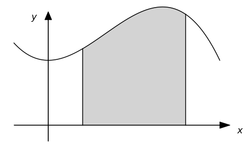
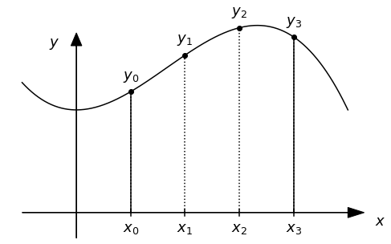
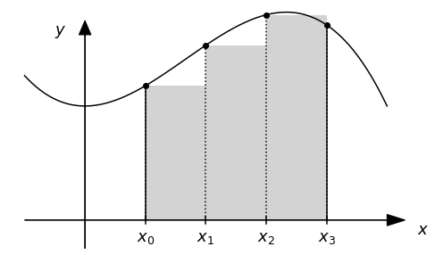
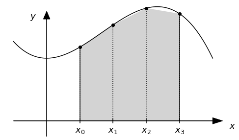

---
jupyter:
  jupytext:
    formats: ipynb,md
    text_representation:
      extension: .md
      format_name: markdown
      format_version: '1.3'
      jupytext_version: 1.13.6
  kernelspec:
    display_name: Python 3 (ipykernel)
    language: python
    name: python3
---

# Numerical Integration

In this notebook, you will implement the different techniques for the numerical computation of integrals in python and explore aspects of numerical integration.

**Learning objectives:** After finishing this notebook, you should be able to:

1. Implement integration of a function with the trapezoidal rule
2. Implement integration of a function with Simpson's rule
3. Calculate the integral of a numerical dataset


```python 
# Initialisation code for the notebook
import numpy as np
import matplotlib.pyplot as plt
plt.rcParams['figure.dpi'] = 100
```

## Numerical Integration

Often in physics, we will want to calculate the integral of a function, which can be interpreted at the area under the curve of the function between a starting point and and ending point, as illustrated here:



Unlike taking a derivative, calculating the analytical form of a derivative is not always easy, and is not even guaranteed to have an analytical closed form! This is one of the reasons it is useful to calculate integrals numerically, know as Numerical Integration:

https://en.wikipedia.org/wiki/Numerical_integration

### Discretisation

As is the case for any calculation in a computer, the first step is to break our continuous variable $x$ into list of numbers `x[i]` separated by (typically) fixed steps (know as <a href=https://en.wikipedia.org/wiki/Discretization>discretising</a>), along with corresponding set of $y$ values $y[i]$:



We will name the spacing between the steps in $\Delta x = h$. The example above would correspond to a total number of points $n = 4$, and following the python convention of counting from zero, the last point is then `y[3]`. 

From there, we can use several different approximations to calculate the integrated area, a few of which we will describe here. 

### Simple sum

The simplest is to simply sum up all the `y[i]` values except the last and then multiply this by the spacing $h$. For a total number of points $n$, this results in an estimate of the integral $I_{sum}$ given by: 

$$
I_{\rm sum} = h \sum_{i=0}^{n-2} y_i
$$

This is equivalent to the following area graphically as an approximation of the continuous integral: 



Note that the sum limit in the formula above **does not** include the last point ($i = n-1$), but instead stops at second-to-last point ($i=n-2$). This is because for $n$ points, there are $n-1$ blocks ("slices") between the first and the last points.

### Trapezoidal rule

An obvious improvement over the sum rule above is to replace the "flat tops" of the boxes above with sloped lines that connect one point to the next:



This is known as the Trapezoidal rule: 

https://en.wikipedia.org/wiki/Trapezoidal_rule

We can already see that this is giving a much better approximation! The formula for the estimated integral using the trapezoidal rule is given by:

$$
I_{\rm trap} =  h \left( \frac{y_0 + y_{n-1}}{2} + \sum_{i=1}^{n-2} y_i \right)
$$

The formula is in fact nearly identical to the simple sum, except that instead of using the first point and skipping the last point, we replace the first point with average of the first and last points. 

### Simpson's rule

While the trapezoidal rule is clearly much better, we can do even better if we use a quadratic interpolation instead of a linear interpolation between the points. This technique is known as Simpson's rule: 

https://en.wikipedia.org/wiki/Simpson%27s_rule

In this case, the estimate of the integral is given by a more complicated sum involving different coefficients for the odd and even points:

$$
I_{\rm simp} = \frac{h}{3}\left( y_0 + 2\sum_{i=1}^{(n-1)/2-1}y_{2i} + 4\sum_{i=1}^{(n-1)/2}y_{2i-1} + y_{n-1} \right)
$$

In the exercises below, you will explore implementing these different types of numerical intergration techniques in python.

## Exercises 

We will start by calculating the following integral: 

$$
\int_0^2 (x^4 - 2x +1) dx
$$

using two different techniques. 

This integral is actually one that you can calculate yourself and has the exact value of 4.4. This will be handy as we can use this exact value to compare with the values that our numerical calculations give. 

(The idea, of course though, is that numerical integration is useful for calculating the integrals of functions that are not easy to calculate! But we will do this later, and for now, it is handy to know what the answer is.) 

Before we start, it is useful already to make a plot of the function we are integrating. 

To do this, we will create an array x ranging from 0 to 2 with 100 points (just to get a bit of a smooth plot). We will then create second array y which will be our integrand, and then we will plot y versus x.

**Exercise 1:** Modify the code below to produce a plot of the integrand in the range of 0 to 2 with 100 points.


```python
# Define the function f(x) 

# First, make the arrays of x and y values for the plot
# npts = ______
# x = np.linspace(____,____,npts)
# y = _____


# Now plot it and add x and y labels

# plt.plot(___,___)
# ...


# A zero axis line is handy. "ls" is a shortcut for "linestyle" and "lw" is a shortcut for "linewidth"
plt.axhline(0,color='grey', linestyle=':')

answer_4_01_1 = np.copy(x)
answer_4_01_2 = np.copy(y)
```

```python
question = "answer_4_01"
num = 2

to_check = [question + "_%d" % (n+1) for n in range(num)]
feedback = ""
passed = True
for var in to_check:
    res, msg = check_answer(eval(var), var)
    passed = passed and res
    print(msg); feedback += msg + "n"

assert passed == True, feedback
```

**Solution:**
``` python tags=["hide-input"] 
# Define the function f(x) 
### BEGIN SOLUTION
def f(x):
    return x**4 - 2*x + 1
### END SOLUTION

# First, make the arrays of x and y values for the plot
# npts = ______
# x = np.linspace(____,____,npts)
# y = _____

### BEGIN SOLUTION
npts = 100
x = np.linspace(0,2,npts)
y = f(x)
### END SOLUTION

# Now plot it and add x and y labels

# plt.plot(___,___)
# ...

### BEGIN SOLUTION
plt.plot(x,y)
plt.xlabel("x")
plt.ylabel("Integrand")
### END SOLUTION

# A zero axis line is handy. "ls" is a shortcut for "linestyle" and "lw" is a shortcut for "linewidth"
plt.axhline(0,color='grey', linestyle=':')

answer_4_01_1 = np.copy(x)
answer_4_01_2 = np.copy(y)
```


**Self check:**

* Does your plot have axis labels?
* Does the function look reasonably like you might think?

The function looks pretty reasonable: it starts going down, it crosses through zero, and then shoots up. It has some "positive" area above the x-axis, and in the middle, it has a little bit of "negative" area that decreases the value of the integral.

## The Trapezoidal Rule

A simple method of calculating an integral is using the trapezoidal rule. 

**Exercise 2:** Write code to calculate the integral using the trapezoidal rule with $n = 11$ points in the range (10 "steps"). 


```python
# trapezoidal_integral = ...

answer_4_02_1 = trapezoidal_integral
```

```python
question = "answer_4_02"
num = 1

to_check = [question + "_%d" % (n+1) for n in range(num)]
feedback = ""
passed = True
for var in to_check:
    res, msg = check_answer(eval(var), var)
    passed = passed and res
    print(msg); feedback += msg + "n"

assert passed == True, feedback
```

**Solution:**
``` python tags=["hide-input"] 
### BEGIN SOLUTION
# The number of points, and the starting and end points
N = 10
a = 0.0
b = 2.0

# The step size
h = (b-a)/N

# s is our running sum
s = 0.5*f(a) + 0.5*f(b)
for k in range(1,N):
    s += f(a+k*h)

# The integral is then given by h*s
trapezoidal_integral = h*s

### END SOLUTION

answer_4_02_1 = trapezoidal_integral
```


Using the code, you can play with $n$ to see how many points we need to get a reasonable accuracy. 


## Benchmarking the Trapezoidal Rule

In general, you will often be using your code to calculate an integral for which you do not know the answer. However, in this case, since we do know the answer, you can get a feeling for how accurate your code is by comparing your calculated value to the correct answer. 

This sort of "benchmarking" is an integral part of developing numerical simulation software. In particular, you can always find a way for your code to give you "an answer". But how can you trust that it is the correct answer? How do you know how much influence the approximations you have made have on the calculated result? 

For this, it is always a good idea to use your code to perform a calculation for a case where you know the answer. This will allow you to play around to see how to optimize your code to be more accurate (and also to find bugs!). Of course, getting an accurate answer for one type of calculation does not guarantee that your code will be accurate for all calculations, but by trying it out for different types of calculations, you can start to get a feeling for how it performs and build up some trust that it will give you an accurate answer. 

Here, we will explore such a "benchmarking" of the Trapezoidal rule for calculating integrals, and explore the number of steps needed to achieve a given accuracy. 

**Exercise 3:** Use a `while` loop to find the minimum value of $N$ you need to get the correct answer to <a href=https://en.wikipedia.org/wiki/Approximation_error#Formal_Definition>relative error</a> of less than $10^{-6}$ = one part per million (ppm).

The definition of relative error is as follows: if $v$ is the correct answer and $v_{\rm approx}$ is the approximate answer, the relative error $\eta$ is defined as:

$$
\eta = \left| \frac{v - v_{\rm approx}}{v} \right|
$$

Your while loop should have an "emergency exit" test that stops the loop with a `break` statement if $N$ exceeds 10,000.

_Tip:_ If you have trouble with your exit condition on your while loop, it might be handy to include a code line `print("N %d eta %e" % (N,eta))` to keep track of what is going on in your code. This is an <a href=https://pythondebugging.com/articles/python-debugging-with-print-statements>elementary form</a> of <a href=https://en.wikipedia.org/wiki/Debugging>debugging</a>.

```python

# N = ...
# integral = ...
# eta = ...

answer_4_03_1 = N
answer_4_03_2 = integral
answer_4_03_3 = eta
```

```python
question = "answer_4_03"
num = 3

to_check = [question + "_%d" % (n+1) for n in range(num)]
feedback = ""
passed = True
for var in to_check:
    res, msg = check_answer(eval(var), var)
    passed = passed and res
    print(msg); feedback += msg + "n"

assert passed == True, feedback
```

**Solution:**
``` python tags=["hide-input"] 
### BEGIN SOLUTION

def f(x):
    return x**4 - 2*x + 1

# We should start with something bigger than the exit condition
eta = 1

# Start with a guess (could start with N=1 if we want)
N = 10

while eta > 1e-6:
    a = 0.0
    b = 2.0
    h = (b-a)/N

    s = 0.5*f(a) + 0.5*f(b)
    for k in range(1,N):
        s += f(a+k*h)

    integral = h*s
    eta = np.abs((integral - 4.4)/4.4)
    if (N > 10000):
        print("N = 10000 and didn't reach eta < 1e-6")
    N += 1

print("N = %d: Integral is %f Relative error %e" % (N, integral, eta))
### END SOLUTION

answer_4_03_1 = N
answer_4_03_2 = integral
answer_4_03_3 = eta
```


## Simpson's Rule

Simpson's rule is a numerical integration technique that replaces the linear approximation of the integrand in the trapizoidal technique with a a "best estimate" quadratic approximation.

**Exercise 4:** Write code to implement Simpson's rule for the integral in section 1.1 using 11 points (10 steps). 


```python
# integral_simpson = ...

print("Integral with Simpson's rule is %f" % integral_simpson)

answer_4_04_1 = integral_simpson
```

```python
question = "answer_4_04"
num = 1

to_check = [question + "_%d" % (n+1) for n in range(num)]
feedback = ""
passed = True
for var in to_check:
    res, msg = check_answer(eval(var), var)
    passed = passed and res
    print(msg); feedback += msg + "n"

assert passed == True, feedback
```

**Solution:**
``` python tags=["hide-input"] 
### BEGIN SOLUTION
N = 10
a = 0.0
b = 2.0
h = (b-a)/N

# Our running sum (we'll multiply by h/3 at the end)
s = f(a) + f(b)

# First the odd terms
for k in range(1,N,2):
    s += 4*f(a+k*h)

# Now the even terms
for k in range(2,N,2):
    s += 2*f(a+k*h)

# The answer is then the sum*h/3
integral_simpson = s*h/3.0
### END SOLUTION

print("Integral with Simpson's rule is %f" % integral_simpson)

answer_4_04_1 = integral_simpson
```


Which technique (Simpson vs. Trapezoidal) is more accurate for the same number of points?

## Vectorising your calculations

Like we did with numerical derivatives, once you have understood how to write the code to calculate the integrals using `for` loops, you can the optimise your code by transforming the `for` loops into vectorised code using numpy slicing and the built-in function `np.sum`

Lets first take a look at an example using the trapezoidal rule. 


$$
I_{\rm trap} =  h \left( \frac{y_0 + y_{n-1}}{2} + \sum_{i=1}^{n-2} y_i \right)
$$

We can easily translate the sum into a vectorised operation by first creating an array `y` evaluating the function at all the points we need for our integration and then using `np.sum()` to implement the formula for the trapezoidal rule:

```
x = np.linspace(0,10,11)
h = x[1]-x[0]
y = f(x)
integral = (f(x[0])+f(x[-1]))/2
integral += np.sum(y[1:-1])
integral *= h
```

**Note subtle point:** this is an example for 10 "steps", but we need an array `x` with a total of **11 points** since an array of 11 point has 10 steps.

For large arrays, this will perform the calculation much, much faster than using your own `for` loops. 

**Exercise 5** Rewrite your calculation of the integral using Simpson's rule from exercise 4 to be vectorised using numpy slicing and the function `np.sum()`. 

*(Hint: it may be useful to look back at the introduction notebooks on how to perform slicing with steps different than 1...)*


```python
# Write your VECTORISED Simpson's rule code here
# integral_simpson_vector = ...

print("Integral with vectorised Simpson's rule is %f" % integral_simpson_vector)

answer_4_05_1 = integral_simpson_vector
```

```python
question = "answer_4_05"
num = 1

to_check = [question + "_%d" % (n+1) for n in range(num)]
feedback = ""
passed = True
for var in to_check:
    res, msg = check_answer(eval(var), var)
    passed = passed and res
    print(msg); feedback += msg + "n"

assert passed == True, feedback
```

**Solution:**
``` python tags=["hide-input"] 
# Write your VECTORISED Simpson's rule code here

### BEGIN SOLUTION
x = np.linspace(0,2,11) # 10 steps is equivalent to 11 points 
h = x[1]-x[0]
y = f(x)
integral = (f(x[0])+f(x[-1]))
integral += 4*np.sum(y[1:-1:2]) # the odd terms
integral += 2*np.sum(y[2:-1:2]) # the even terms, excluding the end points
integral *= h/3.0

integral_simpson_vector = integral
### END SOLUTION

print("Integral with vectorised Simpson's rule is %f" % integral_simpson_vector)

answer_4_05_1 = integral_simpson_vector
```


## Integrating numerical data

In the above, we have focussed on integrating analytical functions. However, the same techniques we have introduced can also be used to integrate numerical data. 

One difference, however, is that we will not evaluate the values of the integrand by a function call, as we did above, but instead by looking up it's value in an array. 

For this you will load data from a file `resource/asnlib/public/velocities.dat` included already on your notebook server. The file contains two columns of numbers, the first representing time $t$ in seconds and the second the $x$-velocity in meters per second of a particle, measured once every second from time $t=0$ to $t=100$ seconds.

**Exercise 6:** Read in the data and, using the trapezoidal rule, calculate from them the approximate distance traveled by the particle in the $x$ direction as a function of time.  

**Since this exercise is also about learning to program, you are forbidden from using built-in scipy or numpy functions!** 

_Hint_ This is a cumulative integral, a bit different than the definite integrals handled above. Your integral code should produce an array not a number! If f(t) is the function describing the velocity as a function of time, then the answer g(t) is given by:

$$
g(t) = \int_0^t h(\tau) d\tau
$$

Every element in your output array is then conceptually defined by computing an integral from $\tau=0$ to $\tau = t$. 

(Of course, there may be cleaver and more computationally efficient ways to do it as well, but that is not the focus right now...)

_Recommendation_ "<a href=https://en.wikipedia.org/wiki/Modular_programming>Modularize</a>" your code by creating a function that does the trapezoidal integration of an array, this will make your code easier to write and use. 

```python
# Download the resource files.
import urllib
urllib.request.urlretrieve("http://www-personal.umich.edu/~mejn/cp/data/velocities.txt", 
                           filename="velocities.txt")
```

```python
# Load the data

# A function for calculating the trapezoidal integral of an array:
def trapezoid(x):

#y=[v[0],v[1]] 
#z=trapezoid(y)

 
# Now calculate the cumulative integral: 
# d = ...

answer_4_06_1 = np.copy(d)
```

```python
question = "answer_4_06"
num = 1

to_check = [question + "_%d" % (n+1) for n in range(num)]
feedback = ""
passed = True
for var in to_check:
    res, msg = check_answer(eval(var), var)
    passed = passed and res
    print(msg); feedback += msg + "n"

assert passed == True, feedback
```

**Solution:**
``` python tags=["hide-input"] 
# Load the data
### BEGIN SOLUTION
data= np.loadtxt("resource/asnlib/public/velocities.dat")
t = data[:,0]
v = data[:,1]

# The number of points in the array we read in
N = len(v)

# It is specified that the time step is constant and is 1 second. (We could check this by checking if the
# time data is a straight line, but I will trust the author.)
h = 1

# n will be the last point of our cumulative integral. range(len(v)) will give a range list 
# running from 0 to N-1 (v[N-1] being the last element in array v) 
### END SOLUTION


# A function for calculating the trapezoidal integral of an array:
def trapezoid(x):
    ### BEGIN SOLUTION
    N = len(x)
    if N == 1:
        return 0
    s = (x[0]+x[-1])/2 
    s += np.sum(x[1:-1])
    return s*h
    ### END SOLUTION

#y=[v[0],v[1]] 
#z=trapezoid(y)

 
# Now calculate the cumulative integral: 
### BEGIN SOLUTION 
 
# Our desired output is not just the total distance travelled, but actually an 
# array that shows the distance as a function of time. This is a bit different
# to what we've been doing above since we will be calculating a _cumulative_ integral

# The output array of distance vs. time
d = np.empty(N)
   
# Note that it does not make sense to calculate the integral for the first point, since in zero 
# time, no distance has been travelled. 
d[0] = 0

# There may be a numpy cumulative integral function (google would tell us quickly), but we'll
# implement it ourselves here with a for loop.

# Note it's not obvious that range() shoud start at two, but you must remember that v[0:2] 
# gives an array [v[0], v[1]]

for i in range(1,N):
    d[i] = trapezoid(v[0:i+1])
### END SOLUTION


answer_4_06_1 = np.copy(d)
```


**Exercise 7:** Make a plot with velocity on the left-hand y-axis and distance travelled in the right-hand y-axis. 

To plot data with a second y-axis, you need a bit more matplotlib code:

```
# First, initialize your plot with the plt.subplots() command, which returns an axis object you will need
fig, ax1 = plt.subplots()

# You then use the twinx() function to make a second axis object with it's x-axis linked to the original x-axis
ax2 = ax1.twinx()

# Now you can use the plot() commands of each axis objects: ax.plot(...). 
ax1.plot(t,d, 'g-', label="d")
ax1.set_ylabel("my axis (my units)", color='g')
ax2.plot(...)
```

You can also use the `axhline()` command to add horizontal lines. For example, this will add a grey dashed horizontal line:

```
ax2.axhline(0, color='grey', linestyle=":")
```


```python
# Your solution here
```

**Solution:**
``` python tags=["hide-input"] 
### BEGIN SOLUTION 
# To make a second axis, we need to use the subplots() command to get access to the 
# "axis" object variable of our plot
fig, ax1 = plt.subplots()

# Once we have it, we can use the twinx() function to make a second y axis
ax2 = ax1.twinx()

# And now we use plot commands associated with the two axis "objects" we have
ax1.plot(t,d, 'g-', label="d")
ax1.set_ylabel("Distance travelled (m)", color='g')
ax1.axhline(0, color='g', linestyle=":")

ax2.plot(t,v, 'b-', label="v")
ax2.set_ylabel("Velocity (m/s)", color='b')
ax2.axhline(0, color='b', linestyle=":")
ax1.set_xlabel("Time (s)")
ax1.legend(loc=2)
ax2.legend(loc=0)
### END SOLUTION 
```

**Self check:**

* Does your plot have axis labels? 
* Are the correct functions plotted? 
* Is it clear which line belongs to which axis? (Either with a legend or with color axis labels? Or both?)


## Numpy and Scipy integration functions

Now that we have some understanding of how numerical integration works, it is also useful to note that there are several numpy functions that can calculate such integrals for you!

**Simple sum:** 

https://docs.scipy.org/doc/numpy/reference/generated/numpy.sum.html

**Trapezoidal rule:**

https://docs.scipy.org/doc/numpy/reference/generated/numpy.trapz.html

**Cumulative sum:**

https://docs.scipy.org/doc/numpy/reference/generated/numpy.cumsum.html

Numpy does not include Simpson's rule (since for small $h$ the trapezoidal rule is often accurate enough), but in case you want to use it, it is available in the scipy package:

**Simpson's rule:**

https://docs.scipy.org/doc/scipy/reference/generated/scipy.integrate.simps.html

Because all of the functions above work with vectorization (see notebook 2b), they can be hundreds of times faster for very large arrays, so it is useful to use them for large calculations. 

```python tags=["auto-execute-page", "thebe-init", "hide-input"]
## Pre-loading the solutions

import sys
await micropip.install("numpy")
sys.path.insert(1, '/validate_answers/../')
from validate_answers import *

with open(location):
    pass # Initially this notebook does not recognise the file unless someone tries to read it first
```
