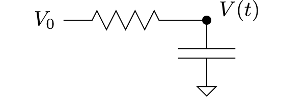

---
jupyter:
  jupytext:
    formats: ipynb,md
    text_representation:
      extension: .md
      format_name: markdown
      format_version: '1.3'
      jupytext_version: 1.16.1
  kernelspec:
    display_name: Python 3 (ipykernel)
    language: python
    name: python3
---

# Ordinary Differential Equations Part 1

In this lecture, we will explore numerical methods of solving ordinary differential equations (ODEs).

**Learning objectives:** After completing this lecture, you should be able to:

1. Implement your own code for numerical integration of a first-order ODE using Euler's method
2. Implement numerical integration of coupled and second-order differential equations
3. Identify failure of the convergence of Euler integration 
4. Implement your own code for second-order and fourth-order Runge-Kutta integration of ODEs
5. Implement solutions of ODEs using the `solve_ivp()` routine from the `scipy` library
6. Apply numerical integration to a physical problem and interpret your results

```python 
# Notebook code
import numpy as np
import matplotlib.pyplot as plt

plt.rcParams['figure.dpi'] = 100
```


## Background on first order ODEs

<a href=https://en.wikipedia.org/wiki/Ordinary_differential_equation>Ordinary differential equations</a> are  equations that specify a relation between derivatives of a function and the function itself. A first order differential equation is one which involves only first-order derivatives:

$$
\frac{dx}{dt} = f(x,t) 
$$

Here, $f(x,t)$ is an known function, $t$ is an independent variable, and one is interested in finding $x(t)$. A  example of a problem in physics that is described by a first-order ODE is the charging of a capacitor through a resistor (an <a href=https://en.wikipedia.org/wiki/RC_circuit>RC circuit</a>):



We will consider the case in which at $t = 0$, the capacitor is uncharged, and a voltage $V_0$ is applied to the resistor. Your task will be to find the voltage on the capacitor. For this, you will need to know the charge on the capacitor, since its voltage is determined by $V = Q / C$.

How do I find the charge of the capacitor? For this, you need first to find the current flowing through the resistor, as this will determine the charge on the capacitor, since by Kirchoff's laws, the charge has nowhere else to go. The current $I$ through the resistor is determined by Ohm's law $\Delta V = IR$, where $\Delta V = V_0 - V$ is the voltage drop across the resistor. 

$$ 
I = \frac{V_0 - V(t)}{R}
$$

Note that this equation does not tell us the current, because the current is determined by the voltage $V(t)$ which we also don't know!

However, since $I = dQ / dt$, and since $Q = CV$, we then have the following equation for $V$: 

$$ 
\frac{dV}{dt} = \frac{V_0}{RC} - \frac{V}{RC}
$$

which we can recognize as a (linear) ordinary differential equation for $V$. This differential equation has a solution that is well known (hopefully also to you too): 

$$
V(t) = V_0 (1-e^{-t/RC})
$$

This is an example of an ODE that has an exact analytical solution. This is convenient to study here as we can compare our numerical integration to the known answer, and once we understand well how the numerical solution of ODEs  works, we can apply this to more complicated (nonlinear) ODEs for which there is no analytical solution.

## Euler's method of numerical integration of ODEs

In general, the technique one uses to solve differential equations is called "numerical integration". 

The important point is: the differential equation tells you that the slope of the function (in this case, the rate of change of the voltage in time) in terms of the value of the voltage itself (in this case, a simple linear relation). 

Now, if I know the value of the voltage at a time $t = t_0$, and the slope of the voltage in time, I can approximately predict the voltage in the future using:

$$
V(t_0 + \Delta t) \approx V(t_0) + \left. \frac{dV}{dt} \right |_{t=t_0} \Delta t
$$

When solving an ODE, in order to generate a unique solution, one must always be provided with an initial condition: in the example above, we know that $V = 0$ at $t = 0$ since the capacitor starts uncharged.  That means we always have at least one point where we know the voltage! 

To find the voltage at any other time $t$ in the future, we can just keep applying the approximation above to "advance" the voltage to the next step until we get to the time in the future that we are interested in. As long as we take time steps $\Delta t$ that are small enough, the approximation should be good and our calculation will be accurate. 

**Exercise 1** Write code to solve the problem of a charging capacitor with $V_0 = 1$ V, $R = 1$ M$\Omega$, and $C = 1 \mu$F. Your calculation should produce an array for $V(t)$ for $t$ from 0 to 10 seconds with 1000 points. Make a plot of $V(t)$. Does it do what you expect it should?

```python
N = 1000
t = np.linspace(0,10,N)
dt = t[1]-t[0]
R = 1e6
C = 1e-6
V0 = 1

# Pre-allocating the array is a good idea, in general it is much faster 
# to fill a pre-allocated array than to use append()
V = np.empty(N)

# Initial condition
# V[0] = ____


# A function for returning the derivative
def dVdt(V):
    # ...


# for i in range(___,___):
#     V[i] = ..

    
# Now make a plot (with appropriate labels!)
    
answer_11_1_1 = np.copy(V)
```

```python
question = "answer_11_1"
num = 1

to_check = [question + "_%d" % (n+1) for n in range(num)]
feedback = ""
passed = True
for var in to_check:
    res, msg = check_answer(eval(var), var)
    passed = passed and res
    print(msg); feedback += msg + "n"

assert passed == True, feedback
```

**Solution:**
``` python tags=["hide-input"] 
N = 1000
t = np.linspace(0,10,N)
dt = t[1]-t[0]
R = 1e6
C = 1e-6
V0 = 1

# Pre-allocating the array is a good idea, in general it is much faster 
# to fill a pre-allocated array than to use append()
V = np.empty(N)

# Initial condition
# V[0] = ____
### BEGIN SOLUTION
V[0] = 0
### END SOLUTION


# A function for returning the derivative
def dVdt(V):
    ### BEGIN SOLUTION
    return (V0-V)/R/C
    ### END SOLUTION


# for i in range(___,___):
#     V[i] = ..
### BEGIN SOLUTION
for i in range(1,N):
    V[i] = V[i-1] + dt*dVdt(V[i-1])
### END SOLUTION

    
# Now make a plot (with appropriate labels!)
### BEGIN SOLUTION
plt.plot(t,V)
plt.ylabel("Voltage (V)")
plt.xlabel("Time (s)")
### END SOLUTION
    
answer_11_1_1 = np.copy(V)
```


**Exercise 2:** Use the Euler method to solve for the voltage on the capacitor for the case that the input voltage is not constant for $t>0$ but instead oscillates at a frequency of 1 Hz with an amplitude of 1 Volt for $t>0$: $V(t>0)= \sin(\omega t)$. The capacitor is also taken to be uncharged at $t=0$. 

Note now that your derivative is now not only a function of $V$, but now also explicitly dependent on $t$.

Your calculation should produce an array for $V(t)$ for $t$ from 0 to 10 seconds with 1000 points. Make a plot of $V(t)$. Does it do what you expect it should?

```python
N = 1000
t = np.linspace(0,10,N) # seconds
dt = t[1]-t[0]
R = 1e6 # Ohms
C = 1e-6 # F
V0 = 1 # V 
f = 1 # Hz 

# Pre-allocating the array is a good idea, in general it is much faster 
# to fill a pre-allocated array than to use append()
V = np.empty(N)

# Initial condition
# V[0] = ____

# A function for returning the derivative
def dVdt(t,V):
    # ...
    
# for i in range(___,___):
#     V[i] = ..

    
# Now make a plot (with appropriate labels!)
    
answer_11_2_1 = np.copy(V)
```

```python
question = "answer_11_2"
num = 1

to_check = [question + "_%d" % (n+1) for n in range(num)]
feedback = ""
passed = True
for var in to_check:
    res, msg = check_answer(eval(var), var)
    passed = passed and res
    print(msg); feedback += msg + "n"

assert passed == True, feedback
```

**Solution:**
``` python tags=["hide-input"] 
N = 1000
t = np.linspace(0,10,N) # seconds
dt = t[1]-t[0]
R = 1e6 # Ohms
C = 1e-6 # F
V0 = 1 # V 
f = 1 # Hz 

# Pre-allocating the array is a good idea, in general it is much faster 
# to fill a pre-allocated array than to use append()
V = np.empty(N)

# Initial condition
# V[0] = ____
### BEGIN SOLUTION
V[0] = 0
### END SOLUTION

# A function for returning the derivative
def dVdt(t,V):
    ### BEGIN SOLUTION
    return (V0*np.sin(2*np.pi*f*t)-V)/R/C
    ### END SOLUTION
    
# for i in range(___,___):
#     V[i] = ..
### BEGIN SOLUTION
for i in range(1,N):
    V[i] = V[i-1] + dt*dVdt(t[i-1],V[i-1])
### END SOLUTION

    
# Now make a plot (with appropriate labels!)
### BEGIN SOLUTION
plt.plot(t,V)
plt.ylabel("Voltage (V)")
plt.xlabel("Time (s)")
### END SOLUTION
    
answer_11_2_1 = np.copy(V)
```


## Second-order ODEs

Another common differential equation that one encounters in physics is that of a harmonic oscillator, for example,  representing a mass on a spring. If the equilibrium position of the mass is at $x = 0$, then the restoring force is given by $F = -kx$. Using $F = ma$, we then obtain the following second-order differential equation for $x(t)$:

$$
\frac{d^2x}{dt^2}  = -\frac{k}{m} x
$$

How do we solve this? On first glance, this might look more challenging than the case above, since I can no longer just use my trick of using the slope to estimate $x$ at the next time step. 

However, there is a trick we can play: we can split this second-order differential equation into two (coupled) first order differential equations. How? To do this, we re-write the above in terms of velocity $v = dx / dt$. I then get the following two first order differential equations: 

$$
\frac{dv}{dt} = -\frac{k}{m} x
$$

and

$$ 
\frac{dx}{dt} = v
$$

Now we can play the same trick: assuming that I know both $x$ and $v$ at some time $t_0$, I can estimate $x$ and $v$ at time $t = t_0 + \Delta $:

$$
v(t_0 + \Delta t) = v(t_0) -\frac{k}{m} x(t_0) \Delta t
$$

and 

$$
x(t_0 + \Delta t) = x(t_0) + v(t_0) \Delta t
$$

From here, we can just do exactly what we did above. The only minor detail is that we have to keep track of two things ($x$ and $v$) instead of just one. And, of course, we still need to know $x$ and $v$ at some point in time! But, as you likely know, the solution of a second order ODE is only unique if I specify **two** initial conditions: both the velocity and position at $t=0$. 

**Exercise 3:** Calculate $x(t)$ for a mass on a spring. Take $m = 1$ kg, $k = 1$ N/m, $x(t=0) = 0$ and $v(t=0) = 1$ m/s. Your code should output an array that represent $x(t)$ for $t$ from 0 to 20*$\pi$ seconds (which should give exactly 10 oscillations) with 1000 points. Make a plot of $x(t)$. Does it do what you expect it should?

```python
N = 1000
t = np.linspace(0,10*2*np.pi,N)
dt = t[1]-t[0]
m = 1
k = 1

# Pre-allocating the array is a good idea, it is much faster 
# to fill a pre-allocated array than to use append()
x = np.empty(N)
v = np.empty(N)

# Initial condition
# v[0] = ___
# x[0] = ___


# A function for returning dv/dt = F / m 
# Note that it is only a function of x in this case
def dvdt(x):
    # ...

# Note that it is only a function of v in this case
def dxdt(v):
    # ...

# for i in range(___,___):
#     x[i] = ... 
#     v[i] = ...

# An appropriate plot

answer_11_3_1 = np.copy(x)
```

```python
question = "answer_11_3"
num = 1

to_check = [question + "_%d" % (n+1) for n in range(num)]
feedback = ""
passed = True
for var in to_check:
    res, msg = check_answer(eval(var), var)
    passed = passed and res
    print(msg); feedback += msg + "n"

assert passed == True, feedback
```

**Solution:**
``` python tags=["hide-input"] 
N = 1000
t = np.linspace(0,10*2*np.pi,N)
dt = t[1]-t[0]
m = 1
k = 1

# Pre-allocating the array is a good idea, it is much faster 
# to fill a pre-allocated array than to use append()
x = np.empty(N)
v = np.empty(N)

# Initial condition
# v[0] = ___
# x[0] = ___
### BEGIN SOLUTION
v[0] = 1
x[0] = 0
### END SOLUTION


# A function for returning dv/dt = F / m 
# Note that it is only a function of x in this case
def dvdt(x):
    ### BEGIN SOLUTION
    return -k*x/m
    ### END SOLUTION

# Note that it is only a function of v in this case
def dxdt(v):
    ### BEGIN SOLUTION
    return v
    ### END SOLUTION

# for i in range(___,___):
#     x[i] = ... 
#     v[i] = ...
### BEGIN SOLUTION
for i in range(1,N):
    x[i] = x[i-1] + dt*dxdt(v[i-1])  
    v[i] = v[i-1] + dt*dvdt(x[i-1])
### END SOLUTION    

# An appropriate plot
### BEGIN SOLUTION
plt.plot(t,x)
plt.ylabel("x (m)")
plt.xlabel("t (s)")
### END SOLUTION

answer_11_3_1 = np.copy(x)
```


## Runge-Kutta integration

As you may have noticed, although Euler integration seems to work pretty well for the RC circuit, it fails very badly for the Harmonic oscillator! The undamped harmonic oscillator is an example of a *stiff* equation which is numerically unstable for some type of solver algorithms:

https://en.wikipedia.org/wiki/Stiff_equation

The reason for this is that extrapolation of the derivative is a very poor approximation: so much so that it requires a very small time step to prevent the solution of the simple harmonic oscillator from diverging! Euler's method is particularly bad with so-called "stiff" equations.

An improvement over the Euler method is to include a more accurate estimate of the derivative of the function defining the derivatives. Doing this in successive higher orders is called the Runge-Kutta (RK) technique:

https://en.wikipedia.org/wiki/Runge%E2%80%93Kutta_methods

The basic idea of RK2 is that numerical derivatives give a much better estimate of the slope at the midpoint between two points rather than at the point itself (see also the lecture notebook for lecture 4). 

Instead of using the value of the derivative at time $t$ to predict the value of the function at the next time step $t+\Delta t$, RK2 uses instead the value of the derivative at a time half-way to the next time step, $t + \Delta t /2$ to extrapolate. Just like how the center-based difference gives a more accurate estimate of the slope, this will also give a more accurate extrapolation of the value of the function at the next time step. To determine the value at $t + \Delta t/2$, we use the Euler method. 

In practice, this is done by defining two coefficients $k_1$ and $k_2$. For the ODE:

$$
\frac{dx}{dt} = f(x,t)
$$

We first calculate the $\Delta x$ we would have in Euler's method and call this $k_1$ (the first-order RK coefficient): 

$$
k_1 = \Delta x_1 = h \cdot f(x,t)
$$

where $h$ is the time step we choose. But instead of updating $x$ based on this alone, we use this to get a better estimate of the slope by moving a half step in $x$ and a half step in $t$ and use this to calculate the second-order RK coefficient, which is an improved estimate of the actual $\Delta x$: 

$$
k_2 = \Delta x_2 = h \cdot f\left(x+\tfrac{1}{2}k_1,t+\tfrac{1}{2}h\right)
$$

And we then use this to update our new estimate of $x(t)$: 

$$
x_{n+1} = x_n + k_2
$$

This relatively simple trick gives a significant improvement over Euler's method for integration. Before we directly apply RK2 integration to the simple Harmonic oscillator, we will implement it first for the first order ODE of the RC circuit.

**Exercise 4** Implement your own RK2 integration code for the same problem as specified in Exercise 1. 

```python
N = 1000
t = np.linspace(0,10,N)
dt = t[1]-t[0]
R = 1e6
C = 1e-6
V0 = 1
f = 1 

# Pre-allocating the array is a good idea, it is much faster 
# to fill a pre-allocated array than to use append()
V = np.empty(N)

# Initial condition
# V[0] = ....

# A function for returning the derivative (for generality, make it a
# function of both V and t, although it may not depend explicitly on t
# in this case)
def dVdt(V,t):
    # ...

for i in range(1,N):

# Now the plot

answer_11_4_1 = np.copy(V)
```

```python
question = "answer_11_4"
num = 1

to_check = [question + "_%d" % (n+1) for n in range(num)]
feedback = ""
passed = True
for var in to_check:
    res, msg = check_answer(eval(var), var)
    passed = passed and res
    print(msg); feedback += msg + "n"

assert passed == True, feedback
```

**Solution:**
``` python tags=["hide-input"] 
N = 1000
t = np.linspace(0,10,N)
dt = t[1]-t[0]
R = 1e6
C = 1e-6
V0 = 1
f = 1 

# Pre-allocating the array is a good idea, it is much faster 
# to fill a pre-allocated array than to use append()
V = np.empty(N)

# Initial condition
# V[0] = ....
### BEGIN SOLUTION
V[0] = 0
### END SOLUTION

# A function for returning the derivative (for generality, make it a
# function of both V and t, although it may not depend explicitly on t
# in this case)
def dVdt(V,t):
    ### BEGIN SOLUTION
    return (V0-V)/R/C
    ### END SOLUTION

for i in range(1,N):
    ### BEGIN SOLUTION
    # First estimate the midpoint function value using Euler
    # The estimated change in V at the midpoint using Euler we call k1
    k1 = dt*dVdt(V[i-1], t[i-1])
    # Now use our estimated value of V at the midpoint to get a better
    # estimate of the slope and use this to extrapolate to the next
    # timestep
    k2 = dt*dVdt(V[i-1]+k1/2, t[i-1]+dt/2)
    # We're done!
    V[i] = V[i-1] + k2
    ### END SOLUTION

# Now the plot
### BEGIN SOLUTION
plt.plot(t,V)
plt.xlabel("Time (s)")
plt.ylabel("Voltage (V)")
### END SOLUTION

answer_11_4_1 = np.copy(V)
```


**Exercise 5:** Implement the solution to Exercise 3 with your own RK2 integration code. Does this look more like what you would expect? 

```python
N = 1000
t = np.linspace(0,10*np.pi*2,N)
dt = t[1]-t[0]
m = 1
k = 1

# Pre-allocating the array is a good idea, it is much faster 
# to fill a pre-allocated array than to use append()
x = np.empty(N)
v = np.empty(N)

# Initial condition
# v[0] = ....
# x[0] = ....

def dvdt(x):
    # ...

def dxdt(v):
    # ...

for i in range(1,N):
    # ....
    #x[i] = ....
    #v[i] = .... 

# And the plot

answer_11_5_1 = np.copy(x)
```

```python
question = "answer_11_5"
num = 1

to_check = [question + "_%d" % (n+1) for n in range(num)]
feedback = ""
passed = True
for var in to_check:
    res, msg = check_answer(eval(var), var)
    passed = passed and res
    print(msg); feedback += msg + "n"

assert passed == True, feedback
```

**Solution:**
``` python tags=["hide-input"] 
N = 1000
t = np.linspace(0,10*np.pi*2,N)
dt = t[1]-t[0]
m = 1
k = 1

# Pre-allocating the array is a good idea, it is much faster 
# to fill a pre-allocated array than to use append()
x = np.empty(N)
v = np.empty(N)

# Initial condition
# v[0] = ....
# x[0] = ....
### BEGIN SOLUTION
v[0] = 1
x[0] = 0
### END SOLUTION

def dvdt(x):
    ### BEGIN SOLUTION
    return -k*x/m
    ### END SOLUTION

def dxdt(v):
    ### BEGIN SOLUTION
    return v
    ### END SOLUTION

for i in range(1,N):
    # ....
    #x[i] = ....
    #v[i] = .... 
    ### BEGIN SOLUTION
    # First the k1s to extrapolate the midpoints
    k1x = dt*dxdt(v[i-1])
    k1v = dt*dvdt(x[i-1])
    # Now the k2s
    k2x = dt*dxdt(v[i-1]+0.5*k1v)
    k2v = dt*dvdt(x[i-1]+0.5*k1x)
    # Now the values
    x[i] = x[i-1] + k2x
    v[i] = v[i-1] + k2v  
    ### END SOLUTION

# And the plot
### BEGIN SOLUTION
plt.plot(t,x)
plt.ylabel("x (m)")
plt.xlabel("t (s)")
### END SOLUTION

answer_11_5_1 = np.copy(x)
```


## Fourth order Runge-Kutta integration (RK4)

The RK2 algorithm described above is a specific case of a more general Runge-Kutta method that can also be extended to higher orders. 

A commonly used one is the 4th order Runge-Kutta method (RK4), one of the most common approaches in computational physics for integrating ODEs. For the ODE: 

$$
\frac{dx}{dt} = f(x,t)
$$

the time step in RK4 is calculated as:

$$
k_1 & =   dt * f(x,t) \\
k_2 & =  dt * f(x+k_1/2, t+dt/2) \\
k_3 & =  dt * f(x+k_2/2, t+dt/2) \\
k_4 & =  dt * f(x+k_3, t+dt) \\
$$

With these definitions, the position at the next time step is given by: 

$$
x(t+dt)  =  x(t) + (k_1 + 2 k_2 + 2 k_3 + k_4)/6
$$

**Exercise 6:** Implement RK4 integration for the problem of Exercise 1. 

```python
N = 1000
t = np.linspace(0,10,N)
dt = t[1]-t[0]
R = 1e6
C = 1e-6
V0 = 1
f = 1 

# Pre-allocating the array is a good idea, it is much faster 
# to fill a pre-allocated array than to use append()
V = np.empty(N)

# Initial condition
# V[0] = ....

# A function for returning the derivative
def dVdt(V,t):
    # ...

for i in range(1,N):
    # ...
    #V[i] = ...
# And the plot


answer_11_6_1 = np.copy(t)
answer_11_6_2 = np.copy(V)
```

```python
question = "answer_11_6"
num = 2

to_check = [question + "_%d" % (n+1) for n in range(num)]
feedback = ""
passed = True
for var in to_check:
    res, msg = check_answer(eval(var), var)
    passed = passed and res
    print(msg); feedback += msg + "n"

assert passed == True, feedback
```

**Solution:**
``` python tags=["hide-input"] 
N = 1000
t = np.linspace(0,10,N)
dt = t[1]-t[0]
R = 1e6
C = 1e-6
V0 = 1
f = 1 

# Pre-allocating the array is a good idea, it is much faster 
# to fill a pre-allocated array than to use append()
V = np.empty(N)

# Initial condition
# V[0] = ....
### BEGIN SOLUTION
v[0] = 0
### END SOLUTION

# A function for returning the derivative
def dVdt(V,t):
    ### BEGIN SOLUTION
    return (V0-V)/R/C
    ### END SOLUTION

for i in range(1,N):
    # ...
    #V[i] = ...
    ### BEGIN SOLUTION
    k1 = dt*dVdt(V[i-1], t[i-1])
    k2 = dt*dVdt(V[i-1]+k1/2, t[i-1]+dt/2)
    k3 = dt*dVdt(V[i-1]+k2/2, t[i-1]+dt/2)
    k4 = dt*dVdt(V[i-1]+k3, t[i-1]+dt)
    # We're done!
    V[i] = V[i-1] + (k1+2*k2+2*k3+k4)/6
    ### END SOLUTION
# And the plot

### BEGIN SOLUTION
plt.plot(t,x)
plt.ylabel("x (m)")
plt.xlabel("t (s)")
### END SOLUTION


answer_11_6_1 = np.copy(t)
answer_11_6_2 = np.copy(V)
```


## The scipy `solve_ivp()` routine

In the above, we have implemented directly the Euler and Runge-Kutta methods of numerical integration with our own python code. Doing so, we have learned insight into how these techniques work and when and how things can go wrong! As we saw, the code is very simple (only a few lines) and using this code, we can directly solve relatively complex numerical problems in physics!

In addition to coding the numerical integration routines yourself, the `scipy` package also has built-in routines for numerical integration of ODEs. In particular, here, we will learn how to use the `solve_ivp()` routine:

https://docs.scipy.org/doc/scipy/reference/generated/scipy.integrate.solve_ivp.html

Reading the documentation page, you can see that the `solve_ivp()` routine takes several variables and has many optional parameters, some of which you can likely now understand having solved the problems yourself above. The parameter `method` controls which technique is used for the numerical integration: by default, it uses a variant of RK4. The scipy numerical integration routines also support some additional routines, such as the BDF method:

https://en.wikipedia.org/wiki/Backward_differentiation_formula

which is more robust for integrating stiff differential equations like the undamped Harmonic oscillator. 

### How to use it

The `solve_ivp()` routine returns not just the solution to the differential equation, but in fact an object that contains more information inside it about the numerical integration process itself. 

The routine is also smart enough to implement automatic choices of the step size, in which the step size is adapted based on estimations of what will make the integration as efficient as possible! While very cool, this means that by default, the resulting calculation will not be sampled equidistantly in time, as our examples above. Fortunately, the routine provides an optional argument `t_eval`, which is a numpy array of times that should be used for evaluating the solution that it returns. 

In the following exercises, we will explore how the `solve_ivp()` routine works and how to use it.

**Exercise 7:** Use the `solve_ivp()` routine to solve the problem of the charging capacitor above from Exercise 1. 

You will need to define a function `dVdt(t,V)`. By convention, this function should take time (the independent variable) as its first argument and the voltage value as it's second.  This function you will need to give as the first argument of the `solve_ivp()` function. 

You will also need to pass a <a href=https://docs.python.org/3/tutorial/datastructures.html#tuples-and-sequences>tuple</a> as the second argument of `solve_ivp()` to specify the start and end times.

Finally, you will need to give `solve_ivp()` the initial value of the voltage in the third argument. Since `solve_ivp()` is capable of solving multidimensional simultaneous equations, and also higher order ODEs, this argument must be a list of initial values, one for each of the 1st order ODEs it is solving. Although the problem we are considering of the RC circuit is only a single first-order ODE, we still have to make our initial condition into an array (for example, a numpy array of size `(1,)`). For this case, you can provide a list with one element: `[V0]`, where `V0` is the value $V(t=0)$.

Plot your solution using points in your plot so that you can see the time steps that the routine chose for you automatically. Also, plot on top of the points you get the answer you had from exercise 6 in which you solve with RK4 with 1000 points.

```python
from scipy.integrate import solve_ivp

R = 1e6
C = 1e-6
V0 = 1

def dVdt(t,V):
    # ...


#sol = solve_ivp(dVdt, ...., ....)


# By default, the independent variable is always stored in the name sol.t
# t = ....


# By default, the dependent variable is always stored in the name sol.y
# The shape of sol.y will be (1,N), since this is only a first order equation
# However, to get this into an array we can plot, we still need to index
# it using sol.y[0,:]
# V = ....


# A plot with the scipy answer and your answer from exercise 5 (with legend)
# plt.plot(t,V, 'o', label=....)
# plt.plot(answer_11_6_1, answer_11_6_2, label=...)
# ...


answer_11_7_1 = np.copy(t)
answer_11_7_2 = np.copy(V)
```

```python
question = "answer_11_7"
num = 2

to_check = [question + "_%d" % (n+1) for n in range(num)]
feedback = ""
passed = True
for var in to_check:
    res, msg = check_answer(eval(var), var)
    passed = passed and res
    print(msg); feedback += msg + "n"

assert passed == True, feedback
```

**Solution:**
``` python tags=["hide-input"] 
from scipy.integrate import solve_ivp

R = 1e6
C = 1e-6
V0 = 1

def dVdt(t,V):
    ### BEGIN SOLUTION
    return (V0-V)/R/C
    ### END SOLUTION


#sol = solve_ivp(dVdt, ...., ....)
### BEGIN SOLUTION
sol = solve_ivp(dVdt, (0,10), [0])
### END SOLUTION


# By default, the independent variable is always stored in the name sol.t
# t = ....
### BEGIN SOLUTION
t = sol.t
### END SOLUTION


# By default, the dependent variable is always stored in the name sol.y
# The shape of sol.y will be (1,N), since this is only a first order equation
# However, to get this into an array we can plot, we still need to index
# it using sol.y[0,:]
# V = ....
### BEGIN SOLUTION
V = sol.y[0,:]
### END SOLUTION


# A plot with the scipy answer and your answer from exercise 5 (with legend)
# plt.plot(t,V, 'o', label=....)
# plt.plot(answer_11_6_1, answer_11_6_2, label=...)
# ...
### BEGIN SOLUTION
plt.plot(t,V, 'o', label="Scipy")
plt.plot(answer_11_6_1, answer_11_6_2, label="Own RK4")
plt.xlabel("Time (s)")
plt.ylabel("Voltage (V)")
plt.legend()
### END SOLUTION


answer_11_7_1 = np.copy(t)
answer_11_7_2 = np.copy(V)
```


You should see that the routine has chosen far less than 1000 points for this integration, but seems to be pretty accurate. Also, the points in time that it chose are not evenly spaced in time, which does not matter so much if you are interested only in the final value, but may not be so useful if you want to know the full trace of the voltage as a function of time.

**Exercise 8** Use the `t_eval` parameter of the `solve_ivp()` to specify which points in time for which the voltage should be calculated. Use a range of 0 of 10 seconds with 1000 points. Make a plot of $V(t)$, and a second plot showing the difference between your RK4 calculation in Exercise 6 with the values calculated by the default settings of the `solve_ivp()` routine.

```python
R = 1e6
C = 1e-6
V0 = 1

def dVdt(t,V):
    # ...

# sol = solve_ivp(dVdt, ...., ...., t_eval=......)
# t = ...
# V = ...


plt.figure(figsize=(12,4))
plt.subplot(121)
# plt.plot(t,answer_11_6_2, '--', linewidth=4, label=...)
# plt.plot(t,V, label=...)
plt.subplot(122)
plt.plot(t,V-answer_11_6_2)
plt.tight_layout()

answer_11_8_1 = np.copy(t)
answer_11_8_2 = np.copy(V)
```

```python
question = "answer_11_8"
num = 2

to_check = [question + "_%d" % (n+1) for n in range(num)]
feedback = ""
passed = True
for var in to_check:
    res, msg = check_answer(eval(var), var)
    passed = passed and res
    print(msg); feedback += msg + "n"

assert passed == True, feedback
```

**Solution:**
``` python tags=["hide-input"] 
R = 1e6
C = 1e-6
V0 = 1

def dVdt(t,V):
    ### BEGIN SOLUTION
    return (V0-V)/R/C
    ### END SOLUTION

# sol = solve_ivp(dVdt, ...., ...., t_eval=......)
# t = ...
# V = ...

### BEGIN SOLUTION
sol = solve_ivp(dVdt, (0,10), [0], t_eval=np.linspace(0,10,1000))
t = sol.t
V = sol.y[0,:]
### END SOLUTION


plt.figure(figsize=(12,4))
plt.subplot(121)
# plt.plot(t,answer_11_6_2, '--', linewidth=4, label=...)
# plt.plot(t,V, label=...)
### BEGIN SOLUTION
plt.plot(t,answer_11_6_2, '--', linewidth=4, label="RK4")
plt.plot(t,V, label="Scipy")
### END SOLUTION
plt.subplot(122)
plt.plot(t,V-answer_11_6_2)
### BEGIN SOLUTION
plt.xlabel("Time (s)")
plt.ylabel("Scipy - RK4 solution (V)")
### END SOLUTION
plt.tight_layout()

answer_11_8_1 = np.copy(t)
answer_11_8_2 = np.copy(V)
```


## Second-order ODEs with `solve_ivp()`

In order to solve a second-order ODE with `solve_ivp()`, or to solve more generally a set of coupled ODEs, one needs to be a bit clever with the definition of the derivative function.

In the simple Harmonic oscillator example that we did above, we defined two derivative functions, one for each one of the (coupled) differential equations. We also had two separate variables we were keeping track of: one for `x` and one for `v`. 

For the `solve_ivp()` routine, this works a bit differently. As we saw above, it works with a variable named `y` for the dependent variable when solving a 1st order ODE. 

When solving multiple coupled ODEs, instead of adding more separate variables, the `solve_ivp()` routine turns `y` into an array! This way, a single routine can solve as many coupled ODEs as you like!

How do figure out what you put into the `y` variable array? You can choose! In this notebook, I will choose that `y[0]` corresponds to $x$ of my harmonic oscillator, and `y[1]` corresponds to $v$. 

The other tricky thing is that your function `dydt(t,y)` that defines the derivative needs to now define _all_ of the derivatives in one function. The way this works is that your function gets passed both the independent variable `t` and the variable `y`, that is an array of all the dependent variables, and your function needs to return an array `yprime` which is the derivative in time of all the corresponding variables in the array: if `y[0]` is $x$, then `yprime[0]` is $dx/dt$, if `y[1]` is $v$, then `yprime[1]` is $dv/dt$.

**Exercise 9:** Use `solve_ivp()` to solve the problem of exercise 3. Use the same sampling in time for your answer as specified in exercise 3 by choosing the appropriate `t_eval`. Make two plots, one showing the resulting solution with your answer from your own RK2 code from exercise 5, and a second plot showing the difference between the two.

```python
N = 1000
t = np.linspace(0,10*np.pi*2,N)
m = 1
k = 1

# The derivative function
def dydt(t,y):
    #x = ...
    #v = ...
    #return ...

# x0 = ...
# v0 = ...

# Solve it
# sol = solve_ivp(dydt, ..., , ..., t_eval=t)


# Extract the answers
# t = ...
# x = ...

#Now your plots
plt.subplots(figsize=(12,4))
plt.subplot(121)
# plt.plot(t,x, label=...)
# plt.plot(t,answer_11_5_1,'--', linewidth=4, label=....)
# plt.ylabel(...)
# plt.xlabel...)
plt.subplot(122)
plt.plot(t,x-answer_11_5_1)
# plt.ylabel(...)
# plt.xlabel(...)
plt.tight_layout()

answer_11_9_1 = np.copy(x)
```

```python
question = "answer_11_9"
num = 1

to_check = [question + "_%d" % (n+1) for n in range(num)]
feedback = ""
passed = True
for var in to_check:
    res, msg = check_answer(eval(var), var)
    passed = passed and res
    print(msg); feedback += msg + "n"

assert passed == True, feedback
```

**Solution:**
``` python tags=["hide-input"] 
N = 1000
t = np.linspace(0,10*np.pi*2,N)
m = 1
k = 1

# The derivative function
def dydt(t,y):
    #x = ...
    #v = ...
    #return ...
    ### BEGIN SOLUTION
    x = y[0]
    v = y[1]
    return [v, -k*x/m]
    ### END SOLUTION

# x0 = ...
# v0 = ...
### BEGIN SOLUTION
x0 = 0
v0 = 1
### END SOLUTION

# Solve it
# sol = solve_ivp(dydt, ..., , ..., t_eval=t)
### BEGIN SOLUTION
sol = solve_ivp(dydt, (0,100), (x0,v0), t_eval=t)
### END SOLUTION


# Extract the answers
# t = ...
# x = ...
### BEGIN SOLUTION
t = sol.t
x = sol.y[0,:]
### END SOLUTION

#Now your plots
plt.subplots(figsize=(12,4))
plt.subplot(121)
# plt.plot(t,x, label=...)
# plt.plot(t,answer_11_5_1,'--', linewidth=4, label=....)
# plt.ylabel(...)
# plt.xlabel...)
### BEGIN SOLUTION
plt.plot(t,x, label="Scipy")
plt.plot(t,answer_11_5_1,'--', linewidth=4, label="Own RK2")
plt.ylabel("x (m)")
plt.xlabel("t (s)")
### END SOLUTION
plt.subplot(122)
plt.plot(t,x-answer_11_5_1)
# plt.ylabel(...)
# plt.xlabel(...)
### BEGIN SOLUTION
plt.ylabel("Scipy - RK2 (m)")
plt.xlabel("t (s)")
### END SOLUTION
plt.tight_layout()

answer_11_9_1 = np.copy(x)
```


They look pretty close: which one do you think is more accurate? How can you check? (Hint: where were things going wrong with Euler? At the start or the end? And what would we predict for the position of this oscillator at the last timestep in our simulation?)

```python
# What is an interesting thing to check to see which one is more accurate?

# print(...)
# print(...)
```

**Solution:**
``` python tags=["hide-input"] 
# What is an interesting thing to check to see which one is more accurate?

# print(...)
# print(...)
### BEGIN SOLUTION
print("My code x[-1] = ", answer_11_5_1[-1])
print("Scip x[-1]    = ", x[-1])
### END SOLUTION
```

```python tags=["auto-execute-page", "thebe-init", "hide-input"]
## Pre-loading the solutions

import sys
await micropip.install("numpy")
from validate_answers import *

with open(location):
    pass # Initially this notebook does not recognise the file unless someone tries to read it first
```
