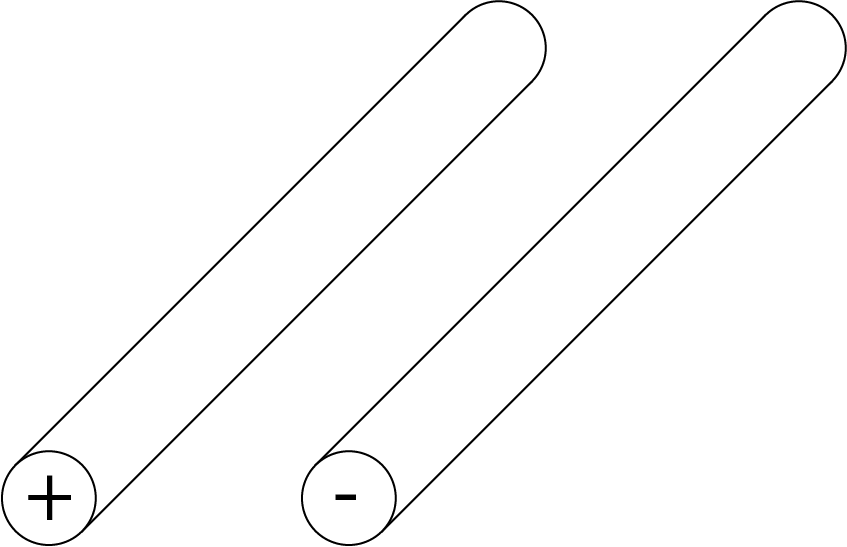
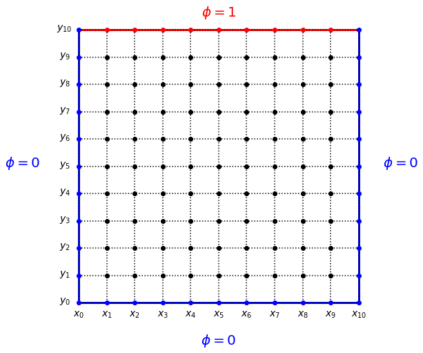

---
jupyter:
  jupytext:
    formats: ipynb,md
    text_representation:
      extension: .md
      format_name: markdown
      format_version: '1.3'
      jupytext_version: 1.16.7
  kernelspec:
    display_name: Python 3 (ipykernel)
    language: python
    name: python3
---

# Partial Differential Equations 1: Boundary Value Problems

In this lecture, we will explore numerically solving partial differential equations (PDEs) that have the form of boundary value problems using various techniques of relaxation. 

**Learning objectives:** After completing this lecture, you should be able to:

1. Implement the Jacobi and Gauss-Seidel methods of solving PDEs 
2. Speed up calculation by implementing successive over-relaxation (SOR)
3. Solve for the electrostatic potential $\phi$ for 2-dimensional (2D) problems using SOR including fixed charges
4. Calculate the surface charge density on the surfaces of a simulation of the 2D poission equation in physical units (C/m$^2$)


```python nbgrader={"grade": false, "grade_id": "cell-cc8d940f3be763cd", "locked": true, "schema_version": 3, "solution": false, "task": false}
# Notebook code
import numpy as np
import matplotlib.pyplot as plt
from time import time

from explore_image import explore_image
plt.rcParams['figure.dpi'] = 100
%matplotlib widget
```

## Poisson's equation in 2D

We will look specifically in this course at the solutions to a specific, linear partial differential equation known as Poisson's equation:

$$
\nabla^2 \phi = 
\frac{\partial^2\phi}{\partial x^2} +
\frac{\partial^2\phi}{\partial y^2} + 
\frac{\partial^2\phi}{\partial z^2} =
\rho(x,y,z)
$$

This equation is hopefully well known to you from your course in <a href=https://en.wikipedia.org/wiki/Electrostatics>electrostatics</a>: it is the equation that determines the electrostatic potential $\phi(\vec{r})$ for a given distribution of charges $\rho(\vec{r})$. 

In this lecture, we will discuss how to solve a two-dimensional version of the equation. By working in 2D, we will keep the calculation times relatively short and it will be easy to visualize our results. The technique, however, can easily be extended into 3D in an obvious way.

What does this mean physically? Of course, Maxwell's equations apply to problems in 3-dimensions: we can't just cut one of the dimensions off! However, if our system is translationally invariant in one dimension (say, the $z$ direction for example), then we know that $\phi$ cannot depend on $z$ since if we move in the $z$ direction, everything looks the same. In this case, the derivative in the $z$ direction will be zero:

$$
\frac{\partial^2\phi}{\partial z^2} = 0
$$

leading us to a two-dimensional version of the Poisson equation:

$$
\frac{\partial^2\phi}{\partial x^2} +
\frac{\partial^2\phi}{\partial y^2} =
\rho(x,y)
$$

What would something like this look like physically? A good example is the two wires that make up a simple transmission line:



If we approximate the wires as infinitely long, or are interested only in places near the wires and also far from their ends, the 2D Poisson equation above will give us a good approximation of the electrostatic potential in the plane perpendicular to the wire direction. 


We will start with the simple case where $\rho(x,y) = 0$, leading to Laplace's equation:

$$
\frac{\partial^2\phi}{\partial x^2} +
\frac{\partial^2\phi}{\partial y^2} = 0
$$

We will use this to explore various techniques for solving it using finite differences and different relaxation techniques, then move on to the solving physical problems in electrostatics. 

## Finite Difference method

The first step in solving the problem numerically is to map the continuous $x,y$ plane into discrete points. Here, we will consider discrete points with a spacing $a$. 

The next step is to approximate the partial derivatives with finite differences. Doing so will lead to:

$$
\frac{\partial^2\phi}{\partial x^2} +
\frac{\partial^2\phi}{\partial y^2} \approx 
\frac{
\phi(x+a,y) + 
\phi(x-a,y) + 
\phi(x,y+a) + 
\phi(x,y-a) -
4 \phi(x,y)}
{a^2}
$$

All we need to do now is to equate this to zero and find the solutions of the resulting coupled (linear) equations. How many equations will we have? If we choose a grid of 100x100 points in our $x,y$ plane, we will have 10,000 equations! That's a lot! Coding this into a matrix is quite daunting...

### Jacobi method for solving the linear equations

Fortunately, there is a simpler method for solving these 10,000 equations, which is known as "relaxation". 

The problem we are looking at is a boundary-value problem: to be able to solve for the potential on our grid, we need to know the value of the potential on the boundaries of our simulation. This is our "known" starting point, and we need to then find the solutions in the middle that solve the Laplace (or the Poisson) equation. 

The way relaxation works is the following: we start with our fixed boundary condition on the outside of our simulation "box". We then start with an initial guess at the potential everywhere inside the box. What do we choose for this? It turns out that it **doesn't matter** what we choose: the techniques we will look at will always work no matter what you chose (which is handy!).

(Note that here, we will consider only "metallic" fixed-potential boundary conditions, also know as the Dirichlet condition. One alternative is also the Neumann boundary condition, specifying no electric field perpendicular to the boundary. Another is periodic boundary conditions. In addition, there are more <a href=https://arxiv.org/abs/1510.04400>exotic boundary conditions</a> that allow, among other things, the simulation of an open boundary to infinity.)

Once we have our boundary set and our initial guess, we then iterate through all the points in our simulation and replace the value of the potential at iteration $N+1$ with the value that would solve the equation we are solving, given the value of it's neighbors at that step of the iteration $N$. With $\rho(x,y) = 0$, this becomes:

$$
\phi_{N+1}(x,y) = 
\frac{\phi_N(x+a,y) + 
\phi_N(x-a,y) + 
\phi_N(x,y+a) + 
\phi_N(x,y-a)}{4}
$$

Note that for $\rho = 0$, the lattice spacing $a$ falls out: we don't even need to know the spacing to do the calculation, just the aspect ratio.

Miraculously (?), if we just keep doing this for a while, the potential will magically converge to the correct solution!

How do we know when to stop? One way is to keep track of the largest change in $\phi$ of any of the pixels in our simulation. If this change in potential goes below a target accuracy that we configure, then we can stop iterating our simulation.


**Exercise 1(a)** Consider a square box with the left, right, and bottom sides grounded, and the top side set to a voltage of 1V. In our finite element technique, we will divide the two-dimensional $x-y$ space into an $M \times M$ grid, illustrated here for $M = 11$: 



The outer boundary points are fixed by the boundary condition, and are not updated when we are solving for $\phi$: instead they remain at a fixed potential. We need to keep track of this so that we do not accidentally update any points that should correspond to a fixed external potential. 

Note that our update equation above does not depend on the spacing between our grid points: the Laplace equation has the same solution regardless if the size of the box in 1 meter of 1 nm! For the Laplace equation, we do not have to keep track what the spacing between our points is.

Your task is to fill in the code below to use Jacobi's method to calculate $\phi(x,y)$.

During your calculation, keep track of the absolute value of the largest change `delta_max` in $\phi$ during that iteration in a list so that we can plot later the convergence as a function of the number of iterations. Use a threshold of 0.1 mV for $\phi$.

To benchmark the computational speed of our simulation, we will keep track of the running time and the code speed.

```python
target_accuracy = 1e-4

# The size of the simulation grid
M = 101
phi = np.zeros([M,M])
phi[-1,1:-1] = 1

# A second matrix for storing the values calculated for the next
# iteration
phinew = phi.copy()

# A matrix to keep track of which points in our simulation 
# are fixed voltages. In this case, it is only the boundaries
# of the simulation
fixed = np.empty([M,M]) 
fixed[:,:] = False # interior points are not fixed, they should be iterated
fixed[0,:] = True
fixed[-1,:] = True
fixed[:,0] = True
fixed[:,-1] = True

# Keep track of the biggest update. 
# When this is smaller than our target accuracy, 
# we will stop iterating
delta_max = 1
delta_max_list = []

t1 = time()
while delta_max > target_accuracy:
    for i in range(M):
        for j in range(M):
            if fixed[i,j]:
                #phinew[i,j] = ...
            else:
                #phinew[i,j] = ....
    #delta_max =....
    delta_max_list.append(delta_max)
    print("N_iter %d delta_max %e\r" % (len(delta_max_list), delta_max), end='')
    # Now that we're done, phi becomes phinew. A sneaky trick: if we swap the two, 
    # we don't need to copy the whole array! 
    phi,phinew = phinew,phi
t2 = time()

print("\nTotal running time: %.2f min" % ((t2-t1)/60))
print("Code speed: %.1f iterations per second" %(len(delta_max_list)/(t2-t1)))

answer_13_1a_1 = phi.copy()
answer_13_1a_2 = delta_max_list.copy()
```

```python
question = "answer_13_1a"
num = 2

to_check = [question + "_%d" % (n+1) for n in range(num)]
feedback = ""
passed = True
for var in to_check:
    res, msg = check_answer(eval(var), var)
    passed = passed and res
    print(msg); feedback += msg + "n"

assert passed == True, feedback
```

**Solution:**
``` python tags=["hide-input"] 
target_accuracy = 1e-4

# The size of the simulation grid
M = 101
phi = np.zeros([M,M])
phi[-1,1:-1] = 1

# A second matrix for storing the values calculated for the next
# iteration
phinew = phi.copy()

# A matrix to keep track of which points in our simulation 
# are fixed voltages. In this case, it is only the boundaries
# of the simulation
fixed = np.empty([M,M]) 
fixed[:,:] = False # interior points are not fixed, they should be iterated
fixed[0,:] = True
fixed[-1,:] = True
fixed[:,0] = True
fixed[:,-1] = True

# Keep track of the biggest update. 
# When this is smaller than our target accuracy, 
# we will stop iterating
delta_max = 1
delta_max_list = []

t1 = time()
while delta_max > target_accuracy:
    for i in range(M):
        for j in range(M):
            if fixed[i,j]:
                #phinew[i,j] = ...
                ### BEGIN SOLUTION
                phinew[i,j] = phi[i,j]
                ### END SOLUTION
            else:
                #phinew[i,j] = ....
                ### BEGIN SOLUTION
                phinew[i,j] = (phi[i+1,j] + phi[i-1,j] + phi[i,j+1] + phi[i,j-1])/4
                ### END SOLUTION
    #delta_max =....
    ### BEGIN SOLUTION
    delta_max = np.max(np.abs(phinew-phi))
    ### END SOLUTION
    delta_max_list.append(delta_max)
    print("N_iter %d delta_max %e\r" % (len(delta_max_list), delta_max), end='')
    # Now that we're done, phi becomes phinew. A sneaky trick: if we swap the two, 
    # we don't need to copy the whole array! 
    phi,phinew = phinew,phi
t2 = time()

print("\nTotal running time: %.2f min" % ((t2-t1)/60))
print("Code speed: %.1f iterations per second" %(len(delta_max_list)/(t2-t1)))

answer_13_1a_1 = phi.copy()
answer_13_1a_2 = delta_max_list.copy()
```


To explore your data, you can use this function to make a handy interactive "data explorer" that I wrote (see code in `resource/asnlib/public/explore_image.py` if you are interested) that can show you both color scale plots and also line cuts. 

Now let's use this function to explore the $\phi$ that you calculated:

```python nbgrader={"grade": false, "grade_id": "cell-2d41400e07d503c1", "locked": true, "schema_version": 3, "solution": false, "task": false}
explore_image(answer_13_1a_1)
```

**Exercise 1(b):** Make a plot of `delta_max` as a function of the iteration number. The y-axis should be a log scale. As always, your plot should have appropriate labels with units where applicable.

```python
# Your code here:
```

**Solution:**
``` python tags=["hide-input"] 
### BEGIN SOLUTION
plt.plot(answer_13_1a_2)
plt.yscale('log')
plt.ylabel("$\Delta \phi_{max}$ (V)")
plt.xlabel("Iteration number")
### END SOLUTION
```

## Gauss-Seidel method

A speedup of the Jacobi method can be obtained by using the _already updated_ calculated values of $\phi$ instead of waiting for the next round. 

For doing this, we have to have a different way of keeping track of `delta_max` than we used above, and so the code will look a bit different. A handy (and computationally efficient) way of doing this in python is to keep track of all the `delta` in a matrix and then us `np.max(np.abs(delta))` to find the largest one afterwards.

(You might think: I could add an `if` statement in my loop to keep track of `delta_max`: why do I need a full matrix? This is what I initially thought too but it turns out that this slows your code down a lot and you're much faster just keeping the full matrix and using `np.max()` at the end. Why? Python is an interpreted language, which means adding anything to a hand-coded loop is just a really, really bad idea if you don't have to. Because `np.max()` does the calculation with "vectorized": it runs with pre-compiled, and not interpreted, loops. We saw this in the first lecture with the 700-fold speed improvement of `np.average` compared to writing our own `for` loop to calculate the average of a vector.)

**Exercise 2(a)** Perform the calculation of exercise 1(a) with the Gauss-Seidel method.

```python
target_accuracy = 1e-4

M = 101
phi = np.zeros([M,M])
delta = phi.copy()
phi[-1,1:-1] = 1

# A matrix to keep track of which points in our simulation 
# are fixed voltages. In this case, it is only the boundaries
# of the simulation
fixed = np.empty([M,M])
fixed[:,:] = False
fixed[0,:] = True
fixed[-1,:] = True
fixed[:,0] = True
fixed[:,-1] = True


# Keep track of the biggest update. 
# When this is smaller than our target accuracy, 
# we will stop iterating
delta_max = 1
delta_max_list = []

t1 = time()
while delta_max > target_accuracy:
    for i in range(M):
        for j in range(M):
            if not fixed[i,j]:
                #delta[i,j] = ...
                #...
    delta_max = np.max(np.abs(delta))
    delta_max_list.append(delta_max)
    print("N_iter %d delta_max %e\r" % (len(delta_max_list), delta_max), end='')   
t2 = time()
print("\nTotal running time: %.2f min" % ((t2-t1)/60))
print("Code speed: %.1f iterations per second" %(len(delta_max_list)/(t2-t1)))

answer_13_2a_1 = phi.copy()
answer_13_2a_2 = delta_max_list.copy()
```

```python
question = "answer_13_2a"
num = 2

to_check = [question + "_%d" % (n+1) for n in range(num)]
feedback = ""
passed = True
for var in to_check:
    res, msg = check_answer(eval(var), var)
    passed = passed and res
    print(msg); feedback += msg + "n"

assert passed == True, feedback
```

**Solution:**
``` python tags=["hide-input"] 
target_accuracy = 1e-4

M = 101
phi = np.zeros([M,M])
delta = phi.copy()
phi[-1,1:-1] = 1

# A matrix to keep track of which points in our simulation 
# are fixed voltages. In this case, it is only the boundaries
# of the simulation
fixed = np.empty([M,M])
fixed[:,:] = False
fixed[0,:] = True
fixed[-1,:] = True
fixed[:,0] = True
fixed[:,-1] = True


# Keep track of the biggest update. 
# When this is smaller than our target accuracy, 
# we will stop iterating
delta_max = 1
delta_max_list = []

t1 = time()
while delta_max > target_accuracy:
    for i in range(M):
        for j in range(M):
            if not fixed[i,j]:
                #delta[i,j] = ...
                #...
                ### BEGIN SOLUTION
                delta[i,j] = (phi[i+1,j] + phi[i-1,j] + phi[i,j+1] + phi[i,j-1])/4 - phi[i,j]
                phi[i,j] += delta[i,j]
                ### END SOLUTION
    delta_max = np.max(np.abs(delta))
    delta_max_list.append(delta_max)
    print("N_iter %d delta_max %e\r" % (len(delta_max_list), delta_max), end='')   
t2 = time()
print("\nTotal running time: %.2f min" % ((t2-t1)/60))
print("Code speed: %.1f iterations per second" %(len(delta_max_list)/(t2-t1)))

answer_13_2a_1 = phi.copy()
answer_13_2a_2 = delta_max_list.copy()
```


You can check that it looks the same:

```python nbgrader={"grade": false, "grade_id": "cell-1bf7a18ed109d0e1", "locked": true, "schema_version": 3, "solution": false, "task": false}
# Notebook code
explore_image(answer_13_2a_1)
```

Although the code is not that much faster in total time (because of the slightly more complicated stuff going on in the `for` loops), it converges in fewer iterations.

**Exercise 2(b):** Plot `delta_max` vs iteration number for both the Jacobi method and the Gauss-Seidel method. Use a logscale for the y-axis. 

```python
# Your code here:
```

**Solution:**
``` python tags=["hide-input"] 
### BEGIN SOLUTION
plt.plot(answer_13_1a_2, label="Jacobi")
plt.plot(answer_13_2a_2, label="Gauss-Seidel")
plt.yscale('log')
plt.ylabel("$\Delta \phi_{max}$ (V)")
plt.xlabel("Iteration number")
plt.legend()
### END SOLUTION
```

## Successive over-relaxation

Although we did not gain much speed with the Gauss-Seidel technique, there is a small trick we can play with it to make it MASSIVELY faster.

The trick is as follows: instead of correcting `phi` to the value that would solve the equation based on it's neighboring values, we go *a bit* further: 

$$
\phi_{new}(x,y) = \phi_{old}(x,y) + \omega \delta
$$

where $\delta$ is the correction that you would have calculated in the Gauss-Seidel method and $\omega$ is a number between 0 and 2. With $\omega > 1$, this technique is known as successive over-relaxation (SOR). It turns out, if you pick the right $\omega$, you simulation can run MUCH MUCH faster. 

Picking the optimal value of $\omega$ is not easy, and depends in detail on the size and even configuration of your simulation. The Gauss-Seidel method corresponds to $\omega = 1$. For $\omega > 2$, the method does not converge (it is unstable). And, for nonlinear Poisson equations (in which $\rho$ depends on $\phi$ in a nonlinear way, which I studied in my PhD), under-relaxing with $\omega < 1$ can help unstable simulations converge. In general, for regular linear PDEs and large simulations, a value close to 2 is a good guess, and guessing a bit high is better than guessing to low. But even if you guess a bit wrong, it still can speed up your simulation very significantly.

(In particular, it can change the scaling with simulation size from $N^2$ to $N^{1.5}$, which is a huge deal! You can read chapter 5 of my <a href=http://nsweb.tn.tudelft.nl/~gsteele/thesis/Gary_Steele.compressed_images.pdf>PhD thesis</a> if you would like to learn some more about the speed and applications of relaxation technique.)

As you will see, even for these small simulation sizes, it can significantly speed up the calculation.

**Exercise 3(a):** Modify your code from 2(a) to implement SOR. Use an SOR paramter of 1.95 (which I found worked well by trail-and-error...). 

```python
SOR_parameter = 1.95
target_accuracy = 1e-4

# phi = ...
# delta_max_list = ...

print("\nTotal running time: %.2f min" % ((t2-t1)/60))
print("Code speed: %.1f iterations per second" %(len(delta_max_list)/(t2-t1)))

answer_13_3a_1 = phi.copy()
answer_13_3a_2 = delta_max_list.copy()
```

```python
question = "answer_13_3a"
num = 2

to_check = [question + "_%d" % (n+1) for n in range(num)]
feedback = ""
passed = True
for var in to_check:
    res, msg = check_answer(eval(var), var)
    passed = passed and res
    print(msg); feedback += msg + "n"

assert passed == True, feedback
```

**Solution:**
``` python tags=["hide-input"] 
SOR_parameter = 1.95
target_accuracy = 1e-4

### BEGIN SOLUTION
M = 101
phi = np.zeros([M,M])
delta = phi.copy()
phi[-1,1:-1] = 1

# A matrix to keep track of which points in our simulation 
# are fixed voltages. In this case, it is only the boundaries
# of the simulation
fixed = np.empty([M,M])
fixed[:,:] = False
fixed[0,:] = True
fixed[-1,:] = True
fixed[:,0] = True
fixed[:,-1] = True


# Keep track of the biggest update. 
# When this is smaller than our target accuracy, 
# we will stop iterating
delta_max = 1
delta_max_list = []

t1 = time()
while delta_max > target_accuracy:
    for i in range(M):
        for j in range(M):
            if not fixed[i,j]:
                delta[i,j] = (phi[i+1,j] + phi[i-1,j] + phi[i,j+1] + phi[i,j-1])/4 - phi[i,j]
                phi[i,j] += SOR_parameter*delta[i,j]
    delta_max = np.max(np.abs(delta))
    delta_max_list.append(delta_max)
    print("N_iter %d delta_max %e\r" % (len(delta_max_list), delta_max), end='')

t2 = time()
### END SOLUTION

print("\nTotal running time: %.2f min" % ((t2-t1)/60))
print("Code speed: %.1f iterations per second" %(len(delta_max_list)/(t2-t1)))

answer_13_3a_1 = phi.copy()
answer_13_3a_2 = delta_max_list.copy()
```


By now, I guess you trust that the technique works, but you can also take a look at $\phi$ just to check if you want:

```python nbgrader={"grade": false, "grade_id": "cell-dba7aebb72d944a5", "locked": true, "schema_version": 3, "solution": false, "task": false}
# Notebook code 
explore_image(answer_13_3a_1)
```

**Exercise 3(b):** Make a plot of `delta_max` vs iteration number for the three techniques. 

```python
# Your code here:
```

**Solution:**
``` python tags=["hide-input"] 
### BEGIN SOLUTION
plt.plot(answer_13_1a_2, label="Jacobi")
plt.plot(answer_13_2a_2, label="Gauss-Seidel")
plt.plot(answer_13_3a_2, label="SOR")
plt.yscale('log')
plt.ylabel("$\Delta \phi_{max}$ (V)")
plt.xlabel("Iteration number")
plt.legend()
### END SOLUTION
```

Note that SOR initially is slower than the other two techniques (and sometimes the convergence parameter can even INCREASE at the start with SOR), but it quickly overtakes the other two and converges very quickly to the correct answer. 

## Including fixed charges

In some cases, one might want to simulate the case where there are external fixed charges in our simulation.

To do this, we need to add an additional term to our update equations to account for the external charge. In the Jacobi method, we would have:

$$
\phi_{N+1}(x,y) = 
\frac{\phi_N(x+a,y) + 
\phi_N(x-a,y) + 
\phi_N(x,y+a) + 
\phi_N(x,y-a) + \rho(x,y)}{4}
$$

Note that we will work in "dimensionless units", or equivalently units in which I have chosen $\epsilon = 1$. This will make it easier to code the problem. You might ask, but what if I want to map the solutions I find to a real charge distribution? Fortunately, the Poisson equation is linear, and so we can always afterwards rescale our calculated results with the appropriately chosen factors to be able to calculate charges in Coulombs and electrostatic potentials in Volts. But we will keep it simple and do the calculation in dimensionless units. 

Note that now that externally imposed charge $\rho$ is not zero, one needs to now account for the lattice spacing correctly to calculate the correct potential to achieve the correct values of the source charges. 

For implementing SOR, we would then follow the Gauss-Seidel approach for the updating of $\phi$ and also over-relax.

In our simulation, we will also now need an additional matrix `rho` to specify the positions of fixed charge densities in the simulation.

**Exercise 4(a):** Peform a simulation of a 2d "point source" consisting of a single pixel at position `i,j = 50,50` with charge `rho = 1`. (Note that our "point source" 2D simulation actually corresponds to the voltage around a thin, infinitely long wire.) Use the metallic boundary condition V=0 at the boundaries. 

To match the numerical answer values of the reference solution, use SOR with an SOR parameter of 1.95. 

```python
target_accuracy = 1e-4
M = 101
SOR_parameter = 1.95

# Our fixed charge input matrix
rho_fixed = np.zeros([M,M])
rho_fixed[M//2,M//2] = 1

# phi = ...

answer_13_4a_1 = phi.copy()
answer_13_4a_2 = rho_fixed.copy()
```

```python
question = "answer_13_4a"
num = 2

to_check = [question + "_%d" % (n+1) for n in range(num)]
feedback = ""
passed = True
for var in to_check:
    res, msg = check_answer(eval(var), var)
    passed = passed and res
    print(msg); feedback += msg + "n"

assert passed == True, feedback
```

**Solution:**
``` python tags=["hide-input"] 
target_accuracy = 1e-4
M = 101
SOR_parameter = 1.95

# Our fixed charge input matrix
rho_fixed = np.zeros([M,M])
rho_fixed[M//2,M//2] = 1

### BEGIN SOLUTION
phi = np.zeros([M,M])
delta = phi.copy()

# A matrix to keep track of which points in our simulation 
# are fixed voltages. In this case, it is only the boundaries
# of the simulation
fixed = np.zeros([M,M])
fixed[:,:] = False
fixed[[0,-1],:] = True
fixed[:,[0,-1]] = True

delta_max = 1
delta_max_list = []

t1 = time()

while delta_max > target_accuracy:
    for i in range(M):
        for j in range(M):
            if not fixed[i,j]:
                delta[i,j] = (phi[i+1,j] + phi[i-1,j] + phi[i,j+1] + phi[i,j-1])/4 \
                    + rho_fixed[i,j]/4 - phi[i,j]
                phi[i,j] += delta[i,j]*SOR_parameter
    delta_max = np.max(np.abs(delta))
    delta_max_list.append(delta_max)
    print("N_iter %d delta_max %e\r" % (len(delta_max_list), delta_max), end='')

t2 = time()
print("\nTotal running time: %.2f min" % ((t2-t1)/60))
print("Code speed: %.1f iterations per second" %(len(delta_max_list)/(t2-t1)))
### END SOLUTION

answer_13_4a_1 = phi.copy()
answer_13_4a_2 = rho_fixed.copy()
```


```python nbgrader={"grade": false, "grade_id": "cell-6ac9674a29b3cb7b", "locked": true, "schema_version": 3, "solution": false, "task": false}
# Notebook code
explore_image(answer_13_4a_1)
```

## Calculating charge distributions

In all of the above simulations, even ones with external charge $\rho=0$, there was charge present in the resulting calculated physical problem. How do I know this? If there is no charge, there will be no change in potential. OK, but where is this charge? 

With the exception of the last simulation, the charge in the simulation was _induced_ charge that formed due to the voltage on the applied to the metals boundaries. 

Even in the last simulation of exercise 4, where there is very clearly charge in the middle of the simulation where we placed the fixed  charge, there is also charge induced on the boundary walls: the image charge induced by the electrical fields from the point charge we added in the middle. 

How do we calculate this charge? Well, if we know $\phi(x,y)$, we can just use the Poisson equation:

$$
\rho(x,y) = \nabla^2 \phi(x,y)
$$

where numerically, we use the following to calculate $\nabla^2 \phi$:

$$
\frac{\partial^2\phi}{\partial x^2} +
\frac{\partial^2\phi}{\partial y^2} \approx 
\frac{
\phi(x+a,y) + 
\phi(x-a,y) + 
\phi(x,y+a) + 
\phi(x,y-a) -
4 \phi(x,y)}
{a^2}
$$

A subtle point arises at the boundary: for the outer boundary points, don't have neighbors. For example, a point on the left of the simulation has no point at $x-a$. 

What do I do? One could add special code for calculating the charge for these boundary conditions, but this would be a lot of cumbersome work. 

A very simple and pragmatic way around this for the "metallic" boundary condition is just to add an extra grid point: make the boundaries two grid points thick. Since the induced charge in a (non-quantum-mechanical) metal is a perfect surface layer, we know that these "extra" boundary points must have zero charge. We can then just set them all to zero, and then use the Poisson equation above to calculate the charge density everywhere, just skipping the outermost pixels. 

Let's implement this for the problem of exercise 4.

**Exercise 5(a):** Implement exercise 4(a) with an extra boundary grid point on all sides. 

```python
target_accuracy = 1e-4
M = 103

phi = np.zeros([M,M])
delta = phi.copy()

# A matrix to keep track of which points in our simulation 
# are fixed voltages. In this case, it is only the boundaries
# of the simulation
fixed = np.zeros([M,M])
fixed[:,:] = False
# fixed[[___,___,___,___],:] = True
# fixed[:,[___,___,___,___]] = True


# The external fixed charge
rho_fixed = np.zeros([M,M])
# rho_fixed[___,___] = 1

# ...


answer_13_5a_1 = rho_fixed.copy()
answer_13_5a_2 = phi.copy()
```

```python
question = "answer_13_5a"
num = 2

to_check = [question + "_%d" % (n+1) for n in range(num)]
feedback = ""
passed = True
for var in to_check:
    res, msg = check_answer(eval(var), var)
    passed = passed and res
    print(msg); feedback += msg + "n"

assert passed == True, feedback
```

**Solution:**
``` python tags=["hide-input"] 
target_accuracy = 1e-4
M = 103

phi = np.zeros([M,M])
delta = phi.copy()

# A matrix to keep track of which points in our simulation 
# are fixed voltages. In this case, it is only the boundaries
# of the simulation
fixed = np.zeros([M,M])
fixed[:,:] = False
# fixed[[___,___,___,___],:] = True
# fixed[:,[___,___,___,___]] = True
### BEGIN SOLUTION
fixed[[0,1,-1,-2],:] = True
fixed[:,[0,1,-1,-2]] = True
### END SOLUTION


# The external fixed charge
rho_fixed = np.zeros([M,M])
# rho_fixed[___,___] = 1
### BEGIN SOLUTION
rho_fixed[M//2,M//2] = 1
### END SOLUTION

# ...
### BEGIN SOLUTION
# Keep track of the biggest update. 
# When this is smaller than our target accuracy, 
# we will stop iterating
delta_max = 1
delta_max_list = []

t1 = time()
SOR_parameter = 1.95

while delta_max > target_accuracy:
    for i in range(M):
        for j in range(M):
            if not fixed[i,j]:
                delta[i,j] = (phi[i+1,j] + phi[i-1,j] + phi[i,j+1] + phi[i,j-1])/4 \
                    + rho_fixed[i,j]/4 - phi[i,j]
                phi[i,j] += delta[i,j]*SOR_parameter
    delta_max = np.max(np.abs(delta))
    delta_max_list.append(delta_max)
    print("N_iter %d delta_max %e\r" % (len(delta_max_list), delta_max), end='')

t2 = time()
print("\nTotal running time: %.2f min" % ((t2-t1)/60))
print("Code speed: %.1f iterations per second" %(len(delta_max_list)/(t2-t1)))
### END SOLUTION


answer_13_5a_1 = rho_fixed.copy()
answer_13_5a_2 = phi.copy()
```


Now that we have the calculated potential with the "extra boundary" point, we can calculate the charge density in our simulation, including the charge density induced on the boundary walls, by using the equation below:

$$
\rho(x,y) = 
\Big( 
\phi(x+a,y) + 
\phi(x-a,y) + 
\phi(x,y+a) + 
\phi(x,y-a) -
4 \phi(x,y)
\Big)
$$

Note that you can only apply this formula to the "interior" points of the simulation: for the "boundary points" at the edges of the simulation, you have no neighbors to fill in this equation! This leads to a problem: the matrix we will calculate for the charge density will be two pixels smaller in each direction (an MxM matrix for $\phi$ becomes an (M-2)x(M-2) matrix for the calculated $\sigma$). 

However, in the example above, we have been using a "double pixel" metal (fixed voltage, <a href=https://en.wikipedia.org/wiki/Dirichlet_boundary_condition>Dirichlet</a>)) boundary condition. In this case, we know that any electric fields from charges inside the simulation must be fully screened by the first metal pixel, and cannot induce any charge in the second layer of "metal" pixels behind them. Because of this, if we want to (and it is handy to, for example, for plotting), we can make the calculated $\sigma$ matrix also MxM pixels and just set the outermost ones to zero. And if we create the matrix using `np.zeros` as below, then they already are zero, which is handy! 

**Exercise 5(b):** Calculate the (dimensionless) charge density for the simulation in question 5(a).

```python
rho_calc = np.zeros([M,M])
phi = answer_13_5a_2

# ...

answer_13_5b_1 = np.copy(rho_calc)
```

```python
question = "answer_13_5b"
num = 1

to_check = [question + "_%d" % (n+1) for n in range(num)]
feedback = ""
passed = True
for var in to_check:
    res, msg = check_answer(eval(var), var)
    passed = passed and res
    print(msg); feedback += msg + "n"

assert passed == True, feedback
```

**Solution:**
``` python tags=["hide-input"] 
rho_calc = np.zeros([M,M])
phi = answer_13_5a_2
### BEGIN SOLUTION
for i in range(1,M-1):
    for j in range(1,M-1):
        rho_calc[i,j] = \
            (phi[i+1,j] + phi[i-1,j] + phi[i,j+1] + phi[i,j-1] - 4*phi[i,j])
### END SOLUTION

answer_13_5b_1 = np.copy(rho_calc)
```


You can use this code to make a plot of the calculated surface charge density. I've chosen a range of the colorscale such that it is not overwhelmed by the large charge density of the point source. 

```python nbgrader={"schema_version": 3, "solution": false, "grade": false, "locked": true, "task": false, "grade_id": "cell-9eef6df5a038beef"}
plt.imshow(answer_13_5b_1, cmap="RdBu")
plt.colorbar()
plt.clim(vmax=-np.min(answer_13_5b_1)-2e-6)
```

You can also "explore" the image here and look at some line cuts. It can be visualised better for this dataset if you plot the negative of the charge density. You can see the image charges on the edges if you adjust the "color tweak" setting to about 0.148. And also if you adjust "linecut" to 1 and turn on "Autoscale linecut". 

What strange thing do you see at "linecut" = 2 with "Autoscale linecut" on? If you look at the linecut, you should see that something is wrong. Can you spot it? And do you know where it comes from? And how to solve it? 

Post in the forum if you're stuck and would like the answer :)

```python nbgrader={"schema_version": 3, "solution": true, "grade": false, "locked": false, "task": false, "grade_id": "cell-e2494f2742ba74a9"}
explore_image(-answer_13_5b_1,zname='$\sigma$')
```

What do you expect the total charge to be in your simulation? Use `np.sum()` to check your answer. Compare this number to the external charge you put on the center pixel in the simulation. Does this make sense? How could you make it better? 

Again, post in the forum if you're not sure :)

```python nbgrader={"schema_version": 3, "solution": false, "grade": false, "locked": true, "task": false, "grade_id": "cell-194bee71f7eeee26"}
np.sum(answer_13_5b_1)
```

```python tags=["auto-execute-page", "thebe-init", "hide-input"]
## Pre-loading the solutions

import sys
await micropip.install("numpy")
from validate_answers import *

with open(location):
    pass # Initially this notebook does not recognise the file unless someone tries to read it first
```
