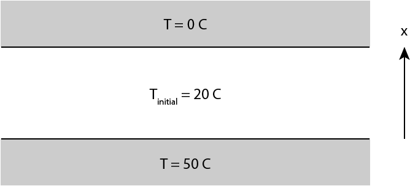
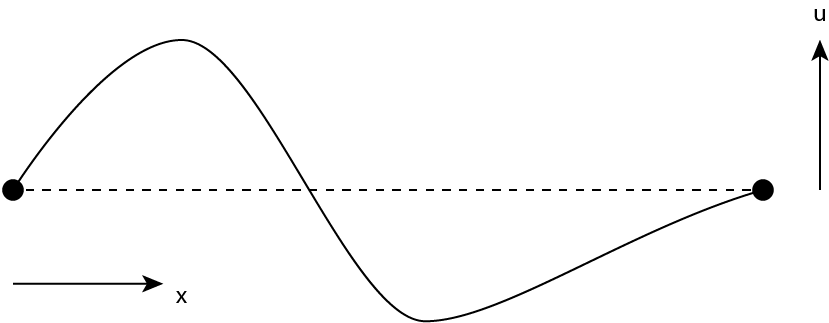

---
jupyter:
  jupytext:
    formats: ipynb,md
    text_representation:
      extension: .md
      format_name: markdown
      format_version: '1.3'
      jupytext_version: 1.16.1
  kernelspec:
    display_name: Python 3 (ipykernel)
    language: python
    name: python3
---

# Partial Differential Equations 2: Initial Value Problems

In this lecture, we will explore numerically solving partial differential equations (PDEs) that have the form of an initial value problem using the forward-time centered-space (FTCS) and the spectral method.

**Learning objectives:** After completing this lecture, you should be able to:

1. Implement the FTCS method for solving initial-value PDEs
3. Solve and interpret the results from simulations of the 1-dimensional diffusion equation using FCTS
4. Identify the failure of the FTCS method for solving some problems due to numerical instability
5. Implement the spectral method for solving initial-value PDEs
6. Solve and interpret the results form simulations of the wave equation using the spectral method

```python nbgrader={"grade": false, "grade_id": "cell-3c20b446d52a656e", "locked": true, "schema_version": 3, "solution": false, "task": false}
# Notebook code
import numpy as np
import matplotlib.pyplot as plt
from time import time
import matplotlib.animation
from scipy.fftpack import dst,idst

%matplotlib notebook
plt.rcParams['figure.dpi'] = 100
plt.rcParams["animation.html"] = "jshtml"
```

## The FTCS method

In the previous lecture, we were looking at solving for the steady-state solution of a PDE such as the Poisson equation subjected to particular boundary conditions. In that case, we were interested in a function $\phi(x,y)$ that was static in time but depended on two spatial coordinates. 

Another class of PDE that arises frequently in physics is a multivariable problem where one is given an initial condition for a function, and one would like to solve for the value of the function at later times. Since time is now a variable in the equation, the simplest of these involve a function of one spatial dimension and time. An example of this type of PDE is the diffusion equation. For a general function $\phi(x,t)$, this has the form:

$$
\frac{\partial \phi}{\partial t} = 
D 
\frac{\partial^2 \phi}{\partial x^2} 
$$

One approximation for solving this is to use the equation above to make a prediction for $\phi(x,t+dt)$:

$$
\phi(x, t+dt) \approx \phi(x,t) + \frac{\partial \phi}{\partial t}dt  = \phi(x,t) +
D  \frac{\partial^2 \phi}{\partial x^2} dt
$$

Using the finite-difference approximation we used previously for the second derivative, we have:

$$
\phi(x, t+dt) \approx \phi(x,t) + \frac{D \cdot dt}{(dx)^2} \big[ \phi(x+dx) + \phi(x-dx) - 2 \phi(x) \big]
$$

This equation then allows us to calculate $\phi(x,t)$ by taking incremental steps in time and iteratively calculating the new updated $\phi$ at each time step. This technique is known as the forward-time centered-space method (FTCS). 

Below, we will explore implementing the FCTS method for calculating the time dependence of the temperature of a block that is subjected to boundary conditions of fixed temperature, illustrated here schematically:



**Exercise 1:** A steel block that is 1 cm thick has an initial temperture of 20 degrees Celcius. At time $t=0$, it is sandwiched between a cold bath at a temperature of 0 degrees at $x = 1$ cm, and a hot bath at a temperature of 50 degrees at $x = 0$. Calculate the time dependence of the temperature profile inside the steel block. 

The thermal diffusivity D for steel is $4.25 \times 10^{-6}$ m$^2$/s. Perform your computation for a grid of points in spacial coodinate $x$ that runs from 0 to 1 cm with a total of `Nx` = 100 point in space. Calculate the profile for times from $t=0$ to $t=2$ seconds with `Nt` = 10$^4$ points in time. 

```python
# Physical constants
D = 4.25e-6

# Our spatial axis
L = 0.01 
Nx = 100

# x = np.linspace(...)
# dx = ...


# Our time axis
tf = 2
Nt = int(1e4)

# t = np.linspace(...,...,...)
# dt = t[...]


# A matrix to store the time and spatial dependence
# of the temperature.
# This will be a matrix of size (N_t, N_x). 
# T[i,j] is then T for time t[i] and position x[j]
T = np.zeros([Nt, Nx])

# Our initial condibtion (uniform constant temperature)
# T[...] = 20

# The temperature at x=0 should be fixed at 50 for all times. 
# At x=L, the temperature should be fixed at 0 for all times. 
# T[...] = 50
# T[...] = 0


# t1 = time()
# for i in range(N_t-1):
#     # Note that we don't update the boundaries at x=0 and x=L
#     for j in range(...,...):
#         T[i+1,j] = T[i,j] + ... 
# t2 = time()


print("Total calculation time: %.2f seconds" % (t2-t1))

answer_14_1_1 = T.copy()
```

```python
question = "answer_14_1"
num = 1

to_check = [question + "_%d" % (n+1) for n in range(num)]
feedback = ""
passed = True
for var in to_check:
    res, msg = check_answer(eval(var), var)
    passed = passed and res
    print(msg); feedback += msg + "n"

assert passed == True, feedback
```

**Solution:**
``` python tags=["hide-input"] 
# Physical constants
D = 4.25e-6

# Our spatial axis
L = 0.01 
Nx = 100

# x = np.linspace(...)
# dx = ...
### BEGIN SOLUTION
x = np.linspace(0,L,Nx)
dx = x[1]

### END SOLUTION


# Our time axis
tf = 2
Nt = int(1e4)

# t = np.linspace(...,...,...)
# dt = t[...]
### BEGIN SOLUTION
t = np.linspace(0,tf,Nt)
dt = t[1]
### END SOLUTION


# A matrix to store the time and spatial dependence
# of the temperature.
# This will be a matrix of size (N_t, N_x). 
# T[i,j] is then T for time t[i] and position x[j]
T = np.zeros([Nt, Nx])

# Our initial condibtion (uniform constant temperature)
# T[...] = 20
### BEGIN SOLUTION
T[0,:] = 20
### END SOLUTION

# The temperature at x=0 should be fixed at 50 for all times. 
# At x=L, the temperature should be fixed at 0 for all times. 
# T[...] = 50
# T[...] = 0
### BEGIN SOLUTION
T[:,0] = 50
T[:,-1] = 0
### END SOLUTION


# t1 = time()
# for i in range(N_t-1):
#     # Note that we don't update the boundaries at x=0 and x=L
#     for j in range(...,...):
#         T[i+1,j] = T[i,j] + ... 
# t2 = time()
### BEGIN SOLUTION
t1 = time()
for i in range(Nt-1):
    for j in range(1,Nx-1):
        T[i+1,j] = T[i,j] + D*dt/dx**2*(T[i,j+1]+T[i,j-1]-2*T[i,j])  
t2 = time()
### END SOLUTION


print("Total calculation time: %.2f seconds" % (t2-t1))

answer_14_1_1 = T.copy()
```


Let's take a look at the results. A nice way to visualize this is with an animation. The following two code cells allow you to create an animation of the temperature profile as a function of time.

```python nbgrader={"grade": false, "grade_id": "cell-e3116ce3d6c79a7c", "locked": false, "schema_version": 3, "solution": true, "task": false}
%%capture
# We need the above notebook "magic" to prevent an extra empty plot from being created.
# It also needs to be on the first line of the code cell.

# We have 10^4 points, but for our animation, 100 frames is enough. 
# (If we try to animate all 10^4 frames, it will take forever to create
# the animation object)

frames = 100
skip = Nt // frames

fig, ax = plt.subplots()
line, = ax.plot(x,T[0,:]);
plt.ylabel("T (deg C)")
plt.xlabel("Distance x (m)")
title = plt.title("t = %s seconds" % t[0])

def animate(i):
    i=i*skip
    title.set_text("t = %.2f seconds" % t[i])
    line.set_data(x,T[i,:])

anim = matplotlib.animation.FuncAnimation(fig, animate, frames=len(t)//skip, interval=40);
```

```python nbgrader={"grade": false, "grade_id": "cell-f54f9b2410347ae3", "locked": true, "schema_version": 3, "solution": false, "task": false}
anim
```

## Applying the FTCS method to the wave equation

Another common initial-value problem that arises with partial differential equations is the wave equation. An example of a common wave equation is that for the vertical displacements $u$ of a string as a function of the horizontal position $x$ and time $t$: 



which obey the equation: 

$$
\frac{\partial^2 u}{\partial t^2} = c^2 
\frac{\partial^2 u}{\partial x^2}
$$

where $c$ is the wave velocity of the string. How do solve this equation? Like we did for ODEs, we will split the second order derivative in time into two first order derivatives by introducing a new variable:

$$
v(t,x) \equiv \frac{\partial u}{\partial t}
$$

Physically, $v$ represents the vertical velocity of the vibrating string. Doing so, we can split the equation above that has a second-order derivative in time into two, coupled equations that have only first-order derivatives in time:

$$
\frac{du}{dt} & = v \\
\frac{dv}{dt} & = c^2 \frac{\partial^2 u}{\partial x^2} \\
$$

Using Euler's method for this, and using the finite difference approximation for the second derivative with respect to $x$, we can derive the following two update equations that for $u$ and $v$: 

$$
u(x,t+dt) & = u(x,t) + v(x,t) dt \\
v(x,t+dt) & = v(x,t) + \frac{c^2 \cdot dt}{(dx)^2} [u(x+dx,t) + u(x-dx,t) - 2u(x,t)]
$$

which, in principle, we can solve using the FTCS method as we did above for the diffusion equation.

**Exercise 2:** Fill in the code below to solve the wave equation for a vibrating string using the FTCS method. Take $c = 1$ m/s and consider a string of length $L$. For your $x$ coordinate, use a grid with `Nx` = 100 points. 

For you $t$ coordinate, run your simulation for 1.2 seconds with 550 points in your time array. Consider an initial displacement $x(x,t=0) = \sin(\pi x/L)$ and an initial velocity $v(x,t=0) = 0$. 

```python
# The wave velocity in the string
c = 1 # m/s

# Positions along the length of the string
# Let's make it 1 m long
L = 1
Nx = 100
# x = np.linspace(...)

dx = x[1]

# Our time axis
# Let's make it 1.2 seconds long
Nt = 550
tf = 1.2
# t = np.linspace(...)
dt = t[1]

# A matrix for tracking the vertical displacement of the string
# and the vertical velocity v = du/dt
# u = np.zeros(...)
# v = np.zeros(...)

# Our initial condibtion: a "displaced" string
# Sine wave in displacement with no initial velocity
u[0,:] = np.sin(np.pi*x/L)
v[0,:] = 0

# Make sure the boundary conditions are inforced
u[:,[0,-1]] = 0
v[:,[0,-1]] = 0

t1 = time()
for i in range(Nt-1):
    for j in range(1,Nx-1):
        #u[i+1,j] = ...
        #v[i+1,j] = ...

t2 = time()

print("Total calculation time: %.2f seconds" % (t2-t1))

answer_14_2_1 = u.copy()
answer_14_2_2 = v.copy()
```

```python
question = "answer_14_2"
num = 2

to_check = [question + "_%d" % (n+1) for n in range(num)]
feedback = ""
passed = True
for var in to_check:
    res, msg = check_answer(eval(var), var, atol=1e8)
    passed = passed and res
    print(msg); feedback += msg + "n"

assert passed == True, feedback
```

**Solution:**
``` python tags=["hide-input"] 
# The wave velocity in the string
c = 1 # m/s

# Positions along the length of the string
# Let's make it 1 m long
L = 1
Nx = 100
# x = np.linspace(...)
### BEGIN SOLUTION
x = np.linspace(0,L,Nx)
### END SOLUTION

dx = x[1]

# Our time axis
# Let's make it 1.2 seconds long
Nt = 550
tf = 1.2
# t = np.linspace(...)
### BEGIN SOLUTION
t = np.linspace(0,tf,Nt)
### END SOLUTION
dt = t[1]

# A matrix for tracking the vertical displacement of the string
# and the vertical velocity v = du/dt
# u = np.zeros(...)
# v = np.zeros(...)
### BEGIN SOLUTION
u = np.zeros([Nt, Nx])
v = np.zeros([Nt, Nx])
### END SOLUTION

# Our initial condibtion: a "displaced" string
# Sine wave in displacement with no initial velocity
u[0,:] = np.sin(np.pi*x/L)
v[0,:] = 0

# Make sure the boundary conditions are inforced
u[:,[0,-1]] = 0
v[:,[0,-1]] = 0

t1 = time()
for i in range(Nt-1):
    for j in range(1,Nx-1):
        #u[i+1,j] = ...
        #v[i+1,j] = ...
        ### BEGIN SOLUTION
        u[i+1,j] = u[i,j] + v[i,j]*dt
        v[i+1,j] = v[i,j] + c**2/dx**2 * \
            (u[i,j-1] + u[i,j+1] - 2*u[i,j])*dt
        ### END SOLUTION

t2 = time()

print("Total calculation time: %.2f seconds" % (t2-t1))

answer_14_2_1 = u.copy()
answer_14_2_2 = v.copy()
```


Let's animate your results:

```python nbgrader={"grade": false, "grade_id": "cell-5483595b1367de11", "locked": false, "schema_version": 3, "solution": true, "task": false}
%%capture

frames = 100
skip = Nt // frames

fig, ax = plt.subplots()
line, = ax.plot(x,u[0,:])
plt.ylim(-1.2,1.2)
plt.ylabel("Displacement u (m)")
plt.xlabel("Distance x (m)")
title = plt.title("t = %s seconds" % t[0])

def animate(i):
    i=i*skip
    title.set_text("t = %.4f seconds" % t[i])
    line.set_data(x,u[i,:])

    
anim = matplotlib.animation.FuncAnimation(fig, animate, frames=frames, interval=80);
```

```python nbgrader={"grade": false, "grade_id": "cell-2c07a956dd8f0a7b", "locked": true, "schema_version": 3, "solution": false, "task": false}
anim
```

Clearly, the FTCS method does not work so well for the wave equation!

## Spectral Method

A very efficient way to solve the wave equation above is one that you are already (or should be) *very* familiar with from quantum mechanics from solving the Schroedinger equation! (Although you may not know it's name...)

This method is called the "spectral method". The idea is that the linear wave equation above can be solved using separation of variables, which leads to two separate equations, one in time and the other in space, which you can solve separately.

The solutions of the spatial equation that results from the separation of variables gives you the shapes of the <a href=https://en.wikipedia.org/wiki/Normal_mode>normal modes</a>, or in quantum mechanics, the eigenmodes. 

The behaviour of eigenmodes in time is very simple: they always have the same shape but they oscillate in time. If you initial condition is an eigenmode, then your time dependence is very simple!

To find the time dependent behaviour of **any** initial condition, the idea is to write the initial position and velocity as a superposition of the normal modes. To get the solution at any time in the future, you can keep the same coefficients but add the specific sinusoidal oscillations for each mode!

In general, to find the eigenmodes, you have to first solve the spatial part of the equation: in quantum mechanics 1 (TN2304), this is what you spend a lot of time doing for different examples of $V(x)$. 

We will consider again the example of our vibrating string, fixed at two ends. In this case, the eigenmodes are defined by the following equation:

$$
c^2 
\frac{\partial^2 u}{\partial x^2} = \lambda u
$$

This equation (the same as that for the wave function of the infinite square well) has solutions we know: these are sine functions! Thus, we need to write our initial displacement, and initial velocity, as a superposition of sine functions (see also Newman section 9.3.4 for a good explanation), and then we can find $u(x,t)$ for all times! If $u_k(0)$ and $v_k(0)$ are the Fourier coefficients at at $t = 0$, then Fourier coefficient $u_k(t)$ at at a time $t$ later is given by:

$$
u_k(t) = u_k(0) \cos(\omega_k t) + v_k(0) \sin(\omega_k t)
$$

with 

$$
\omega_k = \frac{\pi c k}{L}
$$

and $k$ is the index of the Fourier sine coefficient (starting from 1). We can then find $u(x,t)$ by just taking the inverse Fourier sine transform of $u_k(t)$.

The decomposition of a function into sine waves is a common task (it is actually a Discrete Sine Transform (DST), a type of Fourier transform!). Fortunately, there are pre-programmed functions built into the `scipy` package for the DST, and for the inverse DST, which can help save us the time of coding them ourselves:

https://docs.scipy.org/doc/scipy/reference/generated/scipy.fftpack.dst.html

One confusing aspect of the DST is that there are many different "types", which have slighly different conventions of the offsets and endpoints of the sine waves used in the transform. The one we will use is the on of "type I"

One peculiarity of the routines is that none of them include the "fixed" endpoints of our string at $x=0$ and $x=L$: since we want to have them in our function, we will have to take them off for performing the transform, and put them back on when we are done. Another confusing thing is that the inverse transform when using "type I" is not normalized. As all of these are quite inconvenient, we will build some "wrapper functions" around these to fix these for our purposes.

```python nbgrader={"grade": false, "grade_id": "cell-942891e32aa31035", "locked": true, "schema_version": 3, "solution": false, "task": false}
# Notebook code

def my_dst(u):
    return dst(u[1:-1], type=1)

def my_idst(uk):
    u = np.zeros(len(uk)+2)
    u[1:-1] = idst(uk, type=1)/2/(len(uk)+1)
    return u
```

**Exercise 3:** Implement the spectral method to find $u(x,t)$ for the the problem of exercise 2. At the end of your code, implement a function that calculates $u(x,t)$, and use this to find $u(x,10)$. 

```python
# The wave velocity in the string
c = 1 # m/s

# Positions along the length of the string
# Let's make it 1 m long
L = 1
Nx = 100
x = np.linspace(0,L,Nx)
dx = x[1]

# Our initial condibtion. u = vertical displacement, v = du/dt
u0 = np.sin(np.pi*x/L)
v0 = np.zeros(Nx)

# Calculate the Fourier coefficients of the initial condition

# uk0 = my_dst(...)
# vk0 = my_dst(...)

# k = ...
# w = ...

def calc_u(t):
    #uk = ...
    return my_idst(uk)

answer_14_3_1 = uk0.copy()
answer_14_3_2 = vk0.copy()
answer_14_3_3 = k.copy()
answer_14_3_4 = w.copy()
answer_14_3_5 = calc_u(10).copy()
```

```python
question = "answer_14_3"
num = 5

to_check = [question + "_%d" % (n+1) for n in range(num)]
feedback = ""
passed = True
for var in to_check:
    res, msg = check_answer(eval(var), var)
    passed = passed and res
    print(msg); feedback += msg + "n"

assert passed == True, feedback
```

**Solution:**
``` python tags=["hide-input"] 
# The wave velocity in the string
c = 1 # m/s

# Positions along the length of the string
# Let's make it 1 m long
L = 1
Nx = 100
x = np.linspace(0,L,Nx)
dx = x[1]

# Our initial condibtion. u = vertical displacement, v = du/dt
u0 = np.sin(np.pi*x/L)
v0 = np.zeros(Nx)

# Calculate the Fourier coefficients of the initial condition

# uk0 = my_dst(...)
# vk0 = my_dst(...)
### BEGIN SOLUTION
uk0 = my_dst(u0)
vk0 = my_dst(v0)
### END SOLUTION

# k = ...
# w = ...
### BEGIN SOLUTION
k = np.array(range(len(uk0)))+1
w = np.pi * c * k / L
### END SOLUTION

def calc_u(t):
    #uk = ...
    ### BEGIN SOLUTION
    uk = uk0*np.cos(w*t) + vk0*np.sin(w*t)
    ### END SOLUTION
    return my_idst(uk)

answer_14_3_1 = uk0.copy()
answer_14_3_2 = vk0.copy()
answer_14_3_3 = k.copy()
answer_14_3_4 = w.copy()
answer_14_3_5 = calc_u(10).copy()
```


We can also check the animation:

```python nbgrader={"grade": false, "grade_id": "cell-f5f1fda8095bf139", "locked": false, "schema_version": 3, "solution": true, "task": false}
%%capture

frames=100
t = np.linspace(0,2,frames)
u = calc_u(0)
fig, ax = plt.subplots()
line, = ax.plot(x,u)
plt.ylim(-1.2,1.2)
plt.ylabel("Displacement u (m)")
plt.xlabel("Distance x (m)")
title = plt.title("t = %s seconds" % t[0])

def animate(i):
    title.set_text("t = %.4f seconds" % t[i])
    line.set_data(x,calc_u(t[i]))

anim = matplotlib.animation.FuncAnimation(fig, animate, frames=frames, interval=20);
```

```python nbgrader={"grade": false, "grade_id": "cell-a40622bd109d1f21", "locked": false, "schema_version": 3, "solution": true, "task": false}
# Notebook code
anim
```

Finally, this is a fun initial condition!

```python nbgrader={"grade": false, "grade_id": "cell-69143da69e01344e", "locked": false, "schema_version": 3, "solution": true, "task": false}
# Notebook code 

u0 = np.exp(-(x-0.2)**2*500)
v0 = np.zeros(Nx)

uk0 = my_dst(u0)
vk0 = my_dst(v0)
```

```python nbgrader={"grade": false, "grade_id": "cell-1f481fe8aaa6472d", "locked": false, "schema_version": 3, "solution": true, "task": false}
%%capture

# Notebook code 

frames=100
t = np.linspace(0,2,frames)
u = calc_u(0)
fig, ax = plt.subplots()
line, = ax.plot(x,u)
plt.ylim(-1.2,1.2)
plt.ylabel("Displacement u (m)")
plt.xlabel("Distance x (m)")
title = plt.title("t = %s seconds" % t[0])

def animate(i):
    title.set_text("t = %.4f seconds" % t[i])
    line.set_data(x,calc_u(t[i]))

anim = matplotlib.animation.FuncAnimation(fig, animate, frames=frames, interval=40);
```

```python nbgrader={"grade": false, "grade_id": "cell-a684c8270cb7fb54", "locked": false, "schema_version": 3, "solution": true, "task": false}
# Notebook code
anim
```

```python tags=["auto-execute-page", "thebe-init", "hide-input"]
## Pre-loading the solutions

import sys
await micropip.install("numpy")
from validate_answers import *

with open(location):
    pass # Initially this notebook does not recognise the file unless someone tries to read it first
```
