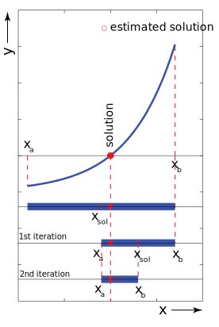
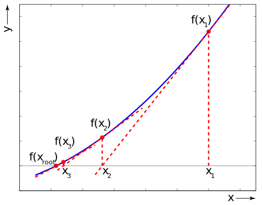

---
jupyter:
  jupytext:
    formats: ipynb,md
    text_representation:
      extension: .md
      format_name: markdown
      format_version: '1.3'
      jupytext_version: 1.13.6
  kernelspec:
    display_name: Python 3 (ipykernel)
    language: python
    name: python3
---

# Root finding

In this lecture you will implement two techniques to determine the root of a non-linear function of one variable. The root of a linear functions can be solved analytically. For non-linear functions (e.g. sin$x = x/2$) this is sometimes possible, but in the most general case it is hard to write down a simple solution (sometimes a series expansions give you an analytical answer, but still this would require a computer to calculate it with the appropriate accuracy for you). In these cases you need a computer to do the job for you. In this notebook we will show you two methods that can be implemented to find the roots of a function of one variable, i.e., $f(x)=0$. In general, the sought solution can be multi-dimensional, which makes it more difficult to solve, but also similar methods can be implemented in that case. Root solving methods also can be used for finding the extrema of a function. Instead of solving for the roots of $f(x)$, solving the roots the derivative $f′(x)$ function, yields the local or global extrema of the function $f(x)$.

**Learning objectives:** After finishing this lecture, you should be able to:

1. Find the root of a one-variable function with the bisection method
2. Find the root of a one-variable function with Newton's method

```python
# Initialisation code for the notebook
import numpy as np
import matplotlib.pyplot as plt
```

## Binary search or bisection method

The <a href="https://en.wikipedia.org/wiki/Bisection_method">bisection method</a> is a simple algorithm that iteratively ’traps’ the root of a function in an ever smaller interval. The bisection method is initiated by choosing two values $a$ and $b$ on the $x$-axis in which the to-be-determined root $f(x) = 0$ is located. By definition, the root is in an interval if there is a sign change in the function, i.e. either $f(a) > 0$ and $f(b) < 0$ or $f(a) < 0$ and $f(b) > 0$ (the product $f(a) \cdot f(b)$ is always negative). The bisection methods works in the following way
* Determine the initial interval $[a, b]$ enclosing the root, you can do this by plotting the function and determine an approximate interval.
* Calculate the midpoint of the interval
* Check in which interval the root is located, again by looking at the sign change over both intervals,
* Set the new interval equal to the interval in which the root is located and set the error for the root as the length of the interval, i.e. $(b − a)/2$, with $b>a$. 
* When the error is larger than the sought for tolerance then continue with a new bisection, else exit and return the center of the interval in which the root is located. 

Note however, that the absolute error on the root cannot be calculated since the value of the root is not known a priori. The best estimate of the error is the size of the interval in which the root is located. The bisection method always yields an answer if the root is in the interval $[a, b]$. The bisection method is robust, but the convergence rate of the bisection method is slow.



**Exercise 1** 

Planck's radiation law tells us that the intensity of radiation per unit area and per unit wavelength $\lambda$
from a black body at temperature $T$ is 

$$
  I(\lambda) = {2\pi hc^2\lambda^{-5}\over\text{e}^{hc/\lambda k_BT}-1}\,,
$$

where $h$ is Planck's constant, $c$ is the speed of light, and $k_B$ is Boltzmann's constant. The wavelength $\lambda$ at which the emitted radiation is strongest is the solution of the equation 

$$
5 \text{e}^{-hc/\lambda k_BT} + {hc\over\lambda k_BT} - 5 = 0.
$$

With the substitution $x=hc/\lambda k_BT$ we find that

$$
5 \text{e}^{-x} + x - 5 = 0.
$$

From which we find the Wien displacement law

$$
\lambda = {b\over T} \, ,
$$

where the so-called Wien displacement constant is $b=hc/k_Bx$, and $x$ is the solution to the nonlinear equation.

Write a program to solve this equation for  $x$ to an accuracy of $\epsilon=10^{-6}$ using the bisection/binary search method. Print the values $a$, $b$, the estimate of the root, and the error during the while loop iterations. Calculate and print the value for the found displacement constant. 
Follow the steps below when making this exercise.
* Make a plot of the function in to get a rough idea what the interval the interval is in which the root is located.
* Write a Python function for the equation for which you want to find the root
* Test that your function definition gives the correct function value
* Chose your interval $[a, b]$ such that the root is inside and that the obvious solution $x$=0 is not included. Make a check in your code that there is actually a root in the interval using an ```if``` statement or otherwise give a warning.
* Implement the bisection method to find the root
* Print the values of $a$, $b$, $xsol$, and the error to the command line at every iteration

Save your final solution as variable `xsol` is is plotted in the same graph. This exercise is from the book Computational Physics of Newman.

```python
# define accuracy
eps=1e-6

# define function
def f(x):

# first make a quick plot of the function over the domain of x
x=np.linspace(-1,10,100)
plt.xlabel('x'), plt.ylabel('f(x)')
plt.plot(x,f(x), '-b')
plt.grid()

# xsol = ...

plt.plot(xsol,f(xsol), 'or')

answer_5_01_1 = np.copy(xsol)
```

```python
question = "answer_5_01"
num = 1

to_check = [question + "_%d" % (n+1) for n in range(num)]
feedback = ""
passed = True
for var in to_check:
    res, msg = check_answer(eval(var), var)
    passed = passed and res
    print(msg)

assert passed == True, feedback
```

**Solution:**
``` python tags=["hide-input"] 
# define accuracy
eps=1e-6

# define function
def f(x):
### BEGIN SOLUTION
    return 5*np.exp(-x)+x-5
### END SOLUTION

# first make a quick plot of the function over the domain of x
x=np.linspace(-1,10,100)
plt.xlabel('x'), plt.ylabel('f(x)')
plt.plot(x,f(x), '-b')
plt.grid()

### BEGIN SOLUTION

# initial estimate
a=2
b=8

if f(a)*f(b)>0:
    print('The function does not have a root in the given interval')
else:
    print('The function has a root in the given interval, continuing...')
    error=1
    while error>eps:
        xsol=0.5*(a+b)
        if f(a)*f(xsol)<0:
            b=xsol
        else:
            a=xsol
        error=0.5*np.abs(a-b)
        print('{:.2e}|{:.2e}|{:.2e}|{:.2e}'.format(a, b, xsol, error))
xsol=(a+b)/2
### END SOLUTION

plt.plot(xsol,f(xsol), 'or')

answer_5_01_1 = np.copy(xsol)
```


The <a href="https://en.wikipedia.org/wiki/Wien%27s_displacement_law">displacement law </a> is the basis for the method of optical pyrometry, a method for measuring the temperatures of objects by observing the color of the thermal radiation they emit. The method is commonly used to estimate the surface temperatures of astronomical bodies, such as the Sun. 

**Exercise 2**
The wavelength peak in the Sun's emitted radiation occurs at $\lambda=502$ nm. Derive from the equations above, your value of $x$, and the wavelength $\lambda$ an estimate of the surface temperature of the Sun and store it in variable `tempsun`.

```python
h=6.6e-34
c=3e8
kb=1.38e-23

# tempsun = ...

answer_5_02_1 = np.copy(tempsun)
```

```python
question = "answer_5_02"
num = 1

to_check = [question + "_%d" % (n+1) for n in range(num)]
feedback = ""
passed = True
for var in to_check:
    res, msg = check_answer(eval(var), var)
    passed = passed and res
    print(msg)

assert passed == True, feedback
```

**Solution:**
``` python tags=["hide-input"] 
h=6.6e-34
c=3e8
kb=1.38e-23

### BEGIN SOLUTION
b=h*c/kb/xsol
print('The displacement constant is {}'.format(b))

wavelength=502e-9
tempsun=b/wavelength
print('The temperature is {} Kelvin'.format(tempsun))

### END SOLUTION
answer_5_02_1 = np.copy(tempsun)
```


## Newton's method

If the derivative of $f(x)$ is known (analytically or numerically) the most common method to solve the roots is the <a href="https://en.wikipedia.org/wiki/Newton%27s_method">Newton's (or Newton-Raphson) method</a>. Newton's method is an iterative method based on the Taylor series expansion of the function at first order (tangent only). 

The figure below illustrates Newton's method. Let the unknown true root of $f(x)$ be $x_{r}$, and $x_1$ a first estimate of it. As the function at the true root is zero, we can write the Taylor expansion around $x_1$ as

$$
f(x_r)=0=f(x_1)+f'(x_1)(x_r-x_1) + \frac{f''(x_1)}{2}(x_r-x_1)^2+... \, .
$$

Neglecting the terms with order equal or larger than 2 in the expansion and solving for $x_r$ results in  

$$
x_{r} \approx x_1 - \frac{f(x_1)}{f'(x_1)} \, .
$$

Since the Taylor expansion is truncated, the found $x_r$ is an approximation, which we call $x_2$. The figure below shows a construction of the point $x_2$. The point $x_2$ can be used in a subsequent approximation of $x_r$, by defining the iteration relation

$$
x_{i+1}=x_i - \frac{f(x_i)}{f'(x_i)}
$$

to iteratively find the root of $f(x)$. Although we only use a first order Taylor expansion, the error of the estimated root can decrease very fast. However, since the method is based on the derivative of the function $f(x)$ the convergence can be slow if locally $|f'(x)|>>$0, or non convergent if locally $f'(x)\approx 0$. The absolute error $\varepsilon$ in the root estimate is taken as $\varepsilon = |x_{i+1}-x_i|$.



**Exercise 3** 

Consider the sixth-order polynomial

$$
P(x) = 924 x^6 - 2772 x^5 + 3150 x^4 - 1680 x^3 + 420 x^2 - 42 x + 1.
$$

There is no general formula for the roots of a sixth-order polynomial, but one can find them easily enough using a computer. 

Make a function $P(x)$ and plot it from $x=0$ to $x=1$. Inspect the plot and find rough values for the six roots of the polynomial, the points at which the function is zero. Put the initial estimates of the roots in an array.

Write a Python program to solve for the positions of all six roots using Newton's method. Calculate your roots to an absolute error that is below $10^{-10}$. Use the absolute difference between successive values as your error. 

Follow the steps below when making this exercise.

1. Solve this problem for a single root
2. Subsequently add a for loop to find all roots and put every root in an array `sol6`.

```python
# define polynomial
def P(x):
    return 924*x**6 - 2772*x**5 +3150*x**4 - 1680*x**3 + 420*x**2 - 42*x + 1

# define derivative
def Pprime(x):
    return 5544*x**5 - 13860*x**4 + 12600*x**3 - 5040*x**2 + 840*x**1 - 42

# first make a quick plot

x=np.linspace(0,1,100)
plt.plot(x,P(x), '-b')
plt.xlabel('x'), plt.ylabel('f(x)')
plt.grid()

polyorder=6
# Make a blank array to store your results
sol6=np.zeros(polyorder)

# sol6 = ...

plt.plot(sol6,P(sol6), 'or')

answer_5_03_1 = np.copy(sol6)
```

```python
question = "answer_5_03"
num = 1

to_check = [question + "_%d" % (n+1) for n in range(num)]
feedback = ""
passed = True
for var in to_check:
    res, msg = check_answer(eval(var), var)
    passed = passed and res
    print(msg)

assert passed == True, feedback
```

**Solution:**
``` python tags=["hide-input"] 
# define polynomial
def P(x):
    return 924*x**6 - 2772*x**5 +3150*x**4 - 1680*x**3 + 420*x**2 - 42*x + 1

# define derivative
def Pprime(x):
    return 5544*x**5 - 13860*x**4 + 12600*x**3 - 5040*x**2 + 840*x**1 - 42

# first make a quick plot

x=np.linspace(0,1,100)
plt.plot(x,P(x), '-b')
plt.xlabel('x'), plt.ylabel('f(x)')
plt.grid()

polyorder=6
# Make a blank array to store your results
sol6=np.zeros(polyorder)

### BEGIN SOLUTION

# put estimates in array
start=np.array([0, 0.2, 0.4, 0.6, 0.8, 1])

eps=1e-10

print('root|error')

cnt=0
for xini in start:
    error=10
    x_1=xini
    while error>eps:
        x_2=x_1 - (P(x_1)/Pprime(x_1))
        error=np.abs(x_2-x_1)
        x_1=x_2
    
    print('{:.2e}|{:.2e}'.format(x_2, error))
    sol6[cnt]=x_2
    cnt+=1   
    
       
### END SOLUTION
plt.plot(sol6,P(sol6), 'or')

answer_5_03_1 = np.copy(sol6)
```


## Root solving in physics
As an example of the use of root solving in physics consider exercise 4 (from the book Computational Physics of Newman).

**Exercise 4** 

There is a magical point between the Earth and the Moon, called the $L_1$ Lagrange point, at which a satellite will orbit the Earth in perfect synchrony with the Moon, staying always in between the two. This works because the inward pull of the Earth and the outward pull of the Moon combine to create exactly the needed centripetal force that keeps the satellite in its orbit. 

Assuming circular orbits, and assuming that the Earth is much more massive than either the Moon or the satellite the distance $r$ from the center of the Earth to the $L_1$ point satisfies 

$$
{GM\over r^2} - {Gm\over(R-r)^2} = \omega^2 r,
$$

where $M$ and $m$ are the Earth and Moon masses, $G$ is Newton's gravitational constant, and $\omega$ is the angular velocity of both the Moon and the satellite.

The equation above is a fifth-order polynomial equation in $r$ (also called a quintic equation). Such equations cannot be solved in closed form (i.e. as an equation), but it's straightforward to solve them numerically. Write a program that uses Newton's method to solve for the distance $r$ from the Earth to the $L_1$ point. Compute a solution accurate to at least four significant figures.

The values of the various parameters are:

$$
G &= 6.674\times10^{-11}\,\mathrm{m}^3\mathrm{kg}^{-1}\mathrm{s}^{-2}, \\
M &= 5.974\times10^{24}\,\mathrm{kg}, \\
m &= 7.348\times10^{22}\,\mathrm{kg}, \\
R &= 3.844\times10^8\,\mathrm{m}, \\
\omega &= 2.662\times10^{-6}\,\mathrm{s}^{-1}.
$$

You will also need to choose a suitable starting value for $r$.

Some tips for making this exercise
* Make a plot of the function and its derivative
* First check the values of the function and its derivative at the point where you start your search, can you see what the problem is with a straightforward implementation of the given the physical parameters?
* Implement Newton's method to a modified version of the equation above and find the solution _Hint: write it as standard polynomial in r_

Store your final solution for $r$ in variable `lagrange`.

```python
G=6.674e-11
M=5.974e24
m=7.348e22
R=3.844e8
omega=2.662e-6

# lagrange = ...

answer_5_04_1 = np.copy(lagrange)
```

```python
question = "answer_5_04"
num = 1

to_check = [question + "_%d" % (n+1) for n in range(num)]
feedback = ""
passed = True
for var in to_check:
    res, msg = check_answer(eval(var), var)
    passed = passed and res
    print(msg)

assert passed == True, feedback
```

**Solution:**
``` python tags=["hide-input"] 
G=6.674e-11
M=5.974e24
m=7.348e22
R=3.844e8
omega=2.662e-6

### BEGIN SOLUTION

# The naive approach is defining the functions directly
#def f(r):
#    return G*M*r**(-2) - G*m*(R-r)**(-2) - r*omega**2

#def fprime(r):
#    return -2*G*M*r**(-3) + 2*G*m*(2*r-2*R)*(R-r)**(-3)-omega**2
# The problem with this approach is that the derivative is small. Hence the convergence to the correct x 
# is extremely slow
# the solution is to write is a standard polynomial in r


def f(r):
    return -omega**2*r**5 + 2*omega**2*R*r**4 - omega**2*R**2*r**3 + G*r**2*(M-m) - 2*r*R*G*M +G*M*R**2

def fprime(r):
    return -5*omega**2*r**4 + 8*omega**2*R*r**3 - 3*omega**2*R**2*r**2 + 2*G*r*(M-m) - 2*R*G*M

r=np.linspace(0.3*R,0.99*R,100)

# first make a quick plot
plt.subplot(121)
plt.plot(r,f(r), '-b')
plt.xlabel('r'), plt.ylabel('f(r)')
plt.grid()

plt.subplot(122)
plt.plot(r,fprime(r), '-b')
plt.xlabel('r'), plt.ylabel('df/dr')
plt.grid()

eps=1e-4

print('root|error|function val')

error=10*eps
x_1=3.2e8
while error>eps:
    x_2=x_1 - (f(x_1)/fprime(x_1))
    error=np.abs(x_2-x_1)
    x_1=x_2
    print('{:.4e}|{:.4e}|{:.4e}'.format(x_2, error, f(x_2)))
    
lagrange=x_2
### END SOLUTION
answer_5_04_1 = np.copy(lagrange)
```


```python tags=["auto-execute-page", "thebe-init", "hide-input"]
## Pre-loading the solutions

import sys
await micropip.install("numpy")
from validate_answers import *

with open(location):
    pass # Initially this notebook does not recognise the file unless someone tries to read it first
```
