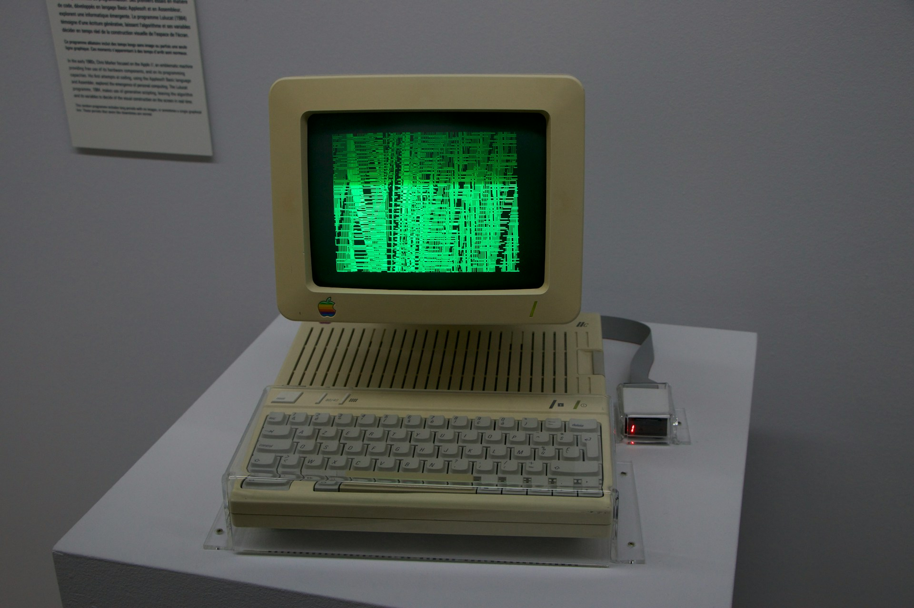

# Welcome to the Computational Science interactive book

This book was created as a lecture material for TN2513 Computational Science at Delft University of Technology. However, it is open to everyone who wants to learn how to use programming to solve problems in physics. We will walk you through most important numerical techniques you will need as a phycists and teach you how to deploy them for your day-to-day physics challenges. Read 'About this book' for detailed overview of the content, pre-requisities and instructions on how to use this book.

## Authors

Gary Steele, Jeroen Kalkman, Thomas Spriggs, Eliska Greplova\
Faculty of Applied Sciences\
Delft University of Technology

### Author contributions

Gary Steele created the content of the content of the chapters Differentiation, Integration, Fourier Transforms, Ordinary Differential equations and Partial Differential Equations. Jeroen Kalkman created the content of the chapters on Root Finding, Linear Algebra, and Random Numbers. Gary Steele, Jeroen Kalkman and Eliska Greplova refined the content of all chapters while teaching the course TN2513 Computational Science at Delft University of Technology. Thomas Spriggs created this Jupyter book with input from Eliska Greplova.

### Acknowledgements

We acknowledge discussions with Freek Pols, help from Tom Van Woudenberg from TeachBooks creating this book, and many contributions from all the teaching assistants that helped us run TN2513 over the years.

